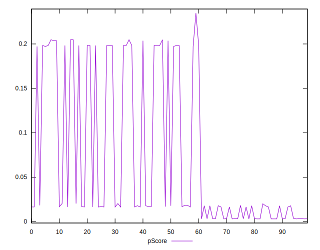

# //cumulative-layout-shift/samples/pages+cached

[→ Parent](../..)


## Raw


```yaml
p90min: 0.45085449218749996
p90max: 1.7690829467773435
p90range: 1.3182284545898435
p90mean: 1.060880627266904
p90median: 1.122510274887085
p90stdev: 0.47992147937871116
p90skewness: 0.06270575821308397
p90eccentricity: 1.0000000000000009
p90discretization: 3.76
outlandishness: 1.0049646162951207
confidence: 0.1932739506957671
p90confidence: 0.1940369089246714

```


## Score


```yaml
p90min: 0
p90max: 0.2
p90range: 0.2
p90mean: 0.07276595744680843
p90median: 0.02
p90stdev: 0.08746311387043729
p90skewness: 0.7496085734628545
p90eccentricity: 0.9999999999999984
p90discretization: 31.333333333333332
outlandishness: 1.0538643351800558
confidence: 0.034878350736318696
p90confidence: 0.035362185252296556

```


## Raw Estimate


## Score Estimate


## P Score


```yaml
p90min: 0.0031022719549900213
p90max: 0.2047569218238503
p90range: 0.20165464986886028
p90mean: 0.07222269612832855
p90median: 0.017840233168241015
p90stdev: 0.0873415265079589
p90skewness: 0.7633827180074779
p90eccentricity: 0.9999999999999989
p90discretization: 4.947368421052632
outlandishness: 1.0619070667856372
confidence: 0.03489539391121584
p90confidence: 0.03531302630235718

```


## Score Difference


```yaml
p90min: 0
p90max: 0
p90range: 0
p90mean: 0
p90median: 0
p90stdev: 0
p90skewness: .nan
p90eccentricity: .nan
p90discretization: 94
outlandishness: .nan
confidence: 0
p90confidence: 0

```


## P Score Difference


```yaml
p90min: -0.0034701865671648395
p90max: 0.004756921823850291
p90range: 0.00822710839101513
p90mean: -0.00033192019866206464
p90median: -0.0017008933368568013
p90stdev: 0.002824476885854084
p90skewness: 0.4790440878111203
p90eccentricity: 1.0000000000000007
p90discretization: 4.947368421052632
outlandishness: 0.6880514487202974
confidence: 0.001148233701999744
p90confidence: 0.001141963399866573

```

