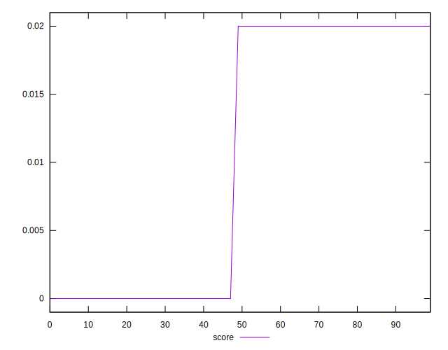

# //cumulative-layout-shift/samples/pages

[→ Parent](../..)


## Raw


```yaml
p90min: 1.121230978012085
p90max: 1.7690829467773437
p90range: 0.6478519687652586
p90mean: 1.4322229793967929
p90median: 1.1500445308685303
p90stdev: 0.3072660204535904
p90skewness: 0.08032109437136135
p90eccentricity: 0.9999999999999996
p90discretization: 7.230769230769231
outlandishness: 1.0031874993077465
confidence: 0.12229780141360966
p90confidence: 0.12423063227672713

```


## Score


```yaml
p90min: 0
p90max: 0.02
p90range: 0.02
p90mean: 0.010319148936170218
p90median: 0.02
p90stdev: 0.009941544858285729
p90skewness: -0.06385955460345351
p90eccentricity: 0.9999999999999999
p90discretization: 31.333333333333332
outlandishness: 0.996292103305346
confidence: 0.0038985058263640245
p90confidence: 0.0040194630103553

```


## Raw Estimate


## Score Estimate


## P Score


```yaml
p90min: 0.0031022719549900213
p90max: 0.01791041875881938
p90range: 0.014808146803829358
p90mean: 0.01042995681582146
p90median: 0.016403247991640446
p90stdev: 0.006937133106122899
p90skewness: -0.05636114636847108
p90eccentricity: 0.9999999999999994
p90discretization: 7.833333333333333
outlandishness: 1.0057631966575453
confidence: 0.00275560874594399
p90confidence: 0.002804750198831801

```


## Score Difference


```yaml
p90min: 0
p90max: 0
p90range: 0
p90mean: 0
p90median: 0
p90stdev: 0
p90skewness: .nan
p90eccentricity: .nan
p90discretization: 94
outlandishness: .nan
confidence: 0
p90confidence: 0

```


## P Score Difference


```yaml
p90min: -0.0035342237039838013
p90max: 0.0033156671300033635
p90range: 0.006849890833987165
p90mean: 0.00017915013776076722
p90median: -0.00021572989618896463
p90stdev: 0.0029994113135979666
p90skewness: -0.057204318840160064
p90eccentricity: 1.0000000000000002
p90discretization: 7.230769230769231
outlandishness: 0.7973244896427747
confidence: 0.0011876261006862068
p90confidence: 0.0012126910857119151

```

