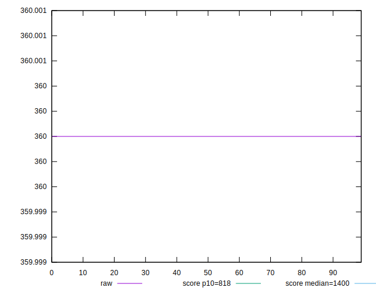
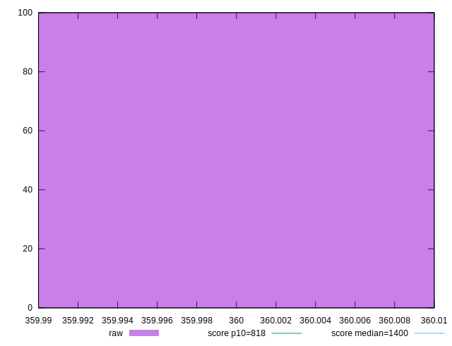
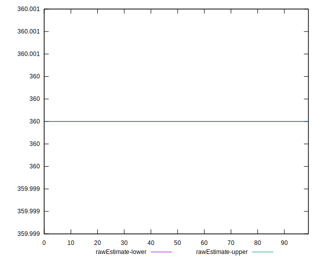
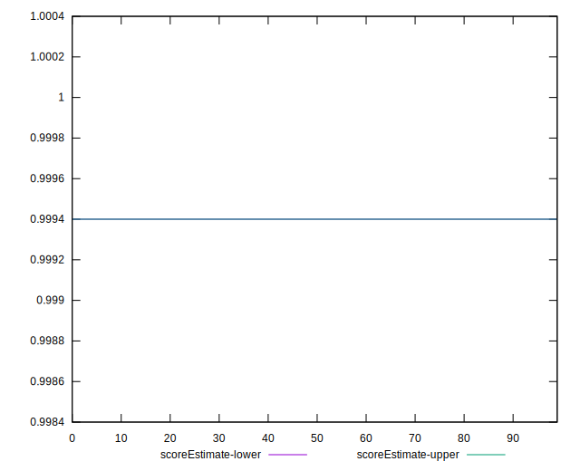
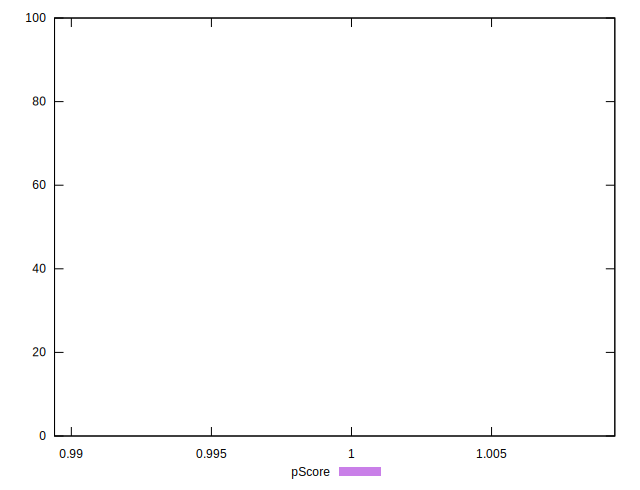
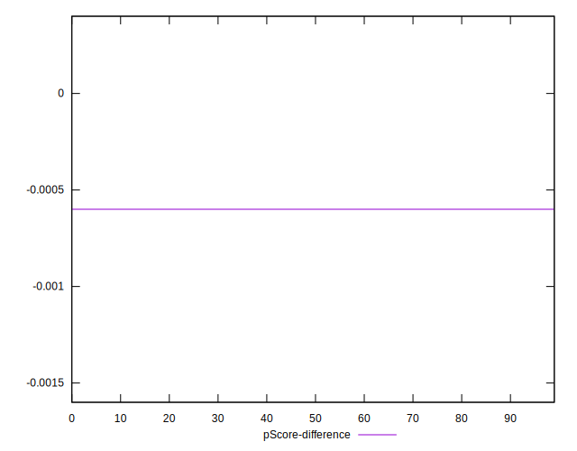
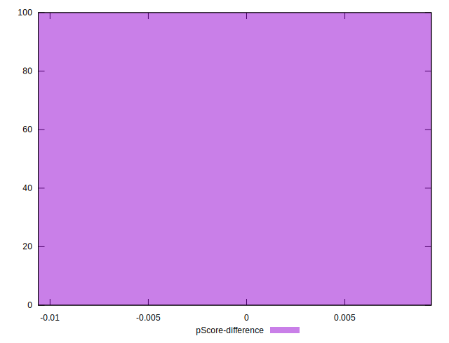

# //dom-size/samples/pages

[→ Parent](../..)


## Raw


```yaml
p90min: 360
p90max: 360
p90range: 0
p90mean: 360
p90median: 360
p90stdev: 0
p90skewness: .nan
p90eccentricity: .nan
p90discretization: 94
outlandishness: 1
confidence: 0
p90confidence: 0

```


## Score


```yaml
p90min: 1
p90max: 1
p90range: 0
p90mean: 1
p90median: 1
p90stdev: 0
p90skewness: .nan
p90eccentricity: .nan
p90discretization: 94
outlandishness: 1
confidence: 0
p90confidence: 0

```


## Raw Estimate


## Score Estimate


## P Score


```yaml
p90min: 0.9994001096556451
p90max: 0.9994001096556451
p90range: 0
p90mean: 0.9994001096556437
p90median: 0.9994001096556451
p90stdev: 1.3322676295501878e-15
p90skewness: 1
p90eccentricity: 1
p90discretization: 94
outlandishness: 0.9999999999999993
confidence: 6.527991429217299e-16
p90confidence: 5.386487244392023e-16

```


## Score Difference


```yaml
p90min: 0
p90max: 0
p90range: 0
p90mean: 0
p90median: 0
p90stdev: 0
p90skewness: .nan
p90eccentricity: .nan
p90discretization: 94
outlandishness: .nan
confidence: 0
p90confidence: 0

```


## P Score Difference


```yaml
p90min: -0.0005998903443549253
p90max: -0.0005998903443549253
p90range: 0
p90mean: -0.0005998903443549253
p90median: -0.0005998903443549253
p90stdev: 0
p90skewness: .nan
p90eccentricity: .nan
p90discretization: 94
outlandishness: 1
confidence: 0
p90confidence: 0

```

