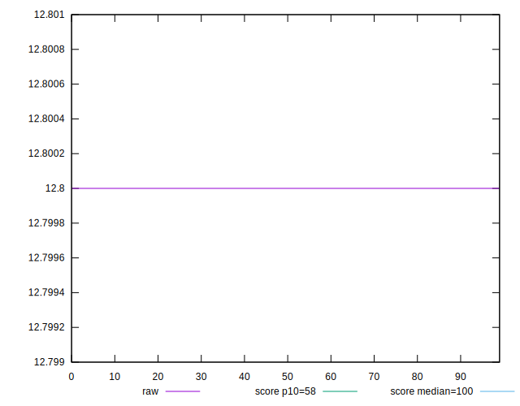
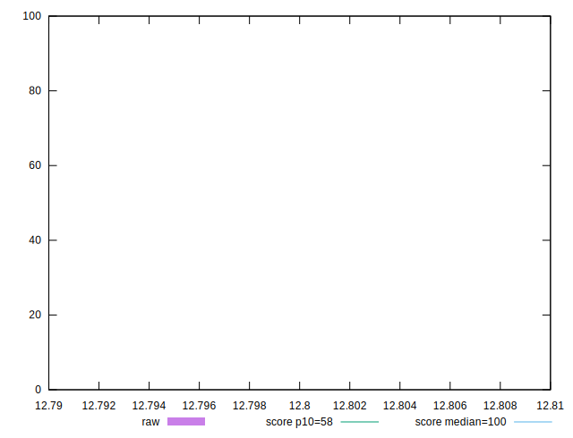
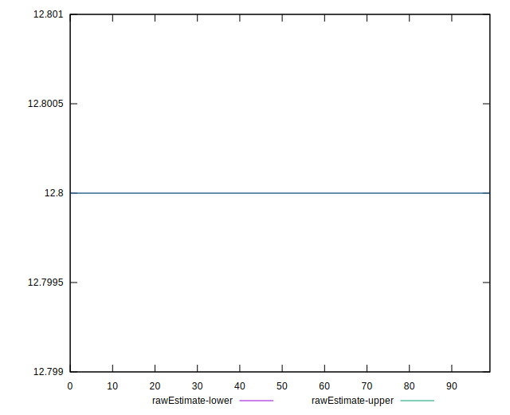
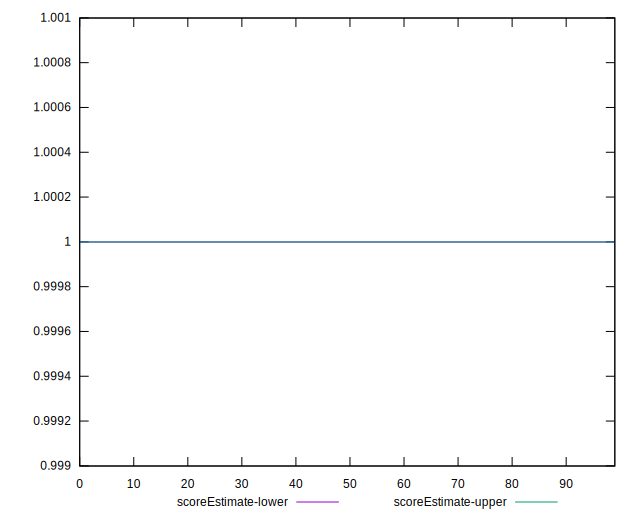
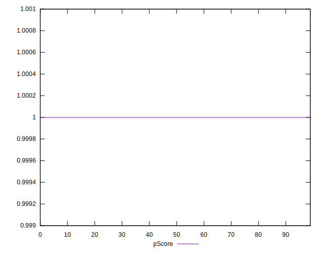
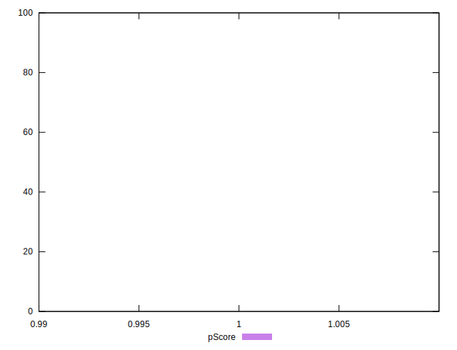
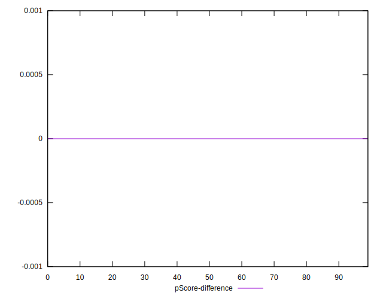
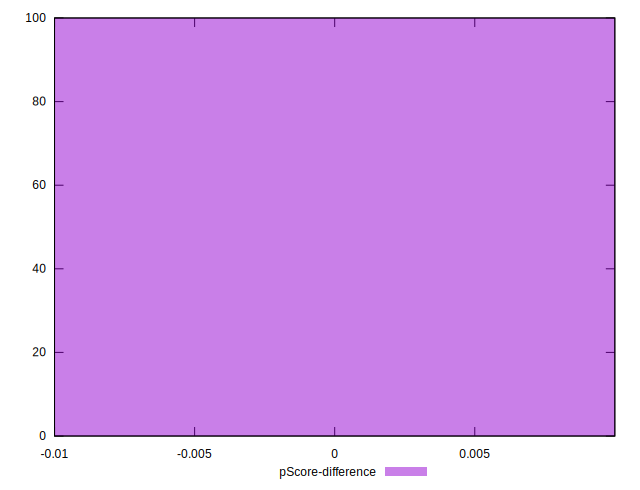

# //estimated-input-latency/samples/pages+cached+noadtech+nomedia+nocss

[→ Parent](../..)


## Raw


```yaml
p90min: 12.8
p90max: 12.8
p90range: 0
p90mean: 12.799999999999976
p90median: 12.8
p90stdev: 2.4868995751603507e-14
p90skewness: 1
p90eccentricity: 1
p90discretization: 94
outlandishness: 1
confidence: 9.7484672009645e-15
p90confidence: 1.0054776189531775e-14

```


## Score


```yaml
p90min: 1
p90max: 1
p90range: 0
p90mean: 1
p90median: 1
p90stdev: 0
p90skewness: .nan
p90eccentricity: .nan
p90discretization: 94
outlandishness: 1
confidence: 0
p90confidence: 0

```


## Raw Estimate


## Score Estimate


## P Score


```yaml
p90min: 0.9999993380488856
p90max: 0.9999993380488856
p90range: 0
p90mean: 0.9999993380488849
p90median: 0.9999993380488856
p90stdev: 7.771561172376096e-16
p90skewness: 1
p90eccentricity: 1
p90discretization: 94
outlandishness: 0.9999999999999993
confidence: 4.351994286144866e-16
p90confidence: 3.1421175592286797e-16

```


## Score Difference


```yaml
p90min: 0
p90max: 0
p90range: 0
p90mean: 0
p90median: 0
p90stdev: 0
p90skewness: .nan
p90eccentricity: .nan
p90discretization: 94
outlandishness: .nan
confidence: 0
p90confidence: 0

```


## P Score Difference


```yaml
p90min: -6.619511143668433e-7
p90max: -6.619511143668433e-7
p90range: 0
p90mean: -6.619511143668433e-7
p90median: -6.619511143668433e-7
p90stdev: 0
p90skewness: .nan
p90eccentricity: .nan
p90discretization: 94
outlandishness: 1
confidence: 0
p90confidence: 0

```

