# //estimated-input-latency/samples/pages+cached

[→ Parent](../..)


## Raw


```yaml
p90min: 12.8
p90max: 14.266666666666666
p90range: 1.466666666666665
p90mean: 12.850496453900687
p90median: 12.8
p90stdev: 0.23235964901119127
p90skewness: 4.935065218924786
p90eccentricity: 0.9999999999999961
p90discretization: 15.666666666666666
outlandishness: 1.0950681321714315
confidence: 2.067208694434687
p90confidence: 0.09394525977732916

```

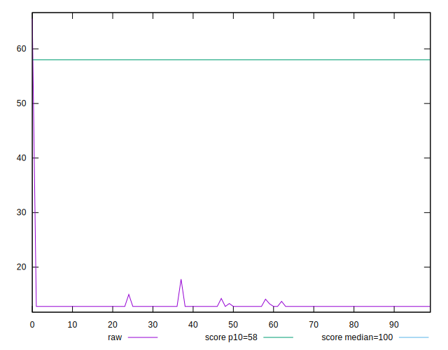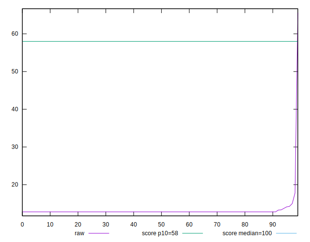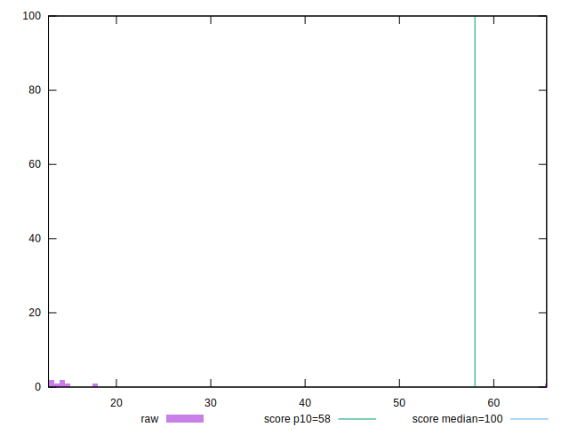
## Score


```yaml
p90min: 1
p90max: 1
p90range: 0
p90mean: 1
p90median: 1
p90stdev: 0
p90skewness: .nan
p90eccentricity: .nan
p90discretization: 94
outlandishness: 0.9968025600000001
confidence: 0.006240446533756123
p90confidence: 0

```

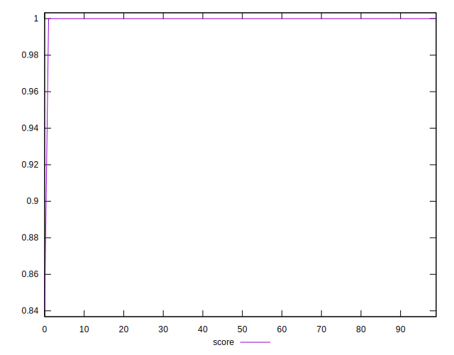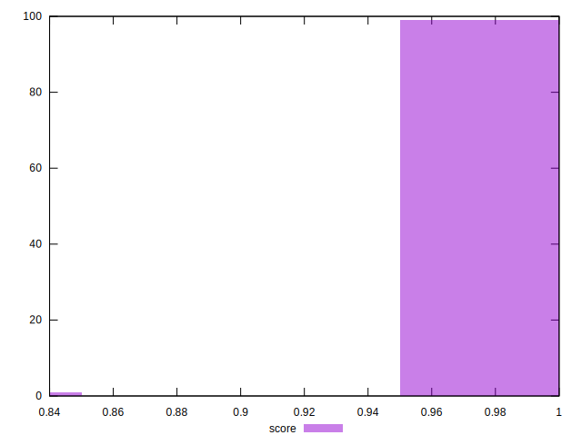
## Raw Estimate

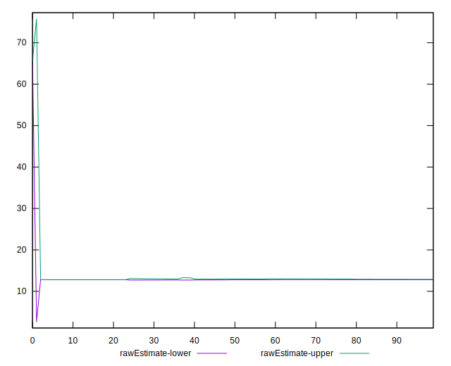
## Score Estimate

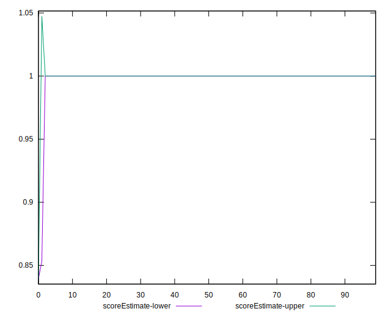
## P Score


```yaml
p90min: 0.9999976858747162
p90max: 0.9999993380488856
p90range: 0.0000016521741694752734
p90mean: 0.999999288313283
p90median: 0.9999993380488856
p90stdev: 2.4212309604816516e-7
p90skewness: -5.428209743212357
p90eccentricity: 1.000000000000003
p90discretization: 15.666666666666666
outlandishness: 0.9967894133891928
confidence: 0.006265059197668694
p90confidence: 9.789271611113748e-8

```

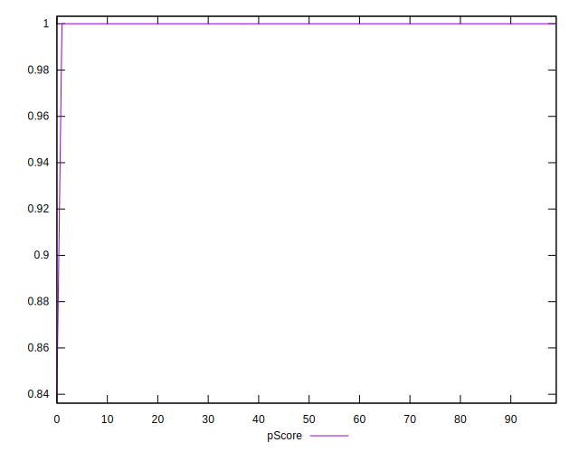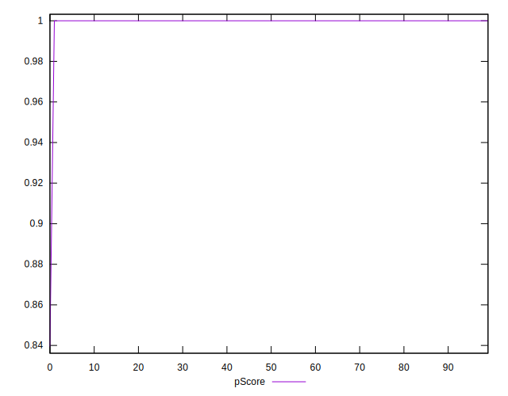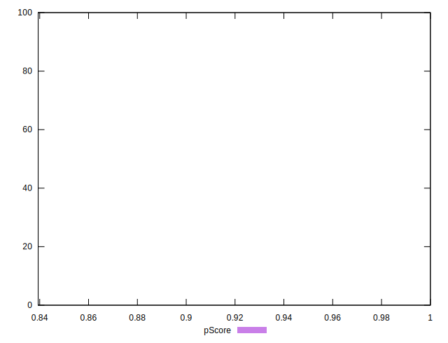
## Score Difference


```yaml
p90min: 0
p90max: 0
p90range: 0
p90mean: 0
p90median: 0
p90stdev: 0
p90skewness: .nan
p90eccentricity: .nan
p90discretization: 94
outlandishness: .nan
confidence: 0
p90confidence: 0

```


## P Score Difference


```yaml
p90min: -0.0000023141252838421167
p90max: -6.619511143668433e-7
p90range: 0.0000016521741694752734
p90mean: -7.11686716090187e-7
p90median: -6.619511143668433e-7
p90stdev: 2.421230960481651e-7
p90skewness: -5.428209754524555
p90eccentricity: 1.000000000000003
p90discretization: 15.666666666666666
outlandishness: 105.05143194963657
confidence: 0.000024630518502860933
p90confidence: 9.789271611113746e-8

```

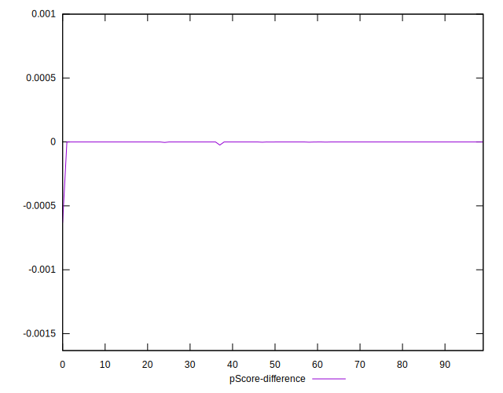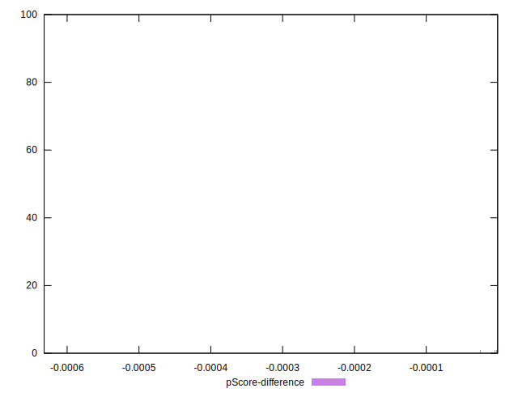