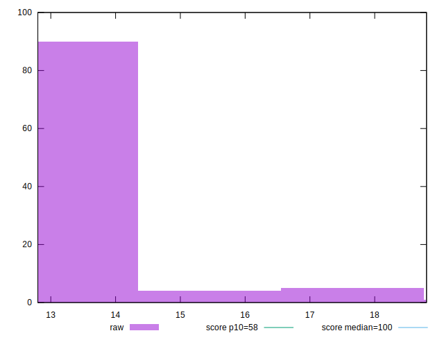

# //estimated-input-latency/samples/pages

[→ Parent](../..)


## Raw


```yaml
p90min: 12.8
p90max: 17.6
p90range: 4.800000000000001
p90mean: 13.121985815602812
p90median: 12.8
p90stdev: 0.8969946299889694
p90skewness: 3.746485570227895
p90eccentricity: 1.000000000000002
p90discretization: 5.529411764705882
outlandishness: 1.0224814552952008
confidence: 0.48924239749994136
p90confidence: 0.3626636289553196

```


## Score


```yaml
p90min: 1
p90max: 1
p90range: 0
p90mean: 1
p90median: 1
p90stdev: 0
p90skewness: .nan
p90eccentricity: .nan
p90discretization: 94
outlandishness: 1
confidence: 0
p90confidence: 0

```


## Raw Estimate


## Score Estimate


## P Score


```yaml
p90min: 0.9999781567708548
p90max: 0.9999993380488856
p90range: 0.000021181278030857342
p90mean: 0.9999985394146851
p90median: 0.9999993380488856
p90stdev: 0.000003401247896995912
p90skewness: -5.299106179988512
p90eccentricity: 0.9999999999999991
p90discretization: 6.714285714285714
outlandishness: 0.9999981211757923
confidence: 0.00000255575124161192
p90confidence: 0.0000013751575138374635

```


## Score Difference


```yaml
p90min: 0
p90max: 0
p90range: 0
p90mean: 0
p90median: 0
p90stdev: 0
p90skewness: .nan
p90eccentricity: .nan
p90discretization: 94
outlandishness: .nan
confidence: 0
p90confidence: 0

```


## P Score Difference


```yaml
p90min: -0.000021843229145224186
p90max: -6.619511143668433e-7
p90range: 0.000021181278030857342
p90mean: -0.0000014605853143269665
p90median: -6.619511143668433e-7
p90stdev: 0.000003401247896995915
p90skewness: -5.299106180312486
p90eccentricity: 0.9999999999999963
p90discretization: 6.714285714285714
outlandishness: 2.700022310000029
confidence: 0.0000025557512416119193
p90confidence: 0.0000013751575138374648

```

