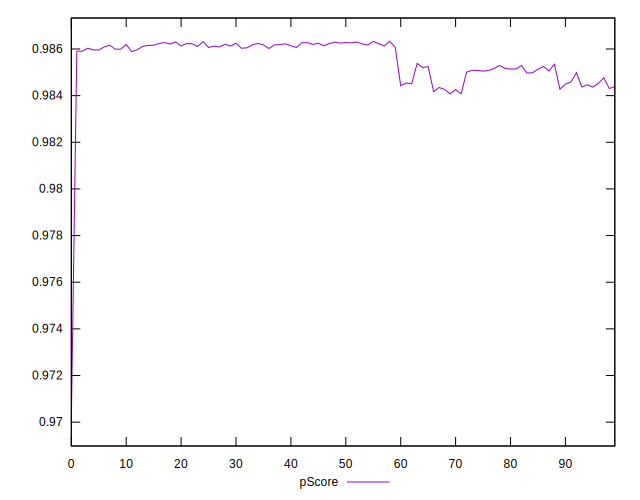

# //first-contentful-paint/samples/pages+cached+noadtech+nomedia+nocss

[→ Parent](../..)


## Raw


```yaml
p90min: 1584.87185
p90max: 1623.4279999999999
p90range: 38.55614999999989
p90mean: 1597.6541585106377
p90median: 1590.1385249999998
p90stdev: 12.709654671199829
p90skewness: 0.6884460968327158
p90eccentricity: 0.9999999999999997
p90discretization: 1
outlandishness: 1.0029373610537782
confidence: 9.968811036619464
p90confidence: 5.138636655921722

```


## Score


```yaml
p90min: 0.98
p90max: 0.99
p90range: 0.010000000000000009
p90mean: 0.987872340425532
p90median: 0.99
p90stdev: 0.0040926349067385934
p90skewness: -1.4036631612562371
p90eccentricity: 0.9999999999999971
p90discretization: 47
outlandishness: 0.9994487083513455
confidence: 0.001763531984749346
p90confidence: 0.0016546919877160097

```


## Raw Estimate


## Score Estimate


## P Score


```yaml
p90min: 0.984167808192348
p90max: 0.9863042769304786
p90range: 0.00213646873813067
p90mean: 0.9856081146271536
p90median: 0.9860250483310837
p90stdev: 0.000700374026635709
p90skewness: -0.7107559984746318
p90eccentricity: 0.9999999999999996
p90discretization: 1
outlandishness: 0.9996641606818998
confidence: 0.0006720019343753466
p90confidence: 0.0002831680119744746

```


## Score Difference


```yaml
p90min: 0
p90max: 0
p90range: 0
p90mean: 0
p90median: 0
p90stdev: 0
p90skewness: .nan
p90eccentricity: .nan
p90discretization: 94
outlandishness: .nan
confidence: 0
p90confidence: 0

```


## P Score Difference


```yaml
p90min: -0.004922687923074376
p90max: 0.004760714456482851
p90range: 0.009683402379557227
p90mean: -0.0022956090782349147
p90median: -0.0038152798586473247
p90stdev: 0.0034037817283620857
p90skewness: 1.4059191392008237
p90eccentricity: 0.9999999999999996
p90discretization: 1
outlandishness: 0.8832149004859945
confidence: 0.0013953828406465306
p90confidence: 0.0013761819664347202

```

