# //first-contentful-paint/samples/pages+cached+noadtech+nomedia

[→ Parent](../..)


## Raw


```yaml
p90min: 1907.8377499999995
p90max: 2160.8553
p90range: 253.0175500000007
p90mean: 1982.5225984042552
p90median: 1924.1897750000003
p90stdev: 85.37268097691111
p90skewness: 0.82627425548511
p90eccentricity: 0.9999999999999999
p90discretization: 1
outlandishness: 1.0054624743663314
confidence: 37.49645751843196
p90confidence: 34.51700295810256

```

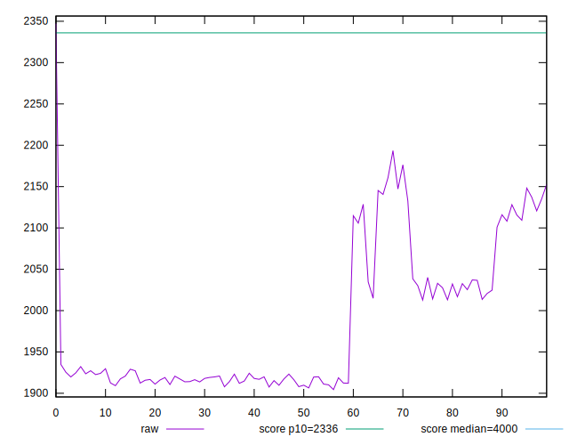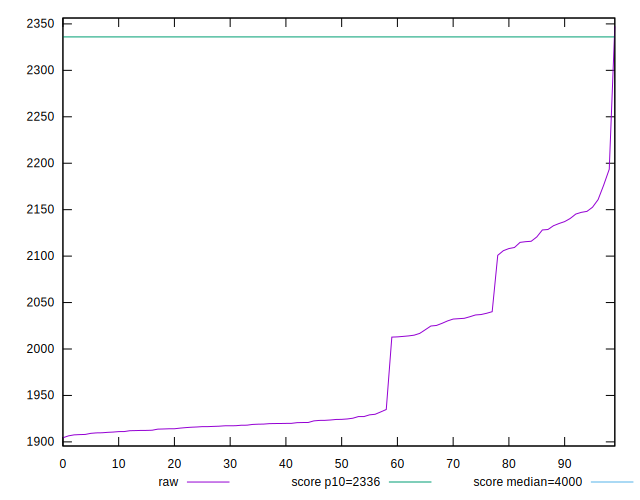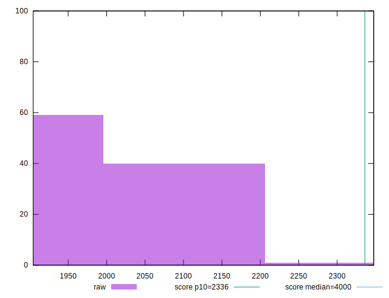
## Score


```yaml
p90min: 0.93
p90max: 0.96
p90range: 0.029999999999999916
p90mean: 0.9526595744680862
p90median: 0.96
p90stdev: 0.010536212319030392
p90skewness: -1.200831003326415
p90eccentricity: 1.000000000000003
p90discretization: 23.5
outlandishness: 0.9981962356780497
confidence: 0.0047810267272478495
p90confidence: 0.0042598928324802735

```

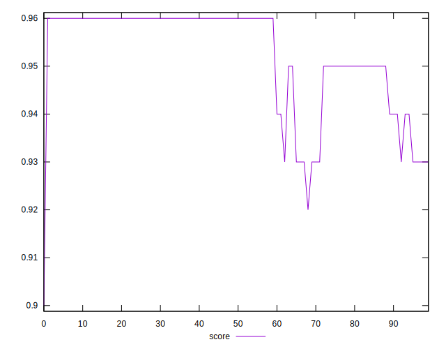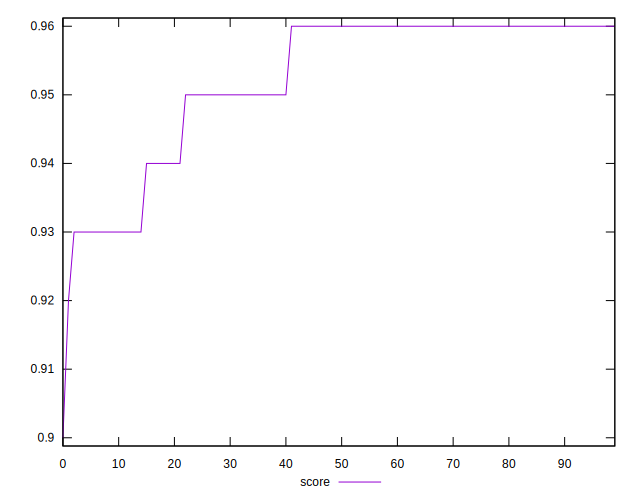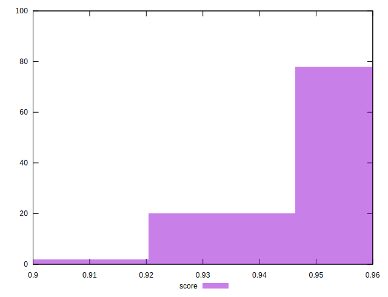
## Raw Estimate

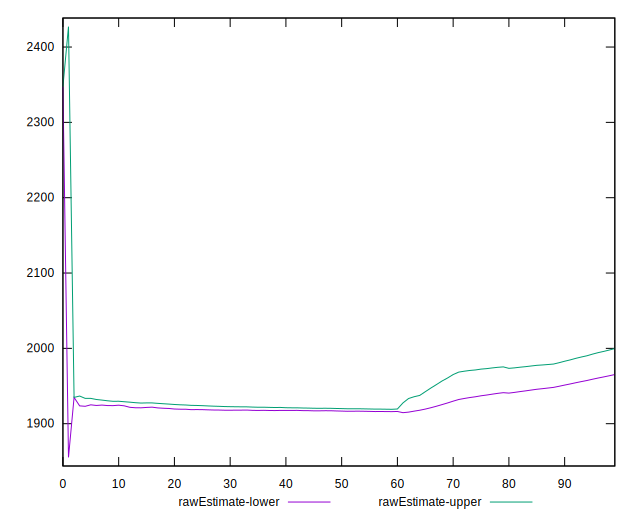
## Score Estimate

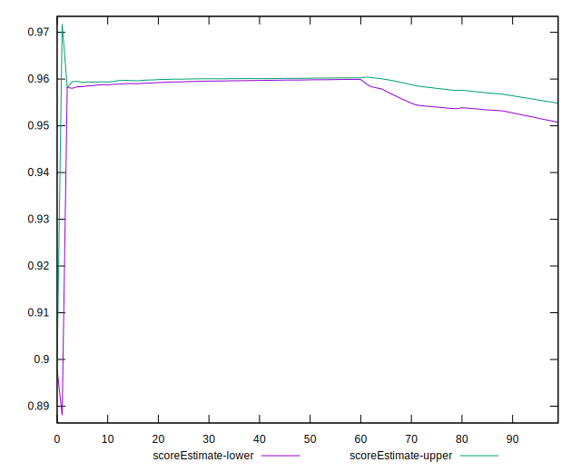
## P Score


```yaml
p90min: 0.9288459913042317
p90max: 0.9611322058605811
p90range: 0.03228621455634939
p90mean: 0.9521370861342934
p90median: 0.9593893509652041
p90stdev: 0.010652190588270334
p90skewness: -0.9056375054948264
p90eccentricity: 1.0000000000000004
p90discretization: 1
outlandishness: 0.9983074287326983
confidence: 0.004840587364674826
p90confidence: 0.004306783971620128

```

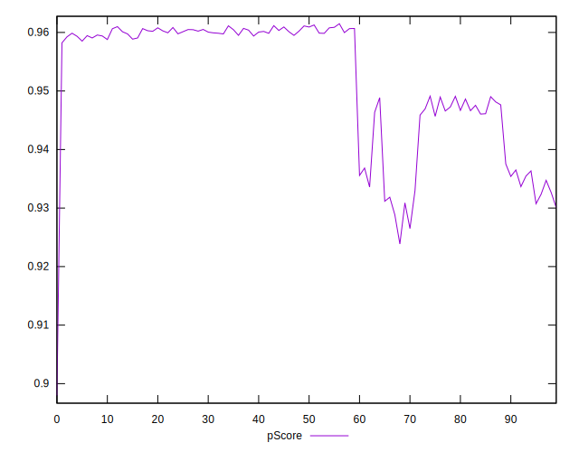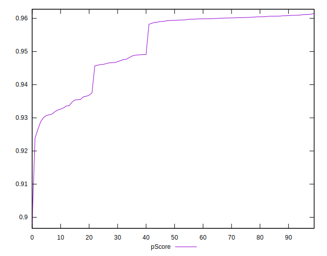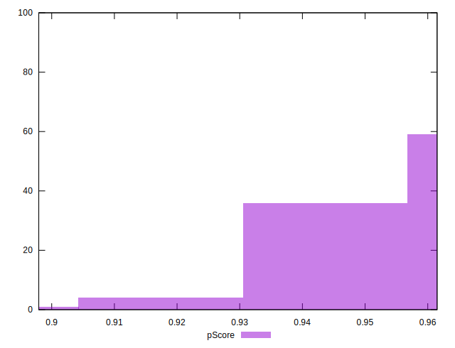
## Score Difference


```yaml
p90min: 0
p90max: 1.1102230246251565e-16
p90range: 1.1102230246251565e-16
p90mean: 2.7165031453594255e-17
p90median: 0
p90stdev: 4.77282453539822e-17
p90skewness: 1.1878131939454835
p90eccentricity: 1.0000000000000024
p90discretization: 47
outlandishness: 1.1291372400756148
confidence: 1.9089337235485828e-17
p90confidence: 1.929699251818031e-17

```

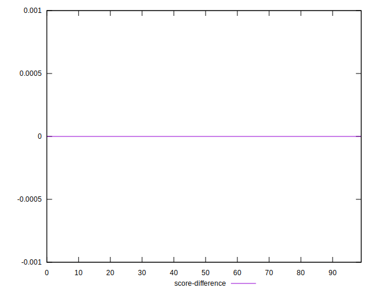
## P Score Difference


```yaml
p90min: -0.004335238387123019
p90max: 0.0035863179747481766
p90range: 0.007921556361871196
p90mean: -0.0004848934132706852
p90median: -0.00012589696506981607
p90stdev: 0.0016643756475766844
p90skewness: -0.49203799359739747
p90eccentricity: 0.9999999999999997
p90discretization: 1
outlandishness: 0.9356599267313302
confidence: 0.0007566362937614124
p90confidence: 0.0006729232172799555

```

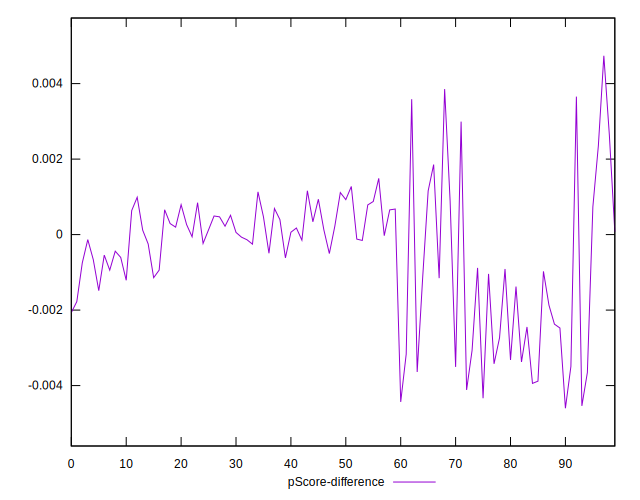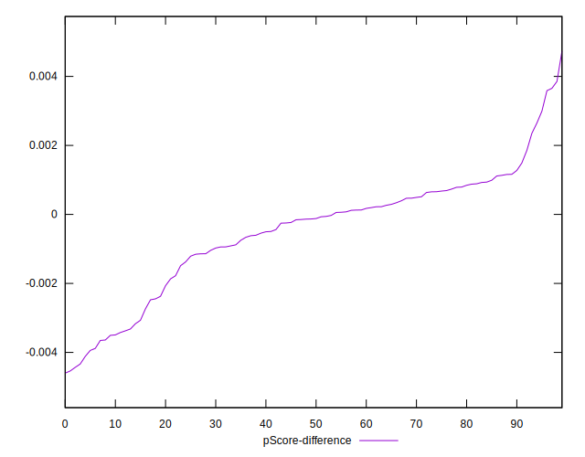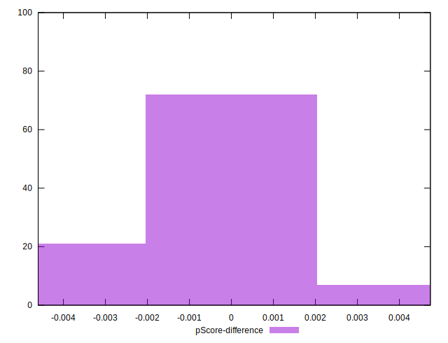