# //first-contentful-paint/samples/pages

[→ Parent](../..)


## Raw


```yaml
p90min: 2312.9210000000003
p90max: 2560.5294999999996
p90range: 247.60849999999937
p90mean: 2451.1431585106384
p90median: 2471.7414500000004
p90stdev: 72.83755051616534
p90skewness: -0.5751219467475267
p90eccentricity: 1.0000000000000002
p90discretization: 1
outlandishness: 0.9987657126935283
confidence: 30.776294078158426
p90confidence: 29.44892813319716

```

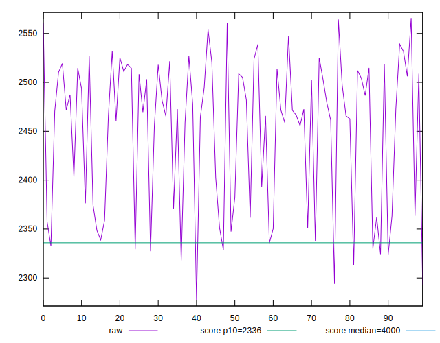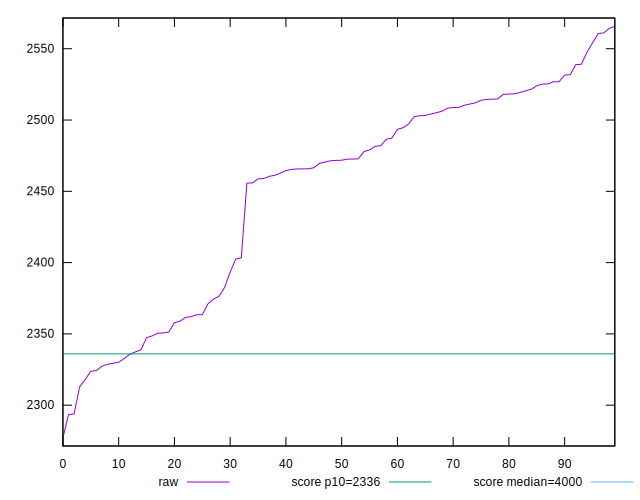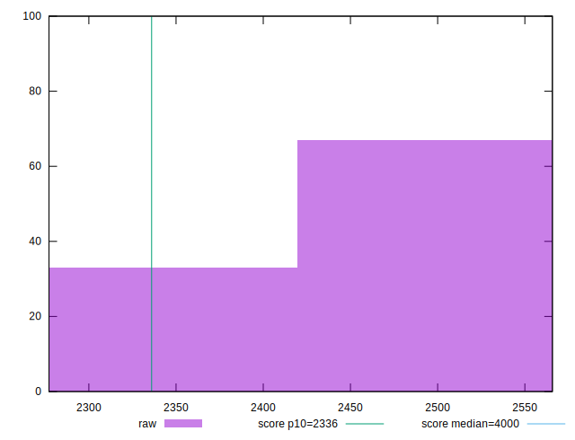
## Score


```yaml
p90min: 0.86
p90max: 0.9
p90range: 0.040000000000000036
p90mean: 0.878297872340426
p90median: 0.87
p90stdev: 0.014632977756637798
p90skewness: 0.39807168657615677
p90eccentricity: 0.9999999999999992
p90discretization: 18.8
outlandishness: 1.0006881028267902
confidence: 0.006148666613969519
p90confidence: 0.005916254833889023

```

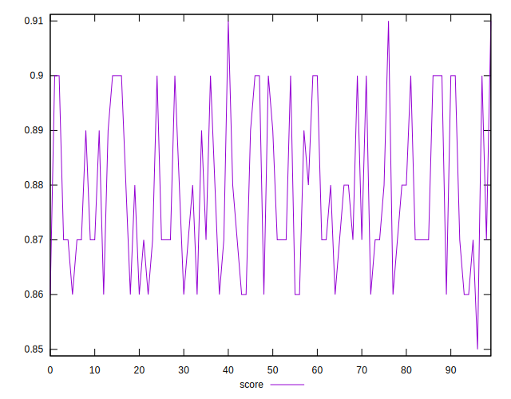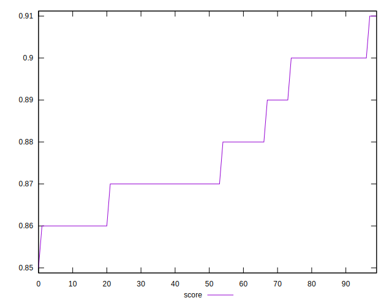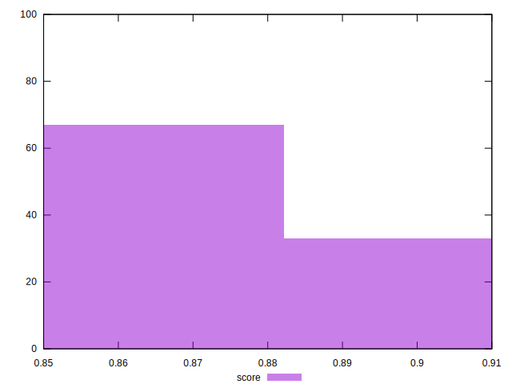
## Raw Estimate

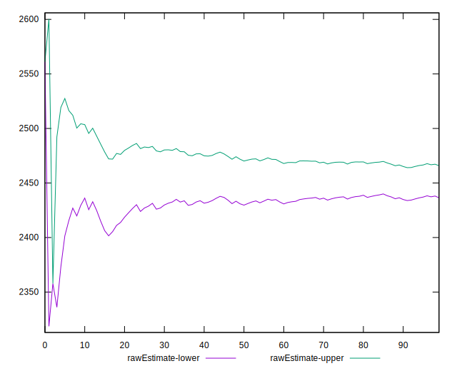
## Score Estimate

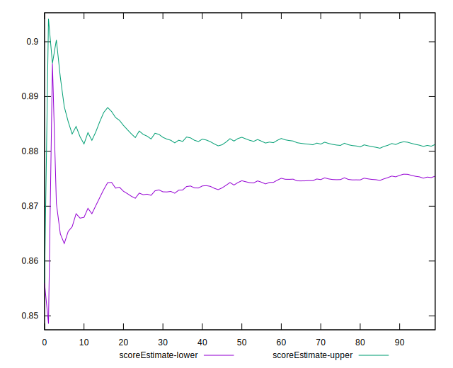
## P Score


```yaml
p90min: 0.8560819140372526
p90max: 0.9040891075143149
p90range: 0.04800719347706228
p90mean: 0.8779933189715277
p90median: 0.8743027619923988
p90stdev: 0.01406718247705348
p90skewness: 0.5322164562767757
p90eccentricity: 0.9999999999999996
p90discretization: 1
outlandishness: 1.0005333117999062
confidence: 0.005932297090614092
p90confidence: 0.005687498314641676

```

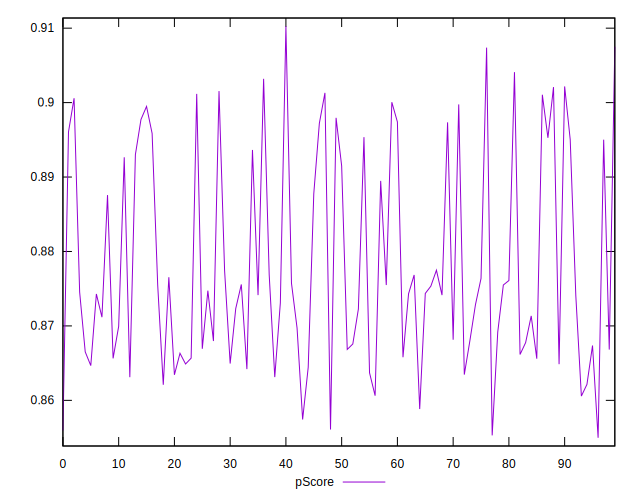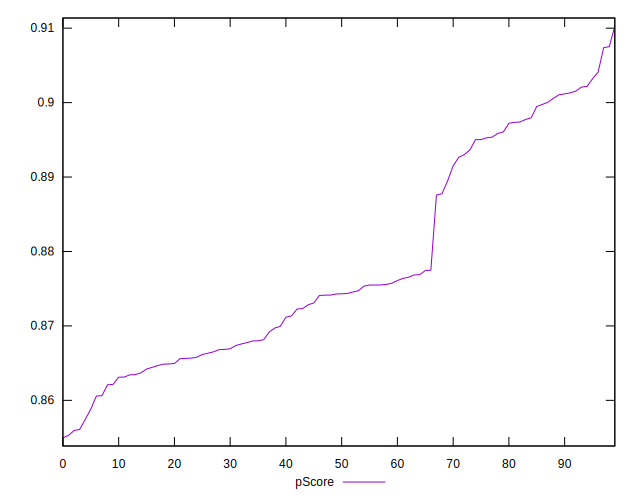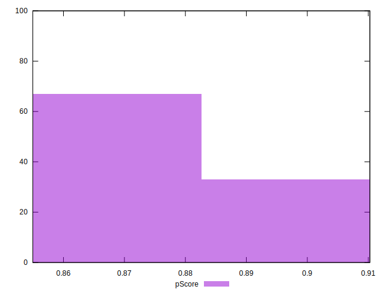
## Score Difference


```yaml
p90min: 0
p90max: 0
p90range: 0
p90mean: 0
p90median: 0
p90stdev: 0
p90skewness: .nan
p90eccentricity: .nan
p90discretization: 94
outlandishness: .nan
confidence: 0
p90confidence: 0

```


## P Score Difference


```yaml
p90min: -0.0047093694950409715
p90max: 0.004861819246560595
p90range: 0.009571188741601566
p90mean: -0.00039764980171783624
p90median: -0.0006676037145808555
p90stdev: 0.003145504080742378
p90skewness: 0.21625421772488712
p90eccentricity: 1
p90discretization: 1
outlandishness: 0.8779325823079606
confidence: 0.001285839388742488
p90confidence: 0.0012717578084384137

```

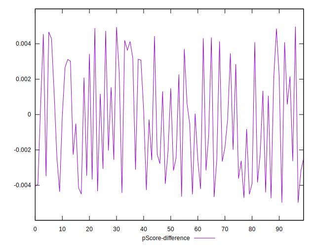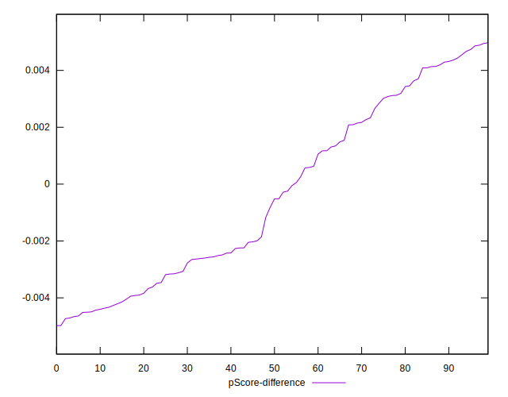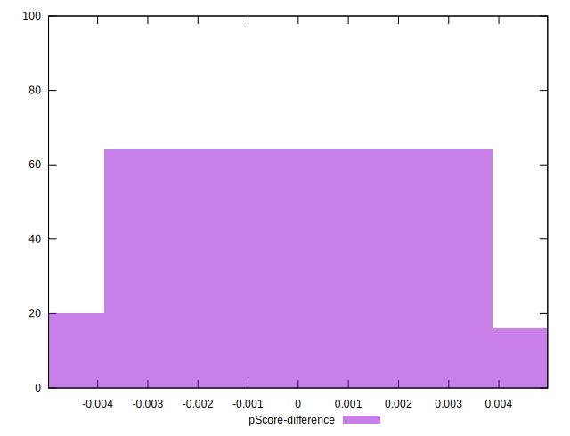