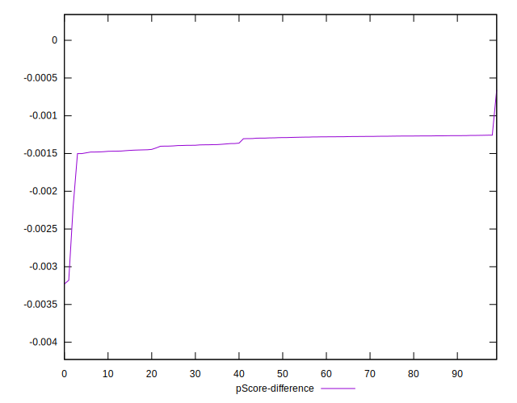

# //first-cpu-idle/samples/pages+cached+noadtech+nomedia+nocss

[→ Parent](../..)


## Raw


```yaml
p90min: 1584.87185
p90max: 1816.8045000000002
p90range: 231.9326500000002
p90mean: 1600.5382223404251
p90median: 1590.4857499999998
p90stdev: 26.05078036679663
p90skewness: 6.104586728397793
p90eccentricity: 0.9999999999999996
p90discretization: 1
outlandishness: 1.085779162983258
confidence: 151.29572601431113
p90confidence: 10.532583171714908

```


## Score


```yaml
p90min: 1
p90max: 1
p90range: 0
p90mean: 1
p90median: 1
p90stdev: 0
p90skewness: .nan
p90eccentricity: .nan
p90discretization: 94
outlandishness: 0.99221521
confidence: 0.008692965048656682
p90confidence: 0

```


## Raw Estimate


## Score Estimate


## P Score


```yaml
p90min: 0.9968209566667575
p90max: 0.9987405728328382
p90range: 0.0019196161660807176
p90mean: 0.9986425114899568
p90median: 0.9987087276822708
p90stdev: 0.00020480497212990075
p90skewness: -7.481257411960318
p90eccentricity: 0.9999999999999997
p90discretization: 1
outlandishness: 0.9921702628495808
confidence: 0.008738922144760033
p90confidence: 0.00008280463665834464

```


## Score Difference


```yaml
p90min: 0
p90max: 0
p90range: 0
p90mean: 0
p90median: 0
p90stdev: 0
p90skewness: .nan
p90eccentricity: .nan
p90discretization: 94
outlandishness: .nan
confidence: 0
p90confidence: 0

```


## P Score Difference


```yaml
p90min: -0.0015010539220297048
p90max: -0.001258478872876001
p90range: 0.00024257504915370376
p90mean: -0.0013370569732309068
p90median: -0.0012892844060333197
p90stdev: 0.000079582557970728
p90skewness: -0.7070813347630021
p90eccentricity: 0.9999999999999997
p90discretization: 1
outlandishness: 1.0571391318607022
confidence: 0.00011534667385780649
p90confidence: 0.00003217600006765507

```

