# //first-cpu-idle/samples/pages+cached+noadtech+nomedia

[→ Parent](../..)


## Raw


```yaml
p90min: 1907.8377499999995
p90max: 2176.3989500000002
p90range: 268.5612000000008
p90mean: 1982.8535234042552
p90median: 1924.1897750000003
p90stdev: 86.06049117745441
p90skewness: 0.8447390567429033
p90eccentricity: 1.0000000000000002
p90discretization: 1
outlandishness: 1.095293041506709
confidence: 252.16632461922214
p90confidence: 34.795091293329925

```

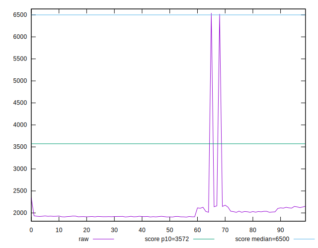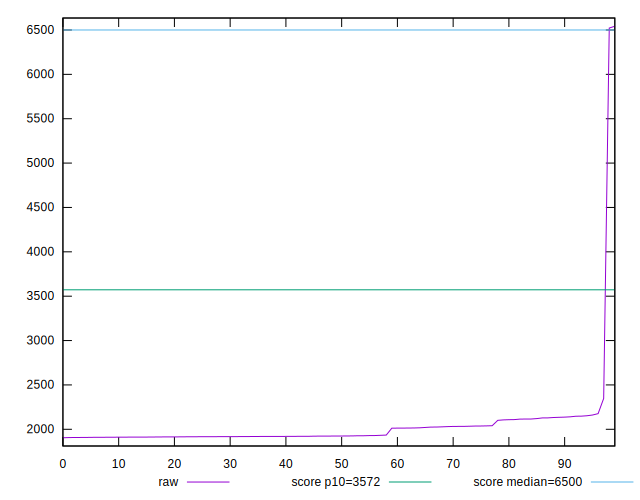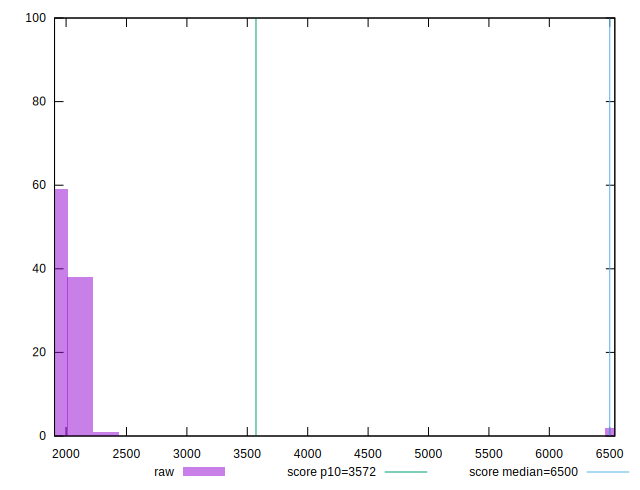
## Score


```yaml
p90min: 0.99
p90max: 1
p90range: 0.010000000000000009
p90mean: 0.9959574468085092
p90median: 1
p90stdev: 0.004907473444540774
p90skewness: -0.390199486285773
p90eccentricity: 0.9999999999999983
p90discretization: 47
outlandishness: 0.980104229869977
confidence: 0.027562418188186482
p90confidence: 0.001984139111759126

```

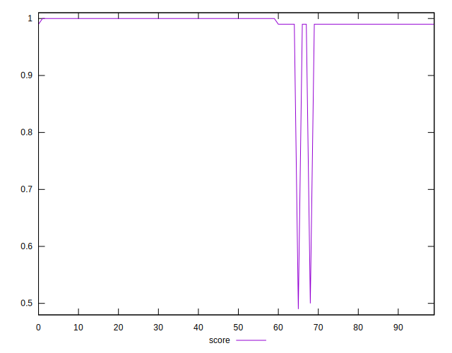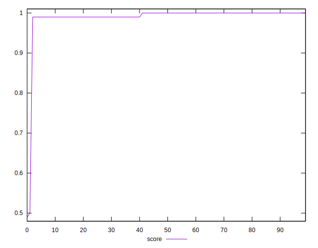
## Raw Estimate

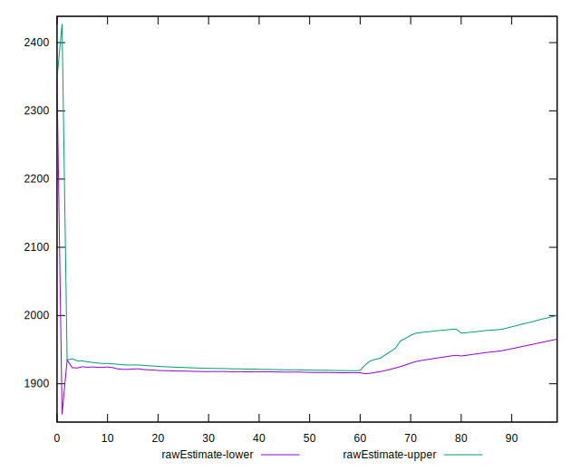
## Score Estimate

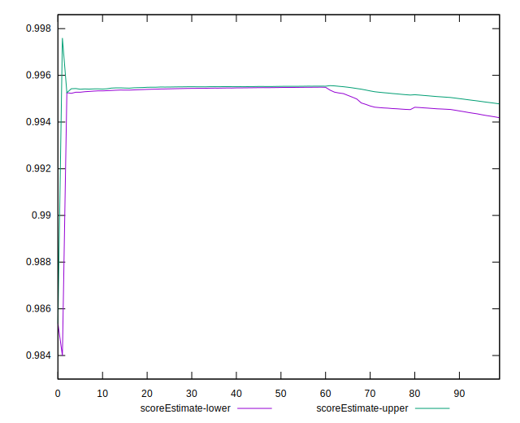
## P Score


```yaml
p90min: 0.9904132792479734
p90max: 0.9956556098889952
p90range: 0.005242330641021753
p90mean: 0.9943358411478055
p90median: 0.9954169189875915
p90stdev: 0.0015997671209294793
p90skewness: -0.9766883370854933
p90eccentricity: 0.9999999999999997
p90discretization: 1
outlandishness: 0.9799481091977355
confidence: 0.027364676208063033
p90confidence: 0.0006468013633111975

```

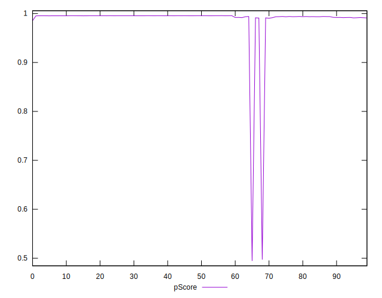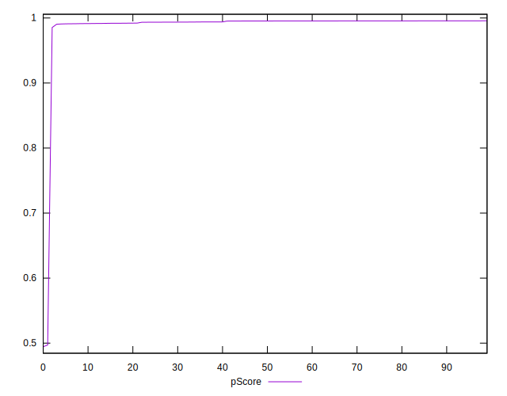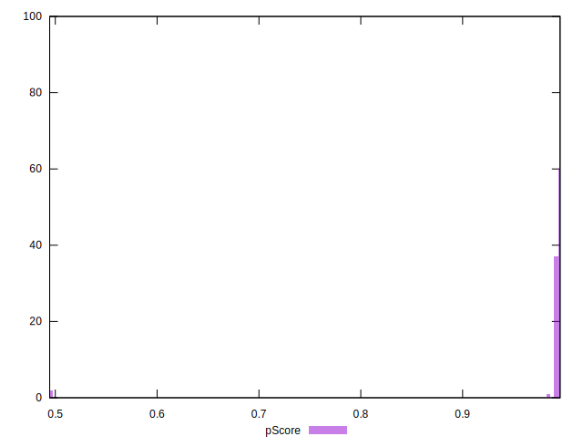
## Score Difference


```yaml
p90min: 0
p90max: 0
p90range: 0
p90mean: 0
p90median: 0
p90stdev: 0
p90skewness: .nan
p90eccentricity: .nan
p90discretization: 94
outlandishness: .nan
confidence: 0
p90confidence: 0

```


## P Score Difference


```yaml
p90min: -0.004656399016542689
p90max: 0.00393984337201303
p90range: 0.00859624238855572
p90mean: -0.001772866662694785
p90median: -0.004387120581338777
p90stdev: 0.0034707325867320378
p90skewness: 0.5957279225007934
p90eccentricity: 1.0000000000000004
p90discretization: 1
outlandishness: 0.9020444777050869
confidence: 0.0013925210182930902
p90confidence: 0.0014032508478375207

```

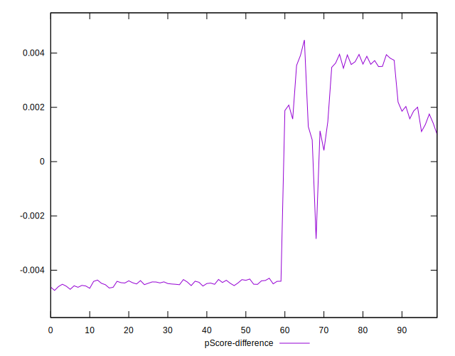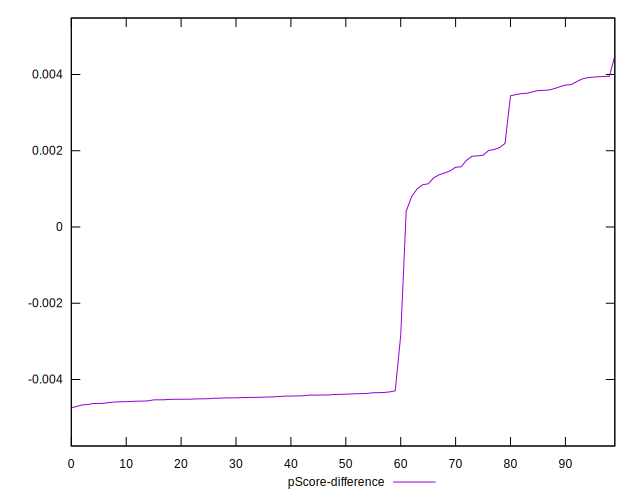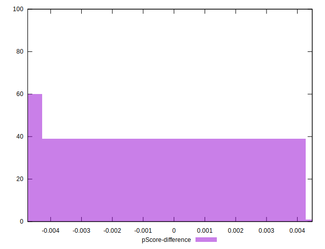