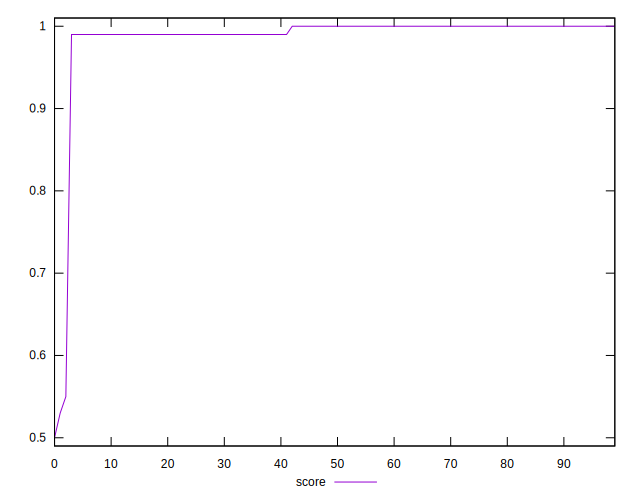
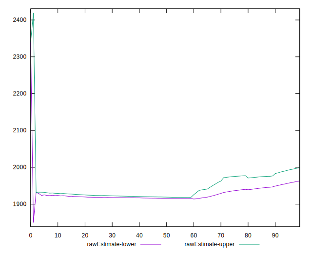

# //first-cpu-idle/samples/pages+cached+noadtech

[→ Parent](../..)


## Raw


```yaml
p90min: 1904.9456499999997
p90max: 2339.8430500000004
p90range: 434.89740000000074
p90mean: 1981.1966739361703
p90median: 1923.8332
p90stdev: 89.09304702649831
p90skewness: 1.3035994261705306
p90eccentricity: 0.9999999999999999
p90discretization: 1.010752688172043
outlandishness: 1.1325456223720118
confidence: 291.33674943464825
p90confidence: 36.021183036195175

```


## Score


```yaml
p90min: 0.99
p90max: 1
p90range: 0.010000000000000009
p90mean: 0.9958510638297858
p90median: 1
p90stdev: 0.004927036671025286
p90skewness: -0.3454668136699174
p90eccentricity: 1.0000000000000007
p90discretization: 47
outlandishness: 0.9721778832165455
confidence: 0.03147043073636826
p90confidence: 0.0019920487139727257

```


## Raw Estimate


## Score Estimate


## P Score


```yaml
p90min: 0.985633615084192
p90max: 0.9956968561392199
p90range: 0.010063241055027872
p90mean: 0.9943514202371868
p90median: 0.9954222081488204
p90stdev: 0.0017465455122106198
p90skewness: -1.8913009776146186
p90eccentricity: 1
p90discretization: 1.010752688172043
outlandishness: 0.972057232487549
confidence: 0.03132242200082454
p90confidence: 0.0007061452905261207

```


## Score Difference


```yaml
p90min: 0
p90max: 0
p90range: 0
p90mean: 0
p90median: 0
p90stdev: 0
p90skewness: .nan
p90eccentricity: .nan
p90discretization: 94
outlandishness: .nan
confidence: 0
p90confidence: 0

```


## P Score Difference


```yaml
p90min: -0.004680606201759363
p90max: 0.004169885225171588
p90range: 0.008850491426930951
p90mean: -0.0016272359737742421
p90median: -0.004382912450637155
p90stdev: 0.0035600282069432323
p90skewness: 0.5595274634963155
p90eccentricity: 1
p90discretization: 1.010752688172043
outlandishness: 0.8950419822480352
confidence: 0.001427642109873038
p90confidence: 0.0014393539331770686

```

