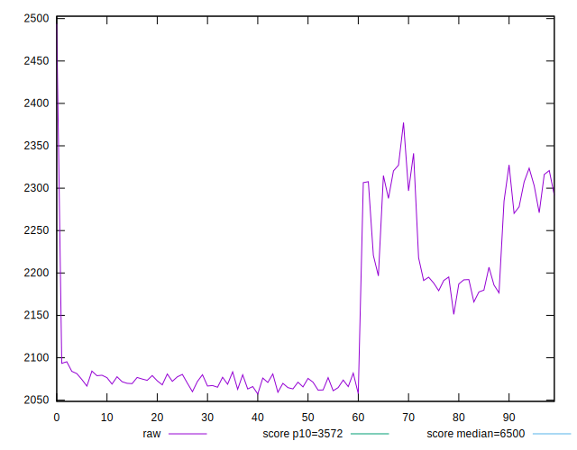

# //first-cpu-idle/samples/pages+cached

[→ Parent](../..)


## Raw


```yaml
p90min: 2059.9965
p90max: 2327.5119999999997
p90range: 267.5154999999995
p90mean: 2140.5729521276594
p90median: 2080.21175
p90stdev: 91.87433937868522
p90skewness: 0.8898337291388362
p90eccentricity: 1.0000000000000002
p90discretization: 1
outlandishness: 1.0050836181462417
confidence: 39.82643115361662
p90confidence: 37.14568651024851

```


## Score


```yaml
p90min: 0.99
p90max: 0.99
p90range: 0
p90mean: 0.9899999999999988
p90median: 0.99
p90stdev: 1.2212453270876722e-15
p90skewness: 1
p90eccentricity: 1
p90discretization: 94
outlandishness: 0.9995960004081211
confidence: 0.0005487899156712159
p90confidence: 4.937613307359355e-16

```


## Raw Estimate


## Score Estimate


## P Score


```yaml
p90min: 0.9860412842441211
p90max: 0.9930493908552018
p90range: 0.0070081066110807555
p90mean: 0.9910938589662069
p90median: 0.992634015495194
p90stdev: 0.002354956788597492
p90skewness: -1.0035237556266565
p90eccentricity: 1.0000000000000002
p90discretization: 1
outlandishness: 0.9996463512715015
confidence: 0.0010610726222393093
p90confidence: 0.0009521318706180377

```


## Score Difference


```yaml
p90min: 0
p90max: 0
p90range: 0
p90mean: 0
p90median: 0
p90stdev: 0
p90skewness: .nan
p90eccentricity: .nan
p90discretization: 94
outlandishness: .nan
confidence: 0
p90confidence: 0

```


## P Score Difference


```yaml
p90min: -0.003831237913226593
p90max: 0.0030636579245102435
p90range: 0.006894895837736836
p90mean: 0.0012088536805630282
p90median: 0.0026386872605911327
p90stdev: 0.0022469369621727882
p90skewness: -1.0626210468317452
p90eccentricity: 0.9999999999999999
p90discretization: 1
outlandishness: 0.8562438016668382
confidence: 0.0009404415694442044
p90confidence: 0.0009084584070982075

```

