# //first-cpu-idle/samples/pages

[→ Parent](../..)


## Raw


```yaml
p90min: 2323.8054999999995
p90max: 2872.197
p90range: 548.3915000000006
p90mean: 2464.4433127659577
p90median: 2472.699675
p90stdev: 92.45771712021848
p90skewness: 1.2285378643635956
p90eccentricity: 1.0000000000000007
p90discretization: 1
outlandishness: 1.0072498680186013
confidence: 48.21032566178713
p90confidence: 37.38155178939606

```

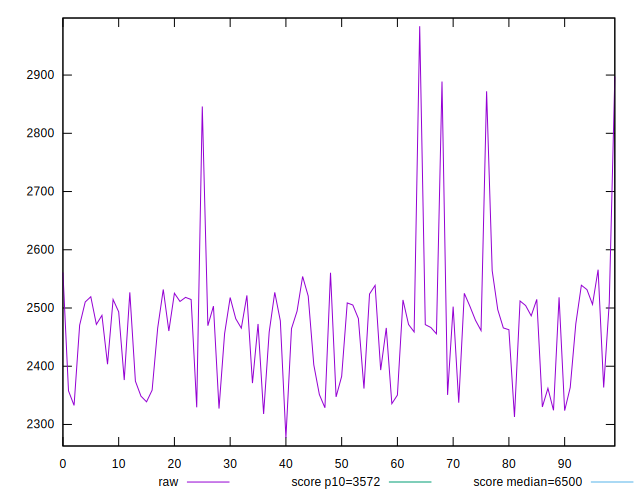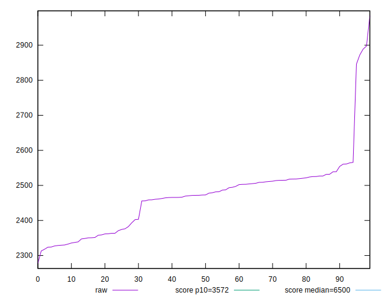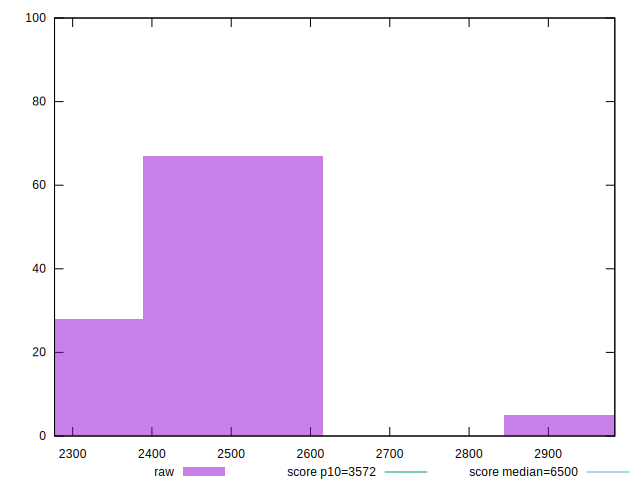
## Score


```yaml
p90min: 0.96
p90max: 0.99
p90range: 0.030000000000000027
p90mean: 0.981276595744681
p90median: 0.98
p90stdev: 0.004888989486415351
p90skewness: -0.8011528484325452
p90eccentricity: 0.9999999999999979
p90discretization: 31.333333333333332
outlandishness: 0.9990288568830208
confidence: 0.002581206341734793
p90confidence: 0.00197666586821105

```

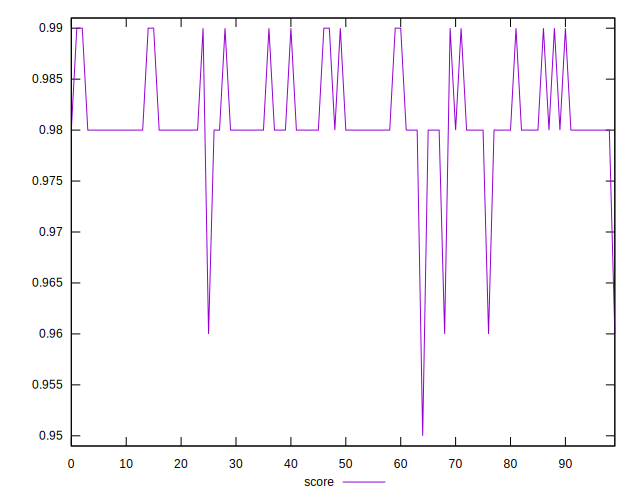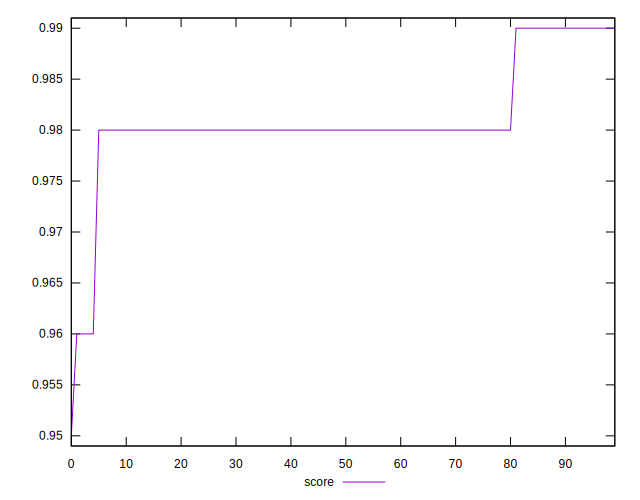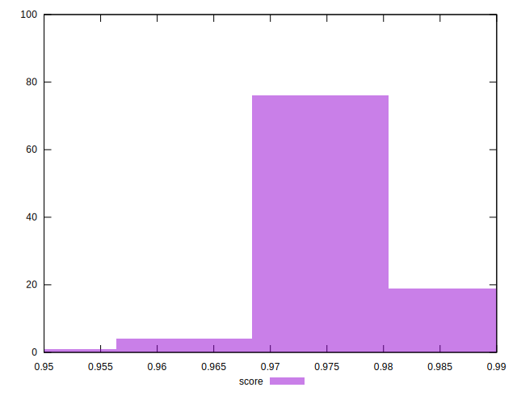
## Raw Estimate

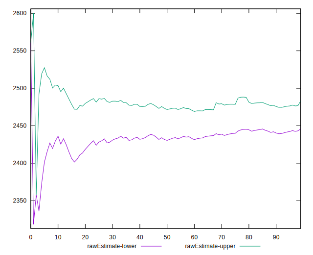
## Score Estimate

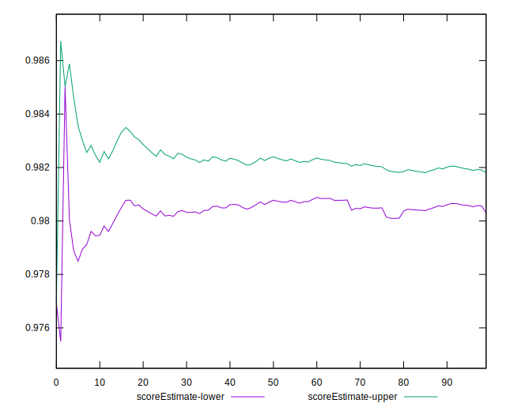
## P Score


```yaml
p90min: 0.9597952913312325
p90max: 0.9861622703642108
p90range: 0.026366979032978244
p90mean: 0.9808137974990835
p90median: 0.9807228804849549
p90stdev: 0.004070802947434376
p90skewness: -2.3101524160499367
p90eccentricity: 1.0000000000000007
p90discretization: 1
outlandishness: 0.998871985795362
confidence: 0.0023049071383575946
p90confidence: 0.0016458651148187108

```

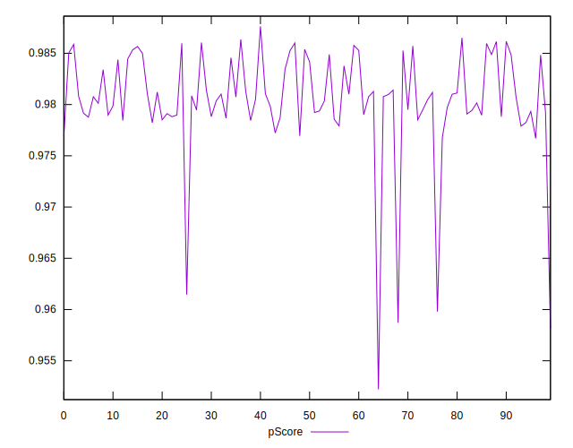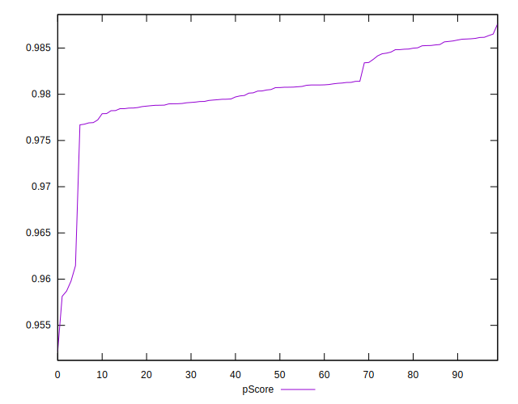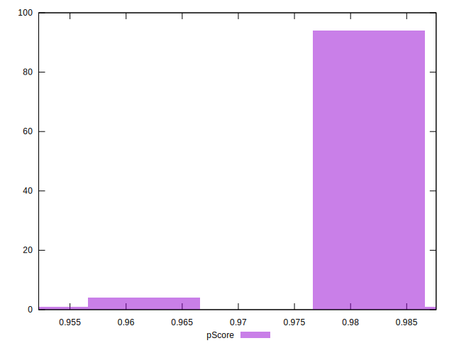
## Score Difference


```yaml
p90min: 0
p90max: 0
p90range: 0
p90mean: 0
p90median: 0
p90stdev: 0
p90skewness: .nan
p90eccentricity: .nan
p90discretization: 94
outlandishness: .inf
confidence: 4.330179641073933e-18
p90confidence: 0

```

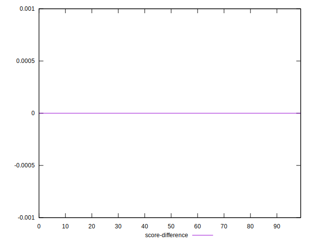
## P Score Difference


```yaml
p90min: -0.0047227979527983965
p90max: 0.004830731068190208
p90range: 0.009553529020988605
p90mean: -0.0005771173261455402
p90median: -0.0007230812587806223
p90stdev: 0.0023532127773904965
p90skewness: 0.28158333722361223
p90eccentricity: 0.9999999999999999
p90discretization: 1
outlandishness: 0.8740300690158213
confidence: 0.0010109269517633733
p90confidence: 0.0009514267499716906

```

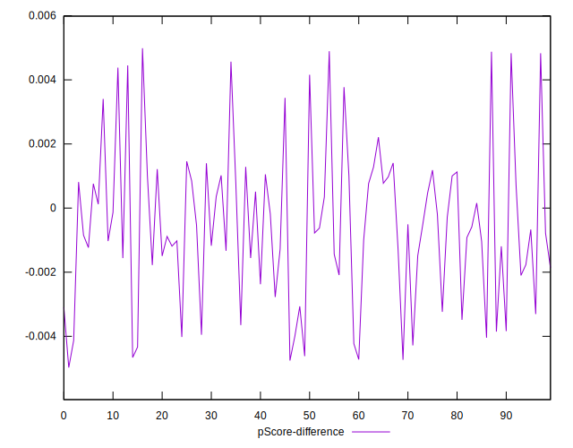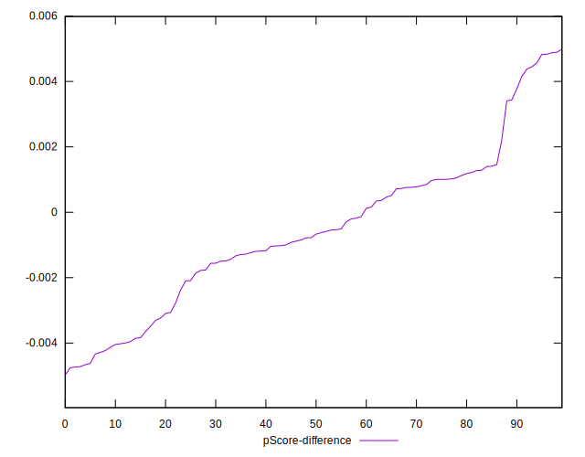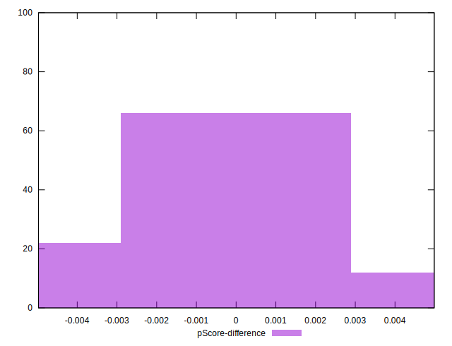