# //first-meaningful-paint/samples/pages+cached+noadtech

[→ Parent](../..)


## Raw


```yaml
p90min: 1904.9456499999997
p90max: 2144.9882500000003
p90range: 240.04260000000068
p90mean: 1976.5862202127655
p90median: 1923.8332
p90stdev: 79.07888388360996
p90skewness: 0.9172348722181705
p90eccentricity: 1.0000000000000002
p90discretization: 1.010752688172043
outlandishness: 1.0049638660345175
confidence: 35.01289005499869
p90confidence: 31.972359749042205

```

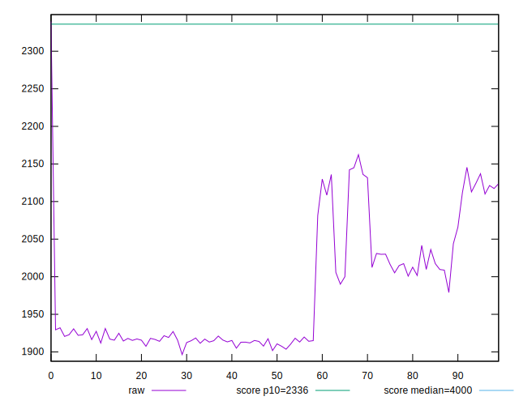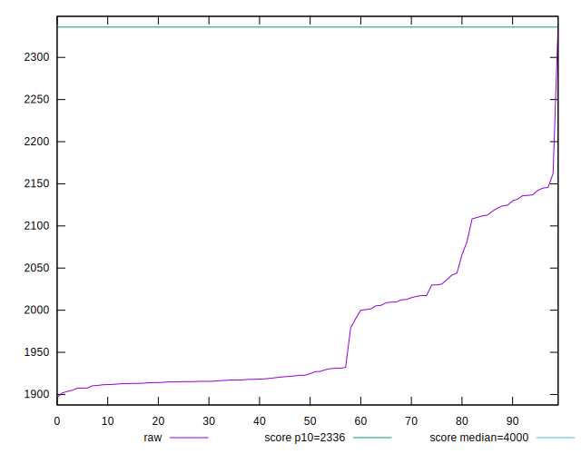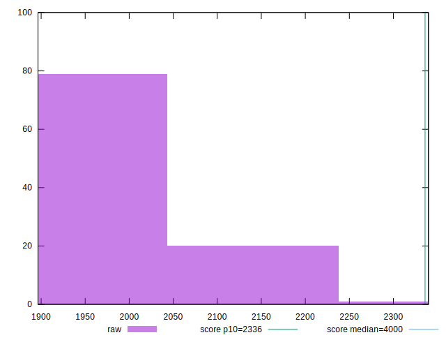
## Score


```yaml
p90min: 0.93
p90max: 0.96
p90range: 0.029999999999999916
p90mean: 0.9529787234042565
p90median: 0.96
p90stdev: 0.009981875834672234
p90skewness: -1.2640966319027769
p90eccentricity: 1.0000000000000018
p90discretization: 23.5
outlandishness: 0.9983663743596493
confidence: 0.004523399856584115
p90confidence: 0.0040357692152829935

```

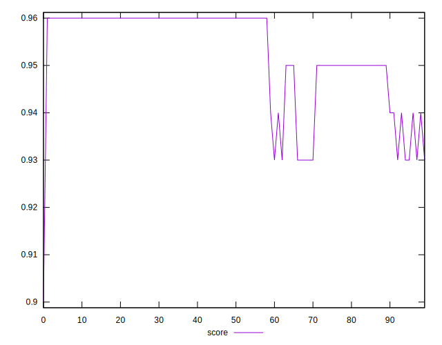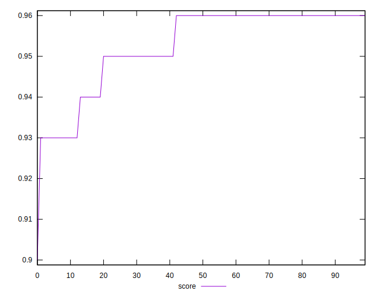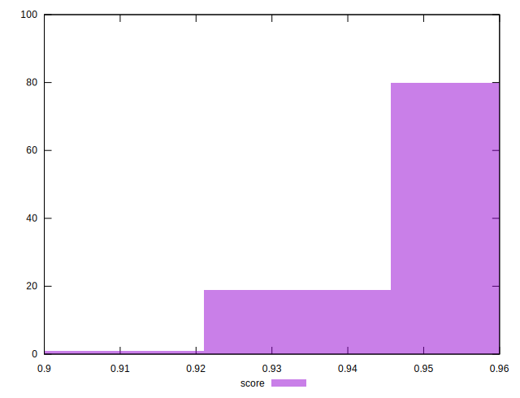
## Raw Estimate

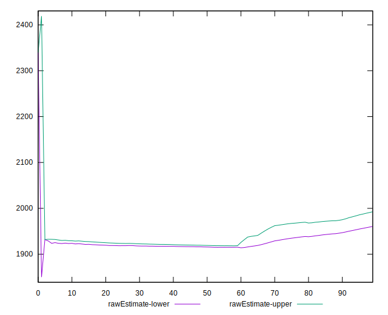
## Score Estimate

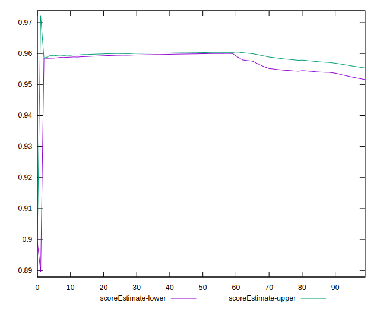
## P Score


```yaml
p90min: 0.9312030335728384
p90max: 0.9614355389006601
p90range: 0.030232505327821735
p90mean: 0.9529288070291726
p90median: 0.9594277803803848
p90stdev: 0.009798250048652481
p90skewness: -1.0093501337519781
p90eccentricity: 1.0000000000000004
p90discretization: 1.010752688172043
outlandishness: 0.9984715708919575
confidence: 0.004495840030604501
p90confidence: 0.003961527528988266

```

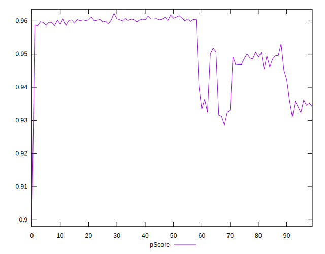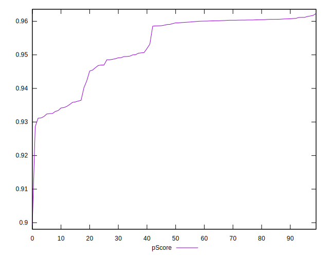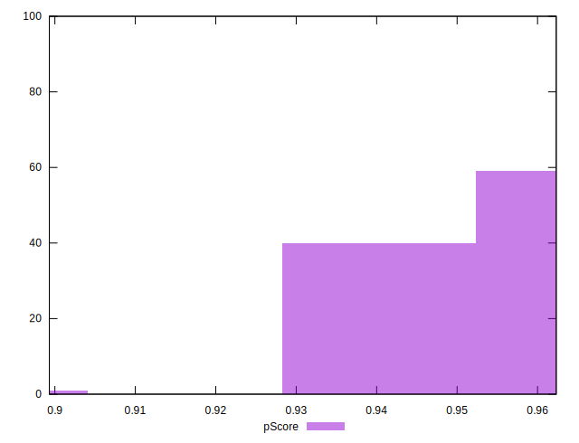
## Score Difference


```yaml
p90min: 0
p90max: 1.1102230246251565e-16
p90range: 1.1102230246251565e-16
p90mean: 3.0708296425802203e-17
p90median: 0
p90stdev: 4.966192006476451e-17
p90skewness: 0.9988681377244395
p90eccentricity: 1.0000000000000009
p90discretization: 47
outlandishness: 1.0992715976331358
confidence: 1.9747698583634158e-17
p90confidence: 2.0078795958675898e-17

```

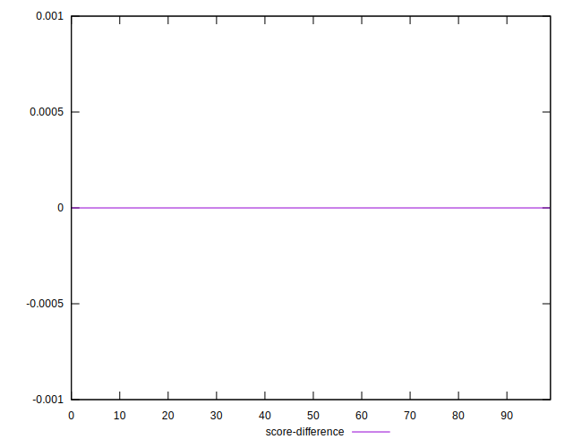
## P Score Difference


```yaml
p90min: -0.004158964539029419
p90max: 0.003401240838002084
p90range: 0.007560205377031504
p90mean: 0.000011509098433006989
p90median: 0.00021871554680774619
p90stdev: 0.0015170173964762835
p90skewness: -0.6235813477858596
p90eccentricity: 0.9999999999999997
p90discretization: 1.010752688172043
outlandishness: 0.000619620169016226
confidence: 0.0007234420268316929
p90confidence: 0.0006133448471159804

```

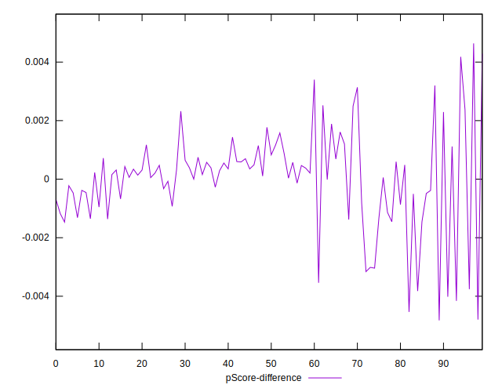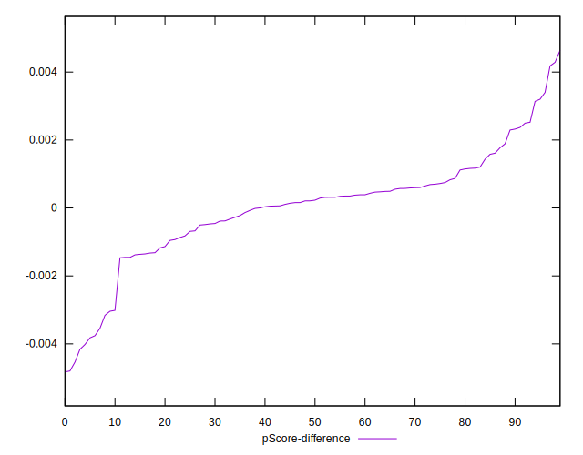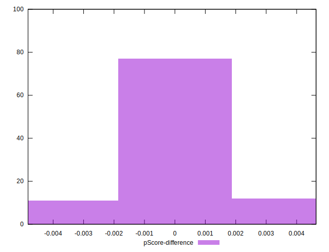