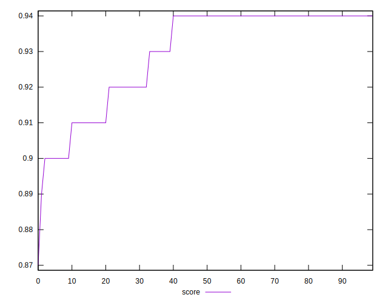

# //first-meaningful-paint/samples/pages+cached

[→ Parent](../..)


## Raw


```yaml
p90min: 2059.9965
p90max: 2327.5119999999997
p90range: 267.5154999999995
p90mean: 2140.450569148936
p90median: 2079.989
p90stdev: 91.96135789755981
p90skewness: 0.8892770033934976
p90eccentricity: 1
p90discretization: 1
outlandishness: 1.005090787759795
confidence: 39.85784070419436
p90confidence: 37.180868941431804

```


## Score


```yaml
p90min: 0.9
p90max: 0.94
p90range: 0.039999999999999925
p90mean: 0.9302127659574467
p90median: 0.94
p90stdev: 0.01368169482193424
p90skewness: -1.0103540206883612
p90eccentricity: 0.9999999999999999
p90discretization: 18.8
outlandishness: 0.9978236922309401
confidence: 0.0060646239234476524
p90confidence: 0.005531641916789285

```


## Raw Estimate


## Score Estimate


## P Score


```yaml
p90min: 0.9015136681885355
p90max: 0.9430773959985823
p90range: 0.0415637278100468
p90mean: 0.9311403486813706
p90median: 0.9403988475830414
p90stdev: 0.014105487183707154
p90skewness: -0.9574089709113816
p90eccentricity: 1.0000000000000002
p90discretization: 1
outlandishness: 0.9979497593376097
confidence: 0.006240454733134645
p90confidence: 0.005702985279063371

```


## Score Difference


```yaml
p90min: 0
p90max: 1.1102230246251565e-16
p90range: 1.1102230246251565e-16
p90mean: 6.732203447195099e-17
p90median: 1.1102230246251565e-16
p90stdev: 5.4240123046452285e-17
p90skewness: -0.4355035563093444
p90eccentricity: 1.0000000000000036
p90discretization: 47
outlandishness: 0.9790581717451521
confidence: 2.1320330729125695e-17
p90confidence: 2.1929807828672678e-17

```


## P Score Difference


```yaml
p90min: -0.00480573228891823
p90max: 0.004228350885914778
p90range: 0.009034083174833007
p90mean: 0.0010601063624957926
p90median: 0.001455495865373524
p90stdev: 0.0019712706046641697
p90skewness: -1.0419272549357685
p90eccentricity: 0.9999999999999994
p90discretization: 1
outlandishness: 0.8638986312181036
confidence: 0.000886371126731961
p90confidence: 0.0007970038250387814

```

