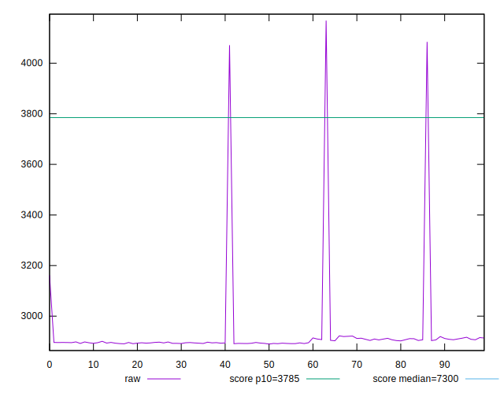
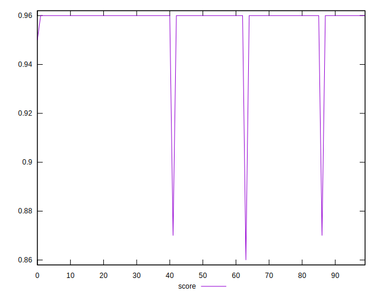
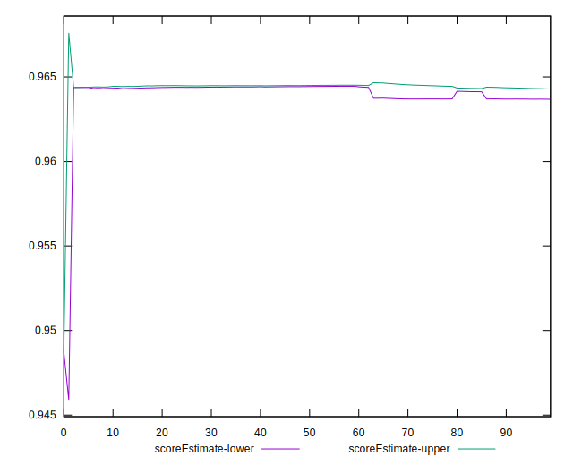

# //interactive/samples/pages+cached+noadtech+nomedia+nocss

[→ Parent](../..)


## Raw


```yaml
p90min: 2891.13785
p90max: 3161.7035
p90range: 270.56565
p90mean: 2903.411510106382
p90median: 2896.0587
p90stdev: 28.161365795043842
p90skewness: 8.201526240867507
p90eccentricity: 1.0000000000000002
p90discretization: 1
outlandishness: 1.0247726017545222
confidence: 81.33047067203626
p90confidence: 11.385913331158296

```


## Score


```yaml
p90min: 0.95
p90max: 0.96
p90range: 0.010000000000000009
p90mean: 0.9598936170212753
p90median: 0.96
p90stdev: 0.0010259202937226556
p90skewness: -9.539955591516541
p90eccentricity: 1.0000000000000038
p90discretization: 47
outlandishness: 0.9941877895971117
confidence: 0.006254588719206152
p90confidence: 0.0004147895252672149

```


## Raw Estimate


## Score Estimate


## P Score


```yaml
p90min: 0.9487262026619598
p90max: 0.964632567149722
p90range: 0.01590636448776217
p90mean: 0.9639654098958793
p90median: 0.9643731958518618
p90stdev: 0.001646591724731913
p90skewness: -8.426021760260179
p90eccentricity: 0.9999999999999996
p90discretization: 1
outlandishness: 0.994142245039923
confidence: 0.006388813945496799
p90confidence: 0.0006657330047855669

```


## Score Difference


```yaml
p90min: 0
p90max: 0
p90range: 0
p90mean: 0
p90median: 0
p90stdev: 0
p90skewness: .nan
p90eccentricity: .nan
p90discretization: 94
outlandishness: .inf
confidence: 4.330179641073934e-18
p90confidence: 0

```


## P Score Difference


```yaml
p90min: 0.002887016399639619
p90max: 0.004632567149722044
p90range: 0.0017455507500824252
p90mean: 0.0041160568505358005
p90median: 0.004373195851861744
p90stdev: 0.00047997181762538226
p90skewness: -0.7962329967275713
p90eccentricity: 0.9999999999999999
p90discretization: 1
outlandishness: 0.9623966491273591
confidence: 0.00030424146164312896
p90confidence: 0.00019405726116603682

```

