# //interactive/samples/pages+cached+noadtech+nomedia

[→ Parent](../..)


## Raw


```yaml
p90min: 3589.4289999999996
p90max: 3906.3815
p90range: 316.9525000000003
p90mean: 3758.227967431059
p90median: 3737.35455
p90stdev: 65.6905575288646
p90skewness: 0.23295593996338396
p90eccentricity: 1.0000000000000002
p90discretization: 1
outlandishness: 1.0240369372935807
confidence: 132.40115748167833
p90confidence: 26.559329548950807

```

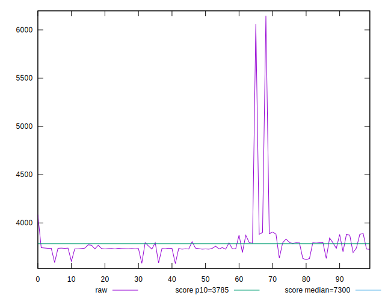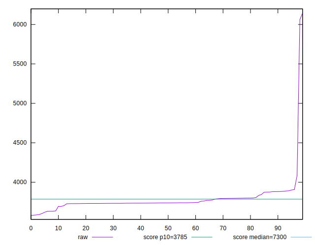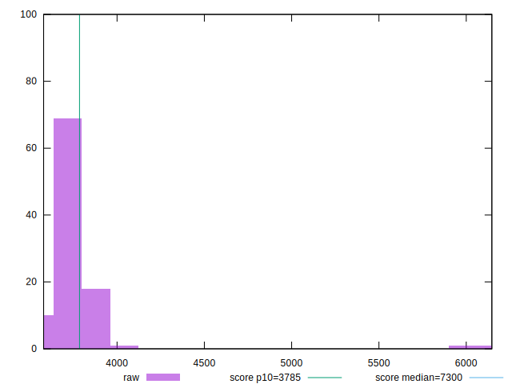
## Score


```yaml
p90min: 0.89
p90max: 0.92
p90range: 0.030000000000000027
p90mean: 0.9005319148936167
p90median: 0.9
p90stdev: 0.006078742394536876
p90skewness: 0.5419733382140347
p90eccentricity: 1.000000000000001
p90discretization: 23.5
outlandishness: 0.9888557943151489
confidence: 0.014878953990002223
p90confidence: 0.0024576945085104944

```

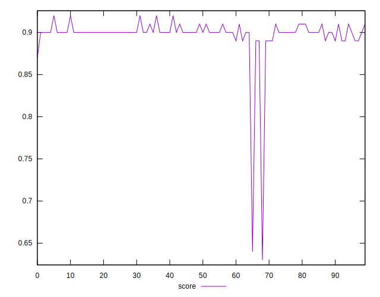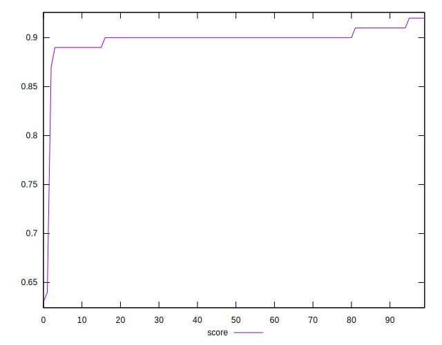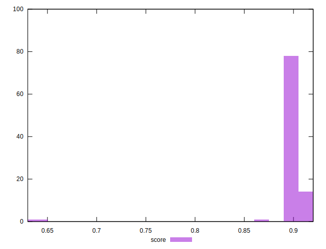
## Raw Estimate

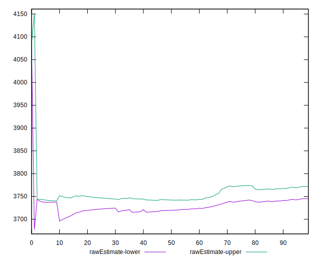
## Score Estimate

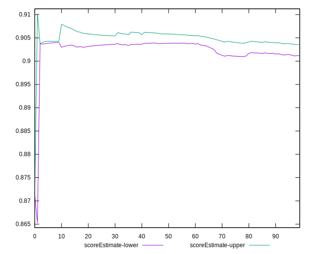
## P Score


```yaml
p90min: 0.888760529924961
p90max: 0.9169834750592476
p90range: 0.02822294513428658
p90mean: 0.9023307628545203
p90median: 0.9042692316198494
p90stdev: 0.00589574193442562
p90skewness: -0.33067655931653195
p90eccentricity: 1.0000000000000002
p90discretization: 1
outlandishness: 0.9885770447634342
confidence: 0.01485319140195333
p90confidence: 0.002383705647545677

```

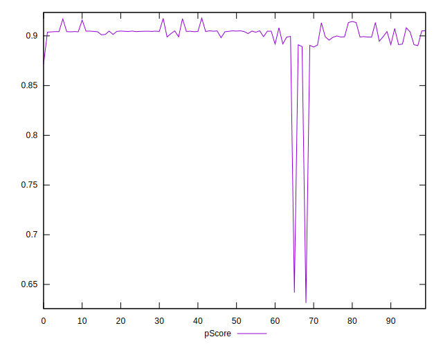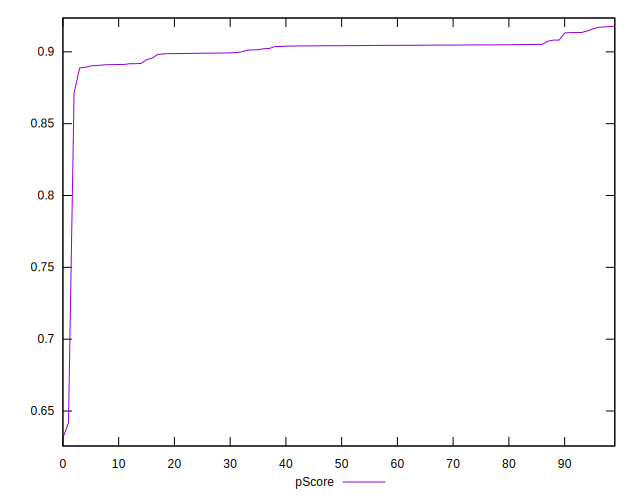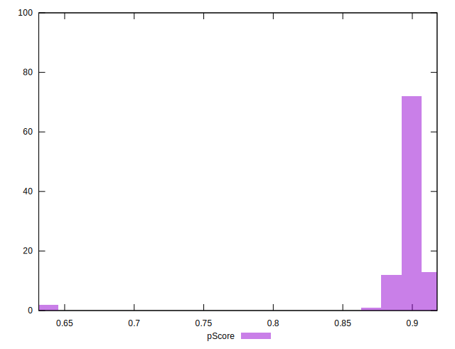
## Score Difference


```yaml
p90min: 0
p90max: 0
p90range: 0
p90mean: 0
p90median: 0
p90stdev: 0
p90skewness: .nan
p90eccentricity: .nan
p90discretization: 94
outlandishness: .nan
confidence: 0
p90confidence: 0

```


## P Score Difference


```yaml
p90min: -0.0049281827234285425
p90max: 0.0048466116992255115
p90range: 0.009774794422654054
p90mean: 0.001769868775821044
p90median: 0.002248418107600625
p90stdev: 0.0028899993785520637
p90skewness: -0.6097934131723584
p90eccentricity: 0.9999999999999997
p90discretization: 1
outlandishness: 0.8821582244907555
confidence: 0.0012075105748202916
p90confidence: 0.0011684547791743177

```

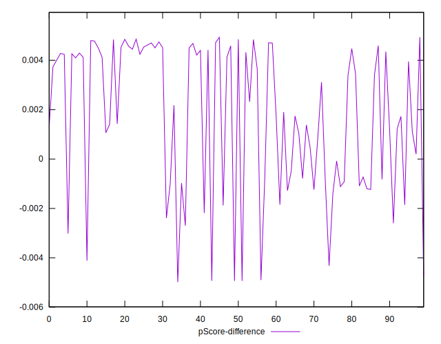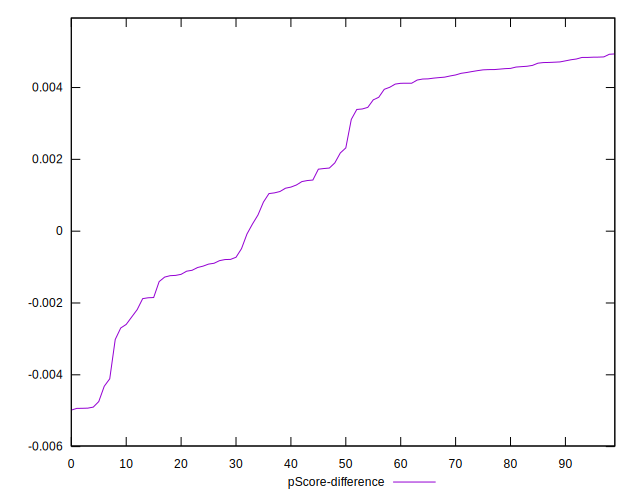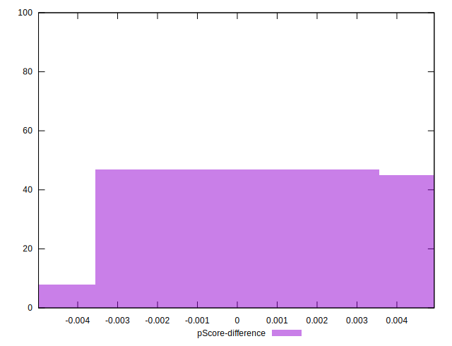