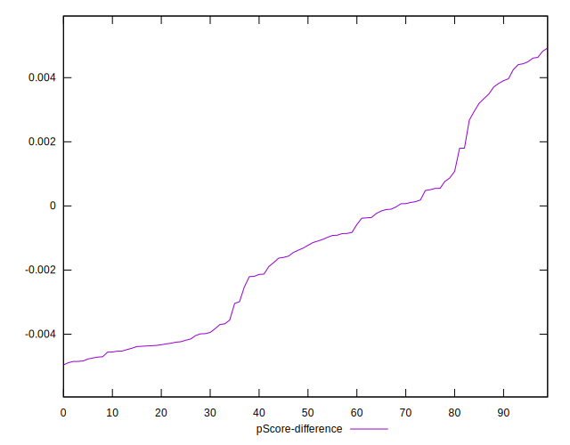

# //interactive/samples/pages+cached+noadtech

[→ Parent](../..)


## Raw


```yaml
p90min: 4274.682000000001
p90max: 6344.367499999999
p90range: 2069.6854999999987
p90mean: 4385.988827659575
p90median: 4337.355625
p90stdev: 213.38386079191648
p90skewness: 8.25547426097139
p90eccentricity: 1.0000000000000002
p90discretization: 1
outlandishness: 1.0281928926846906
confidence: 169.61442192243268
p90confidence: 86.27316455199383

```


## Score


```yaml
p90min: 0.61
p90max: 0.85
p90range: 0.24
p90mean: 0.8409574468085115
p90median: 0.85
p90stdev: 0.02539346326242125
p90skewness: -8.036139394748869
p90eccentricity: 0.9999999999999997
p90discretization: 18.8
outlandishness: 0.9823430275956457
confidence: 0.02021235131252232
p90confidence: 0.010266823491024167

```


## Raw Estimate


## Score Estimate


## P Score


```yaml
p90min: 0.6078637746146736
p90max: 0.8517967779442772
p90range: 0.24393300332960366
p90mean: 0.8396263912802548
p90median: 0.8451309776937205
p90stdev: 0.025076535138417184
p90skewness: -8.42368576849211
p90eccentricity: 1
p90discretization: 1
outlandishness: 0.9826704093811035
confidence: 0.020005670217017872
p90confidence: 0.010138686376568165

```


## Score Difference


```yaml
p90min: 0
p90max: 1.1102230246251565e-16
p90range: 1.1102230246251565e-16
p90mean: 1.1810883240693155e-17
p90median: 0
p90stdev: 3.423119174922781e-17
p90skewness: 2.5532425695667236
p90eccentricity: 1.0000000000000036
p90discretization: 47
outlandishness: 1.4932839999999998
confidence: 1.4635906249893457e-17
p90confidence: 1.3840002836352562e-17

```


## P Score Difference


```yaml
p90min: -0.004848016555624501
p90max: 0.004609080713755542
p90range: 0.009457097269380044
p90mean: -0.0012525712366274625
p90median: -0.0012716897917980363
p90stdev: 0.002811279666529973
p90skewness: 0.5027764629384316
p90eccentricity: 1.0000000000000002
p90discretization: 1
outlandishness: 0.888375877163026
confidence: 0.0011706944536659272
p90confidence: 0.0011366276360925355

```

