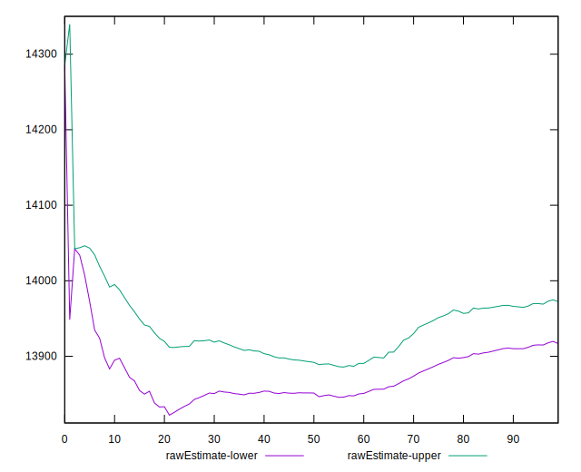

# //interactive/samples/pages+cached

[→ Parent](../..)


## Raw


```yaml
p90min: 13686.475449999998
p90max: 14319.315999999995
p90range: 632.8405499999972
p90mean: 13944.522494680856
p90median: 13907.859925
p90stdev: 137.2842997300986
p90skewness: 0.7672402213248947
p90eccentricity: 1.0000000000000002
p90discretization: 1
outlandishness: 1.0010870163990857
confidence: 67.70588613555559
p90confidence: 55.50537391658591

```


## Score


```yaml
p90min: 0.09
p90max: 0.11
p90range: 0.020000000000000004
p90mean: 0.10372340425531905
p90median: 0.1
p90stdev: 0.005049550760130134
p90skewness: 0.27884691978889337
p90eccentricity: 1
p90discretization: 31.333333333333332
outlandishness: 0.9937738241683104
confidence: 0.002300433365996118
p90confidence: 0.0020415823484756057

```


## Raw Estimate


## Score Estimate


## P Score


```yaml
p90min: 0.0943326168501516
p90max: 0.11003445253029293
p90range: 0.01570183568014133
p90mean: 0.1033908666553864
p90median: 0.10425872569328021
p90stdev: 0.003409953667250424
p90skewness: -0.6977446889251055
p90eccentricity: 1.0000000000000002
p90discretization: 1
outlandishness: 0.9969558695421908
confidence: 0.0016527841565624308
p90confidence: 0.0013786773411895977

```


## Score Difference


```yaml
p90min: 0
p90max: 0
p90range: 0
p90mean: 0
p90median: 0
p90stdev: 0
p90skewness: .nan
p90eccentricity: .nan
p90discretization: 94
outlandishness: .nan
confidence: 0
p90confidence: 0

```


## P Score Difference


```yaml
p90min: -0.0045826569810843015
p90max: 0.004620052177554318
p90range: 0.00920270915863862
p90mean: -0.00017909253152274552
p90median: -0.00010166493984766628
p90stdev: 0.0032288056440472855
p90skewness: 0.13049850018697778
p90eccentricity: 0.9999999999999997
p90discretization: 1
outlandishness: 0.8655739338067969
confidence: 0.0013095145131196962
p90confidence: 0.0013054374384337242

```

