# //interactive/samples/pages

[→ Parent](../..)


## Raw


```yaml
p90min: 14031.446
p90max: 14330.179
p90range: 298.7330000000002
p90mean: 14155.734874999998
p90median: 14141.506000000001
p90stdev: 75.90316119106122
p90skewness: 0.47374642627039054
p90eccentricity: 1.0000000000000009
p90discretization: 1
outlandishness: 1.0009963210188588
confidence: 42.99988282727761
p90confidence: 30.688384262756795

```

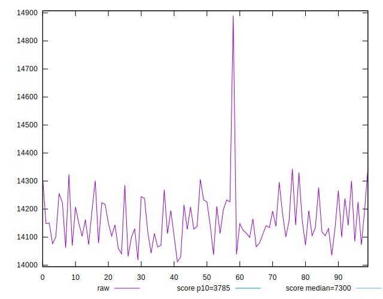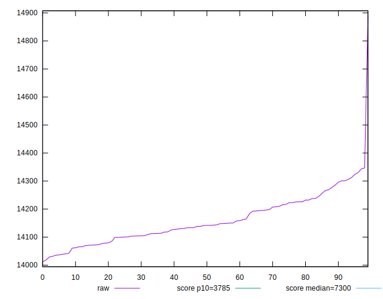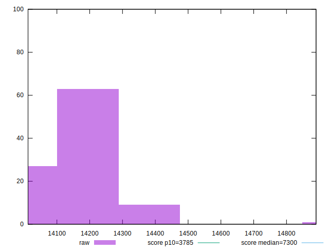
## Score


```yaml
p90min: 0.09
p90max: 0.1
p90range: 0.010000000000000009
p90mean: 0.099255319148936
p90median: 0.1
p90stdev: 0.0026253112083517182
p90skewness: -3.241763593892231
p90eccentricity: 1.000000000000003
p90discretization: 47
outlandishness: 0.9928531154328198
confidence: 0.0013459687885829124
p90confidence: 0.0010614387847222872

```

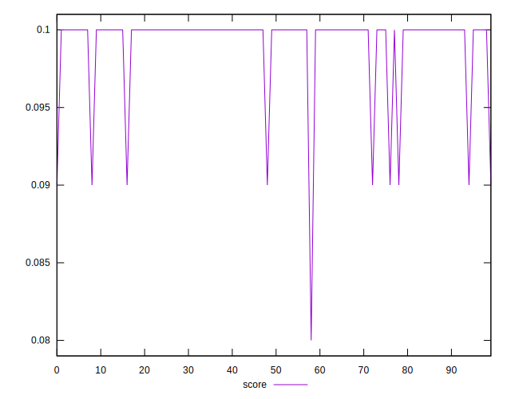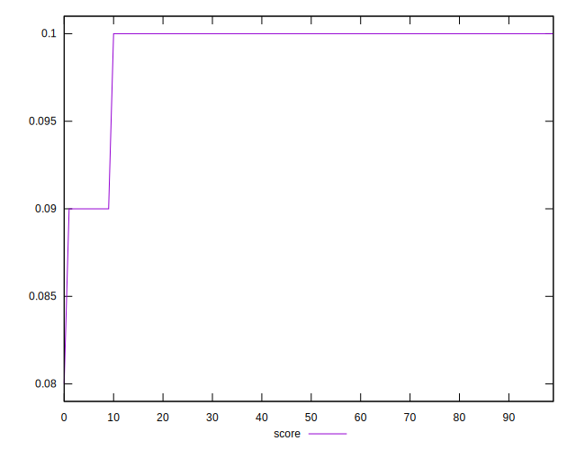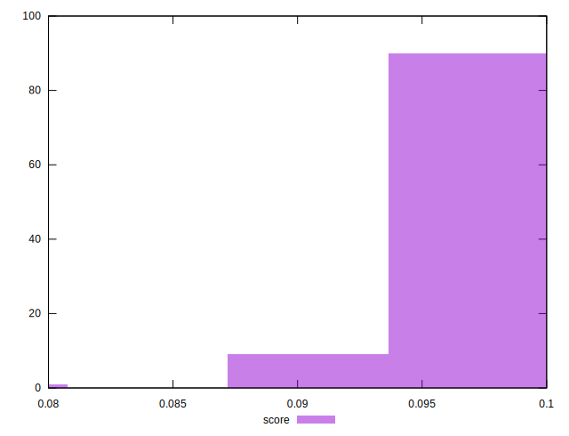
## Raw Estimate

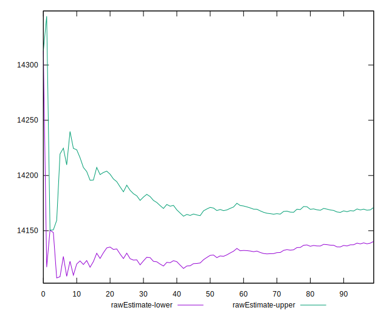
## Score Estimate

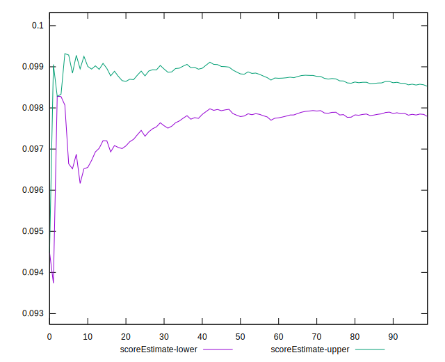
## P Score


```yaml
p90min: 0.0940840736170841
p90max: 0.10116988652441844
p90range: 0.0070858129073343434
p90mean: 0.09817476871761516
p90median: 0.09849785932389168
p90stdev: 0.0018034874760361574
p90skewness: -0.44136124742246796
p90eccentricity: 0.9999999999999999
p90discretization: 1
outlandishness: 0.9969384452611277
confidence: 0.0009856563501132937
p90confidence: 0.0007291674787872322

```

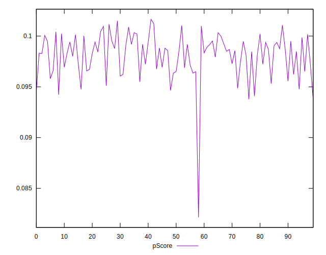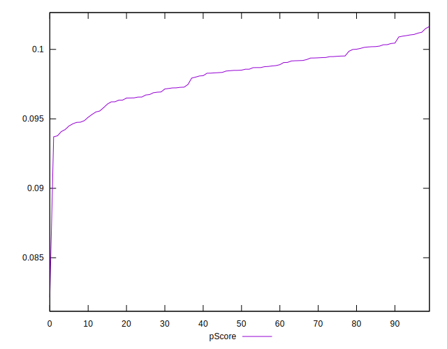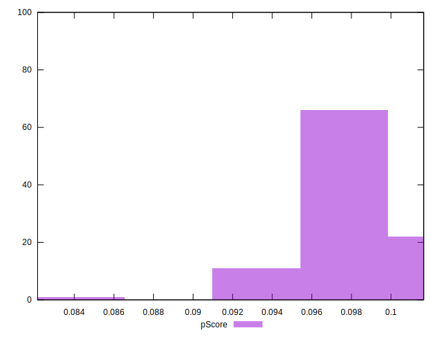
## Score Difference


```yaml
p90min: 0
p90max: 0
p90range: 0
p90mean: 0
p90median: 0
p90stdev: 0
p90skewness: .nan
p90eccentricity: .nan
p90discretization: 94
outlandishness: .nan
confidence: 0
p90confidence: 0

```


## P Score Difference


```yaml
p90min: -0.004439844509580099
p90max: 0.0046421564213573185
p90range: 0.009082000930937417
p90mean: -0.0009346520823656403
p90median: -0.0011336495956618953
p90stdev: 0.0020030490450159075
p90skewness: 0.7407781534959893
p90eccentricity: 1.0000000000000007
p90discretization: 1
outlandishness: 0.8776907192505684
confidence: 0.0008918384894776259
p90confidence: 0.0008098521566956199

```

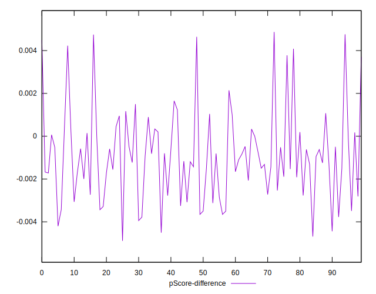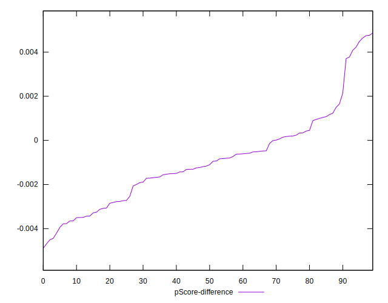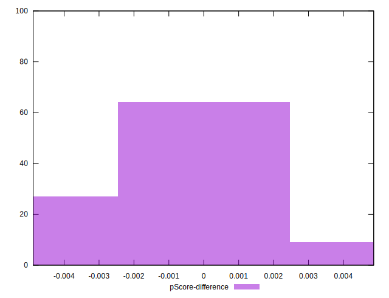