# //largest-contentful-paint/samples/pages+cached+noadtech+nomedia+nocss

[→ Parent](../..)


## Raw


```yaml
p90min: 4199.715100000001
p90max: 4240.595499999999
p90range: 40.88039999999819
p90mean: 4213.040692021276
p90median: 4207.710375
p90stdev: 11.306685430687708
p90skewness: 0.6625272182425406
p90eccentricity: 1
p90discretization: 1
outlandishness: 0.9959774419137607
confidence: 38.92186335263746
p90confidence: 4.571402584427814

```

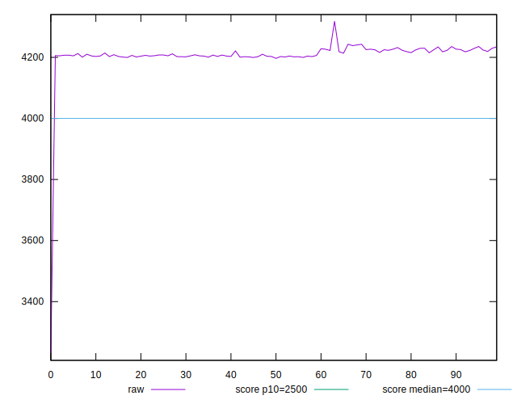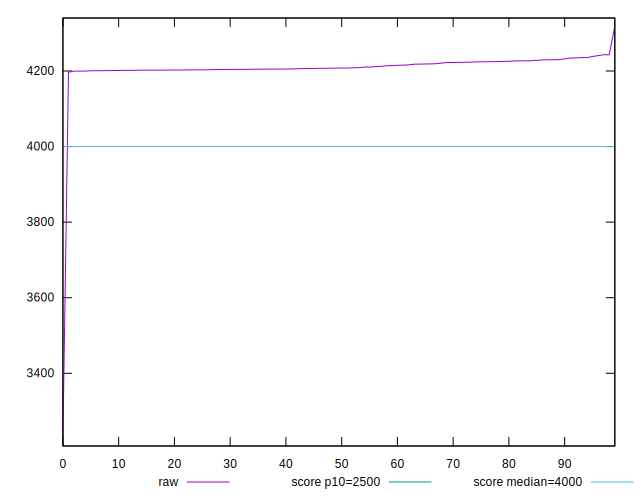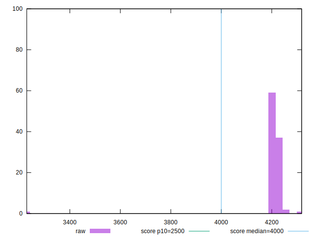
## Score


```yaml
p90min: 0.44
p90max: 0.45
p90range: 0.010000000000000009
p90mean: 0.44521276595744624
p90median: 0.45
p90stdev: 0.004995471013563365
p90skewness: -0.08518354200008187
p90eccentricity: 0.999999999999998
p90discretization: 47
outlandishness: 1.0112044480643585
confidence: 0.010945727672628107
p90confidence: 0.0020197173824131787

```

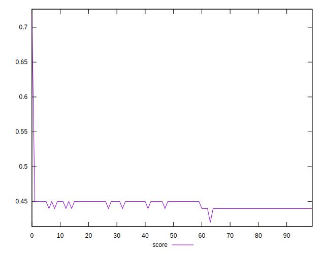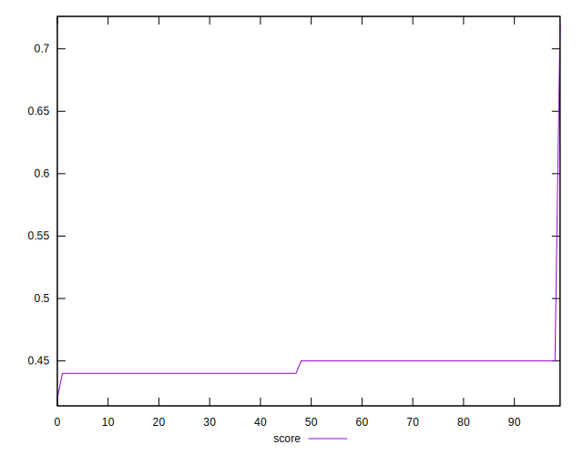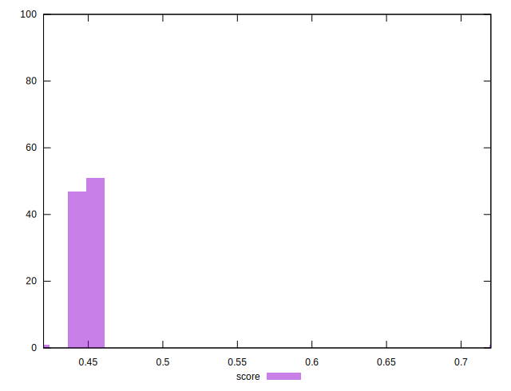
## Raw Estimate

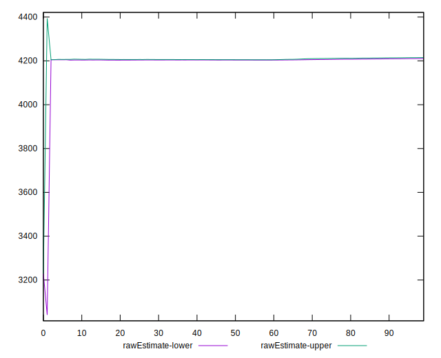
## Score Estimate

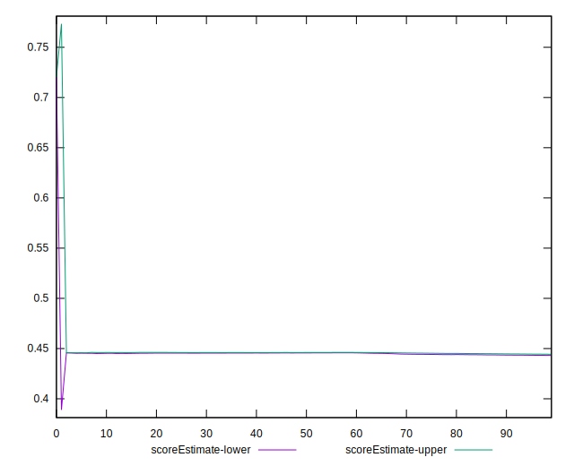
## P Score


```yaml
p90min: 0.43673048981919754
p90max: 0.44715580958378426
p90range: 0.010425319764586716
p90mean: 0.44374741349471675
p90median: 0.44510577893894354
p90stdev: 0.0028866703843145563
p90skewness: -0.6587879347351165
p90eccentricity: 1.0000000000000002
p90discretization: 1
outlandishness: 1.0109552301553593
confidence: 0.010912252560946302
p90confidence: 0.0011671088345158078

```

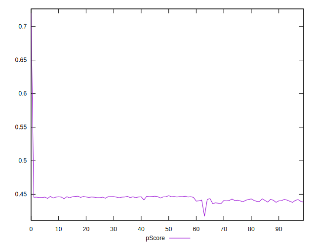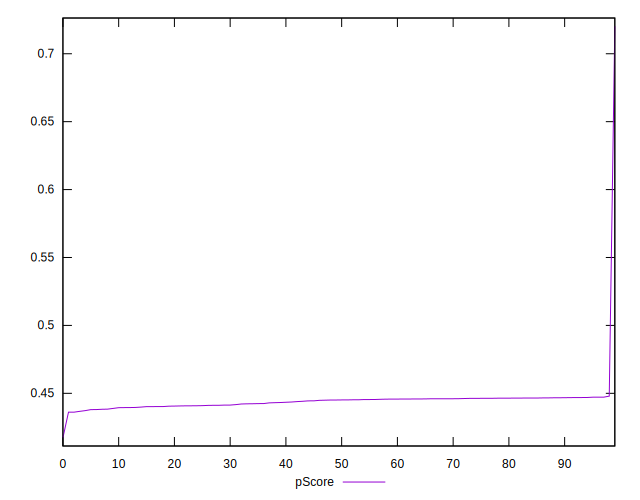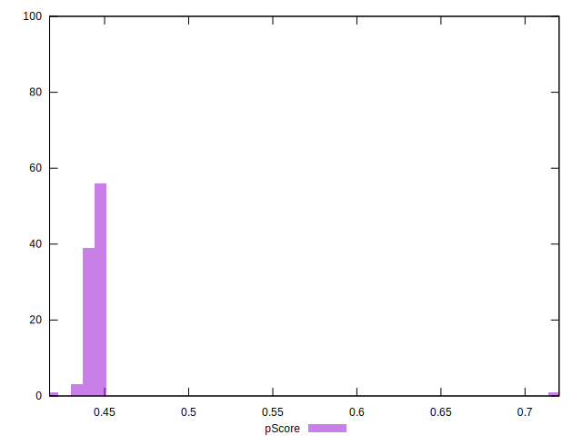
## Score Difference


```yaml
p90min: 0
p90max: 0
p90range: 0
p90mean: 0
p90median: 0
p90stdev: 0
p90skewness: .nan
p90eccentricity: .nan
p90discretization: 94
outlandishness: .nan
confidence: 0
p90confidence: 0

```


## P Score Difference


```yaml
p90min: -0.004848287520234695
p90max: 0.004441268179675828
p90range: 0.009289555699910523
p90mean: -0.0016208167656425088
p90median: -0.0029639937713295816
p90stdev: 0.0026558477942451113
p90skewness: 0.6649246177976794
p90eccentricity: 1.0000000000000007
p90discretization: 1
outlandishness: 0.889365030679552
confidence: 0.0011200534592584355
p90confidence: 0.0010737850225767322

```

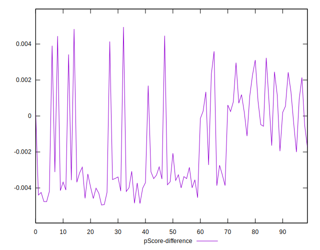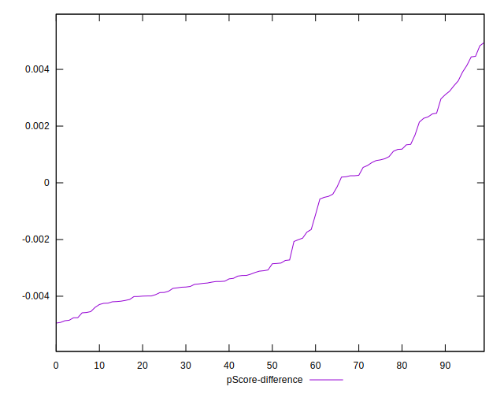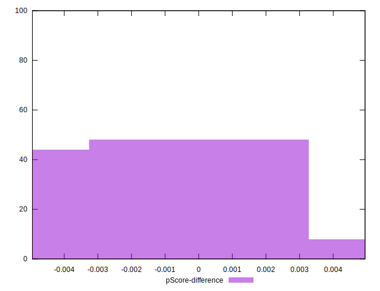