# //largest-contentful-paint/samples/pages+cached+noadtech+nomedia

[→ Parent](../..)


## Raw


```yaml
p90min: 6745.673499999999
p90max: 7335.876
p90range: 590.2025000000012
p90mean: 7011.644795303962
p90median: 6947.95415
p90stdev: 146.53391843649342
p90skewness: 0.7492957529437095
p90eccentricity: 1.0000000000000002
p90discretization: 1
outlandishness: 1.0018701821283424
confidence: 69.23378147362251
p90confidence: 59.24508447266293

```

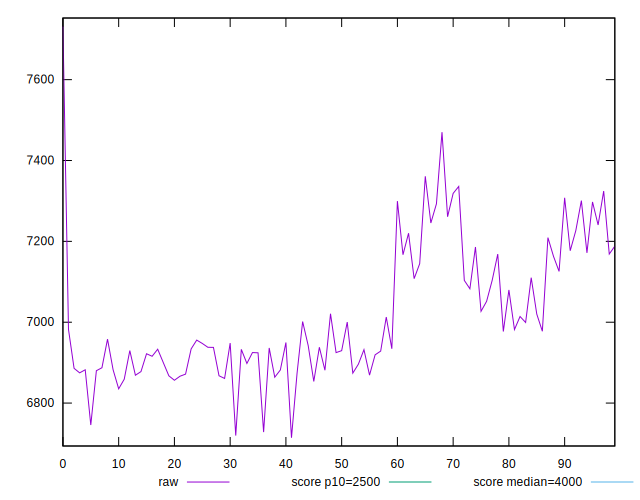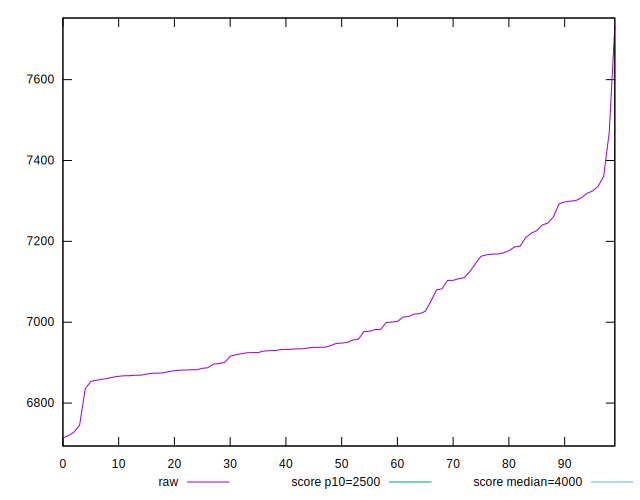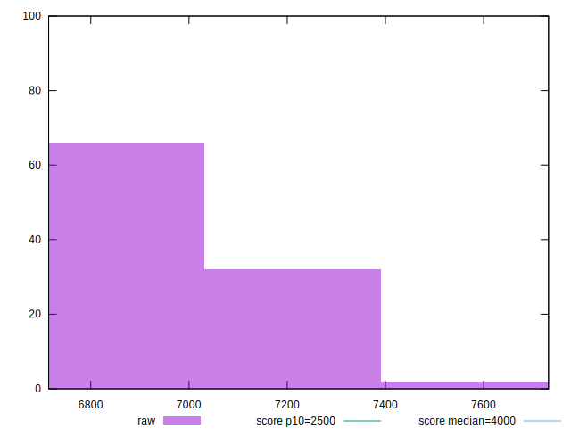
## Score


```yaml
p90min: 0.05
p90max: 0.08
p90range: 0.03
p90mean: 0.06393617021276582
p90median: 0.07
p90stdev: 0.007609915858620441
p90skewness: -0.6521008074753478
p90eccentricity: 1.000000000000001
p90discretization: 23.5
outlandishness: 0.9957449685908957
confidence: 0.003407407392676419
p90confidence: 0.0030767627910613746

```

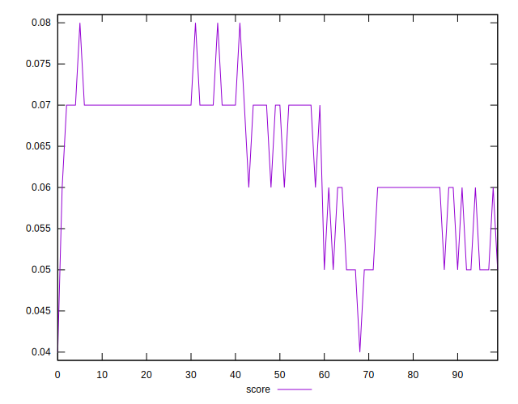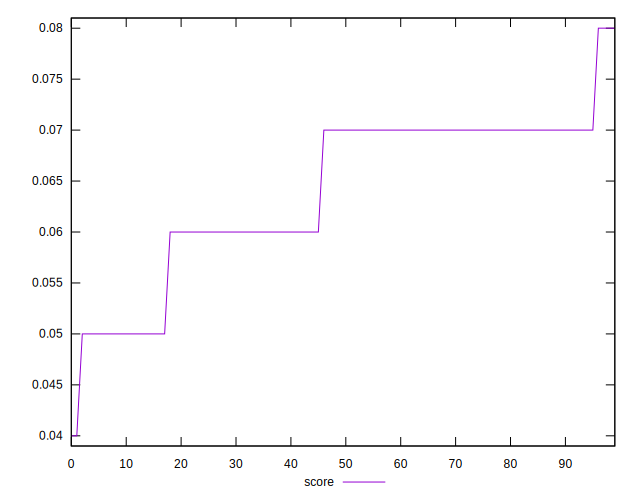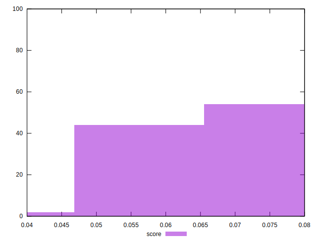
## Raw Estimate

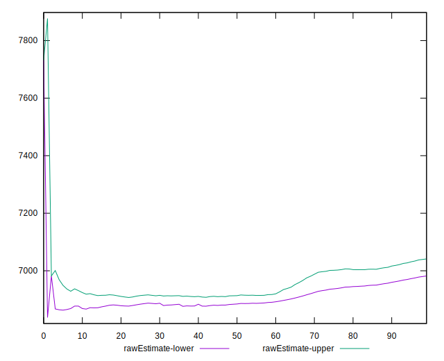
## Score Estimate

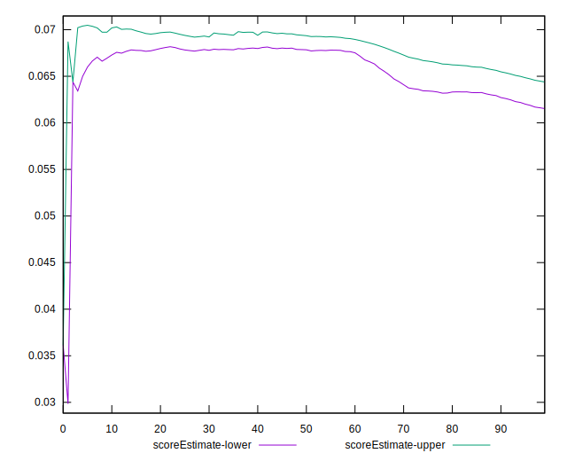
## P Score


```yaml
p90min: 0.04909561796282852
p90max: 0.07708092056294857
p90range: 0.027985302600120054
p90mean: 0.06332757486404983
p90median: 0.06609182570079691
p90stdev: 0.006798966459593732
p90skewness: -0.6204723989945441
p90eccentricity: 0.9999999999999997
p90discretization: 1
outlandishness: 0.9950437239398093
confidence: 0.0031286443946843337
p90confidence: 0.002748888083546371

```

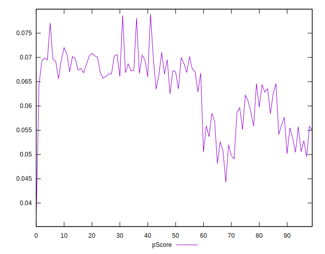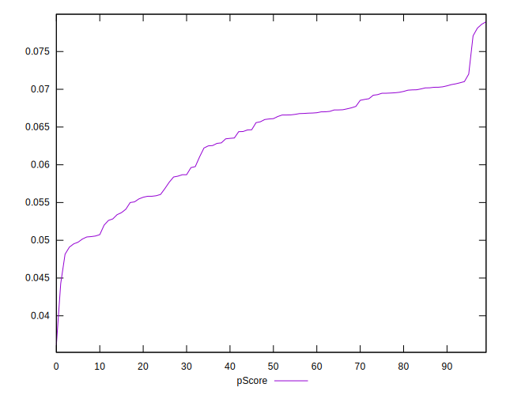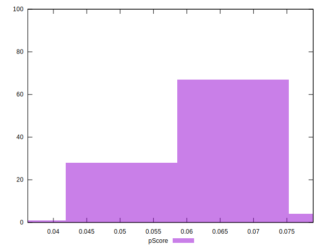
## Score Difference


```yaml
p90min: 0
p90max: 0
p90range: 0
p90mean: 0
p90median: 0
p90stdev: 0
p90skewness: .nan
p90eccentricity: .nan
p90discretization: 94
outlandishness: .nan
confidence: 0
p90confidence: 0

```


## P Score Difference


```yaml
p90min: -0.004301918909523639
p90max: 0.004404510373892612
p90range: 0.00870642928341625
p90mean: -0.0006739681603081636
p90median: -0.0005242393184308192
p90stdev: 0.002413771910763359
p90skewness: 0.37669524695582013
p90eccentricity: 1.0000000000000007
p90discretization: 1
outlandishness: 0.872545263308603
confidence: 0.0010241943155012397
p90confidence: 0.0009759113949641157

```

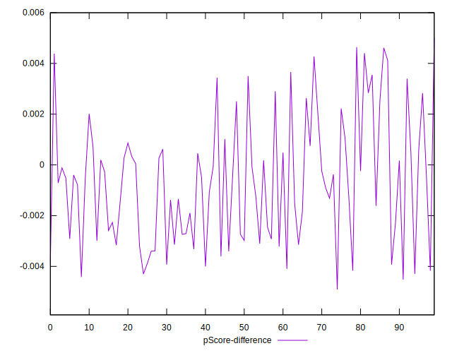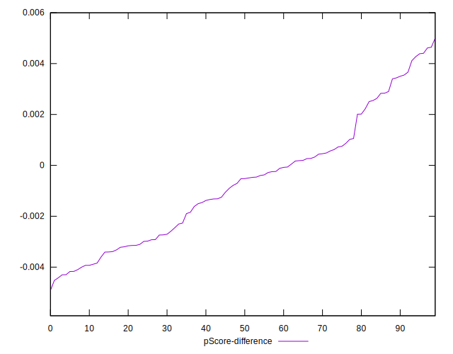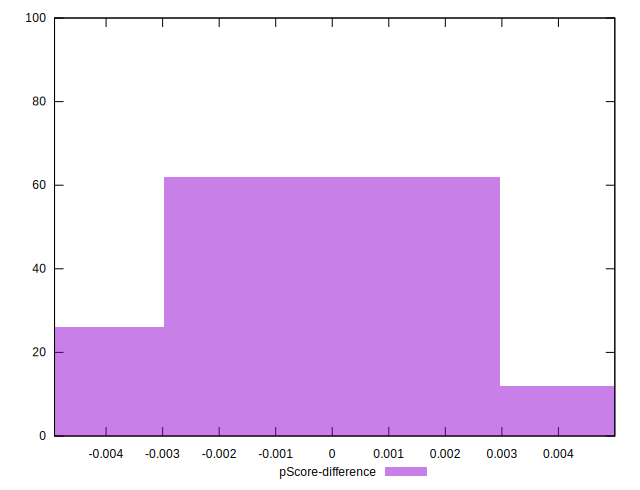