# //largest-contentful-paint/samples/pages+cached+noadtech

[→ Parent](../..)


## Raw


```yaml
p90min: 7702.533000000001
p90max: 8180.54195
p90range: 478.00894999999855
p90mean: 7887.319429787235
p90median: 7841.7493749999985
p90stdev: 134.87256783874358
p90skewness: 0.8546057286956513
p90eccentricity: 1.000000000000001
p90discretization: 1
outlandishness: 1.0005849371175806
confidence: 57.84860751878312
p90confidence: 54.53028732125495

```

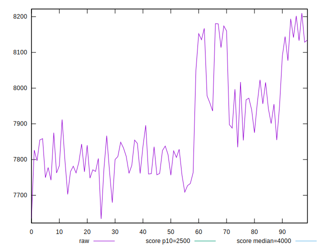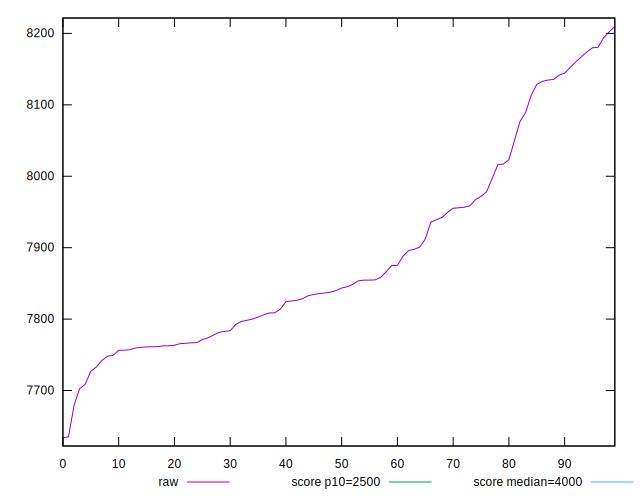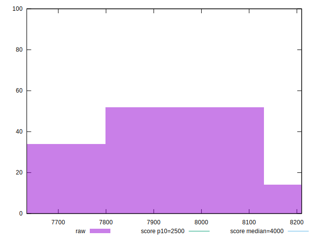
## Score


```yaml
p90min: 0.03
p90max: 0.04
p90range: 0.010000000000000002
p90mean: 0.032553191489361644
p90median: 0.03
p90stdev: 0.004360404581259402
p90skewness: 1.1222850838908285
p90eccentricity: 1.0000000000000007
p90discretization: 47
outlandishness: 1.0028778845743085
confidence: 0.0018065722830990553
p90confidence: 0.0017629538642526567

```

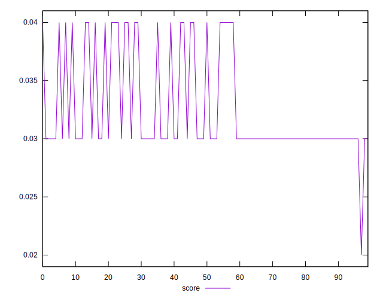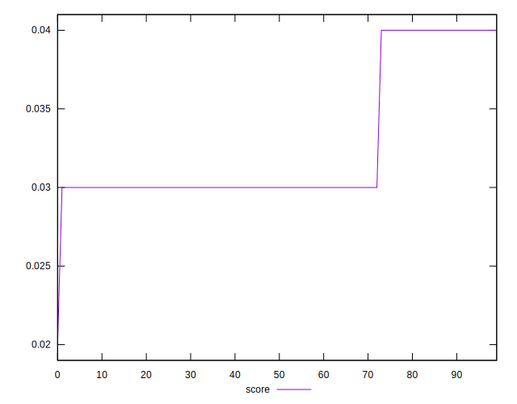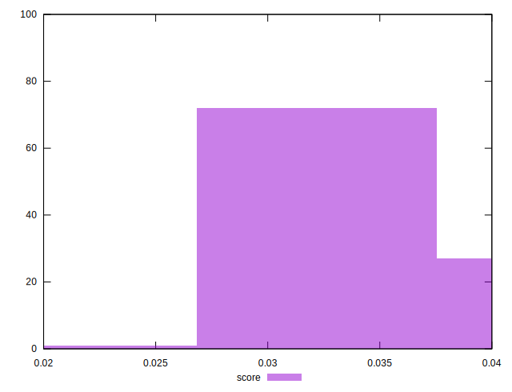
## Raw Estimate

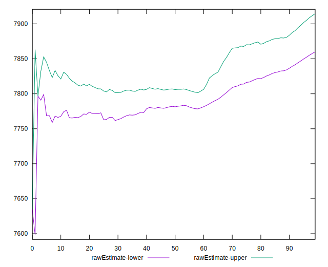
## Score Estimate

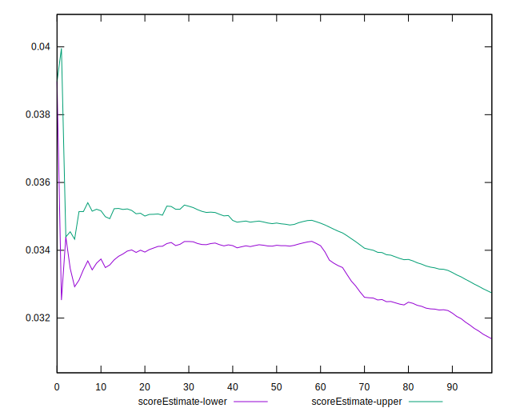
## P Score


```yaml
p90min: 0.025537696065743465
p90max: 0.03699510796350686
p90range: 0.011457411897763392
p90mean: 0.032230799515473876
p90median: 0.03321464013521616
p90stdev: 0.003221289249627366
p90skewness: -0.7301750235469229
p90eccentricity: 1.0000000000000002
p90discretization: 1
outlandishness: 0.9985186244470305
confidence: 0.0013849923047160072
p90confidence: 0.0013023984872674046

```

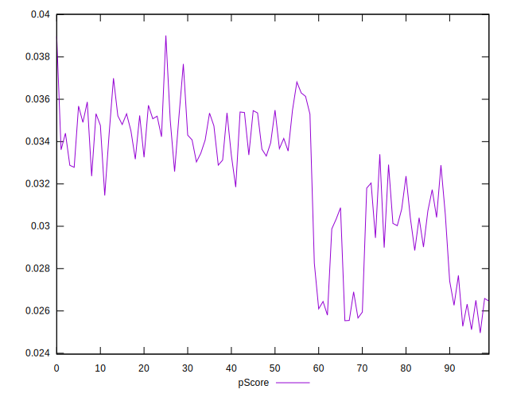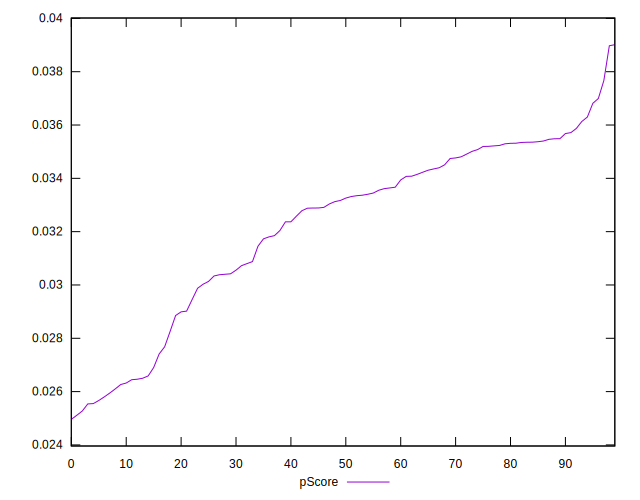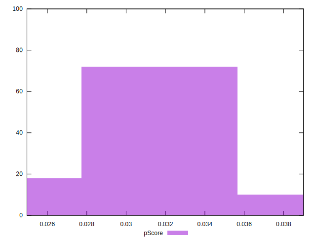
## Score Difference


```yaml
p90min: 0
p90max: 0
p90range: 0
p90mean: 0
p90median: 0
p90stdev: 0
p90skewness: .nan
p90eccentricity: .nan
p90discretization: 94
outlandishness: .nan
confidence: 0
p90confidence: 0

```


## P Score Difference


```yaml
p90min: -0.00480476895726608
p90max: 0.004765521391447619
p90range: 0.009570290348713699
p90mean: -0.00041685273025218554
p90median: -0.00004826568884377935
p90stdev: 0.003401340864664144
p90skewness: 0.03317076447328326
p90eccentricity: 0.9999999999999997
p90discretization: 1
outlandishness: 0.8892045118110092
confidence: 0.0013765432490104043
p90confidence: 0.0013751951015674336

```

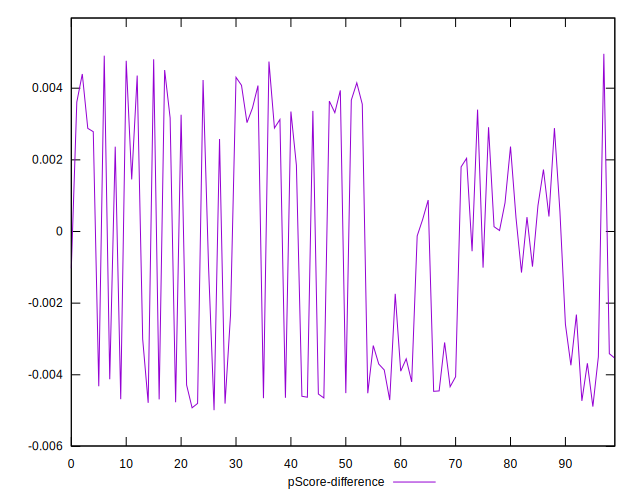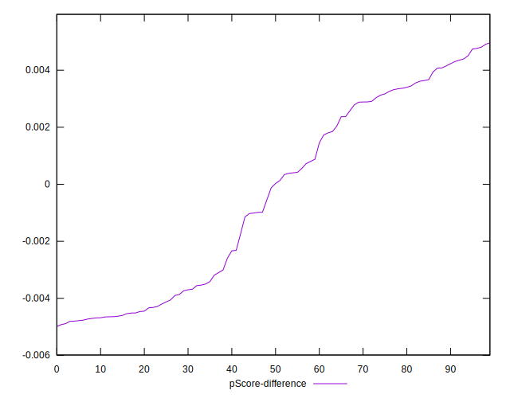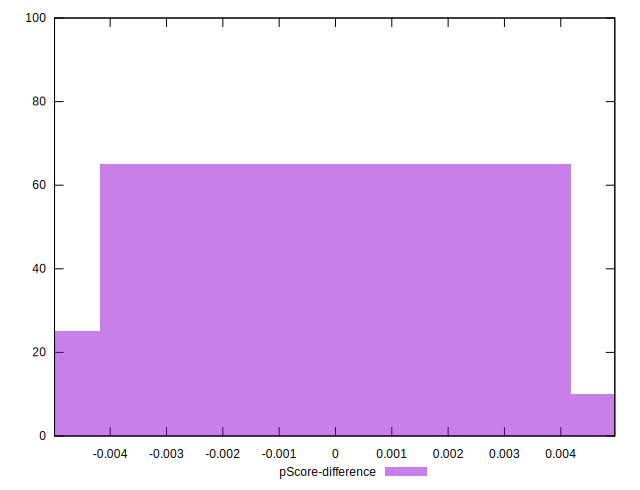