# //largest-contentful-paint/samples/pages+cached

[→ Parent](../..)


## Raw


```yaml
p90min: 13766.962999999998
p90max: 14524.143
p90range: 757.1800000000021
p90mean: 14205.726962234043
p90median: 14201.460824999995
p90stdev: 155.4913101454666
p90skewness: -0.1263583583618807
p90eccentricity: 1.0000000000000004
p90discretization: 1
outlandishness: 0.9972991945331973
confidence: 124.94111646205776
p90confidence: 62.8666448193402

```

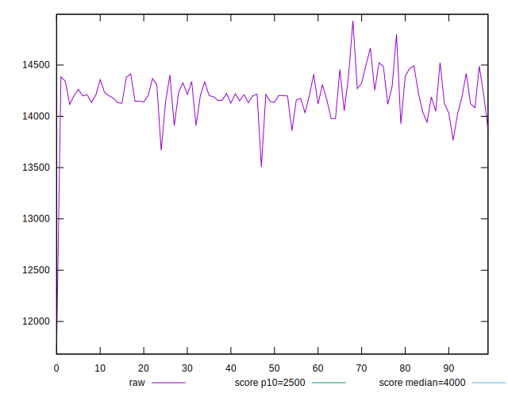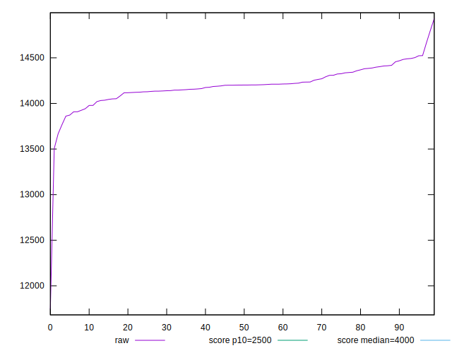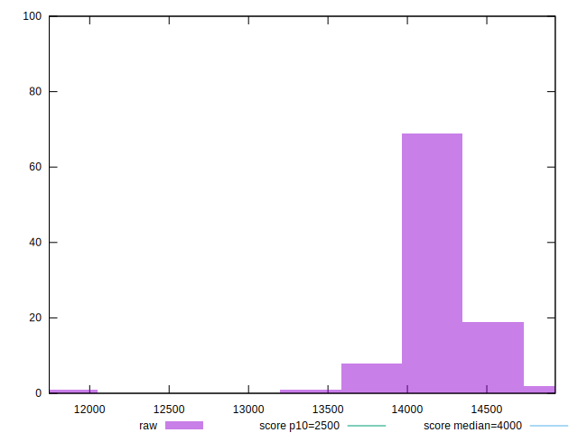
## Score


```yaml
p90min: 0
p90max: 0
p90range: 0
p90mean: 0
p90median: 0
p90stdev: 0
p90skewness: .nan
p90eccentricity: .nan
p90discretization: 94
outlandishness: .nan
confidence: 0
p90confidence: 0

```


## Raw Estimate

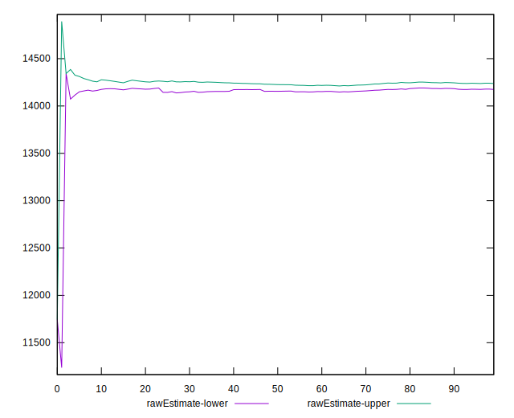
## Score Estimate

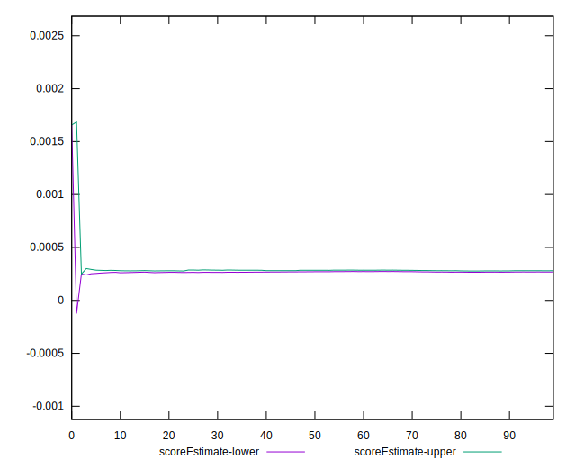
## P Score


```yaml
p90min: 0.00021900416399778244
p90max: 0.0003757306519074355
p90range: 0.00015672648790965304
p90mean: 0.0002762636865518006
p90median: 0.00027535043675142035
p90stdev: 0.000030933845133930825
p90skewness: 0.5018105571603909
p90eccentricity: 1.0000000000000002
p90discretization: 1
outlandishness: 1.1038625125064159
confidence: 0.000056141552495033214
p90confidence: 0.000012506853618456074

```

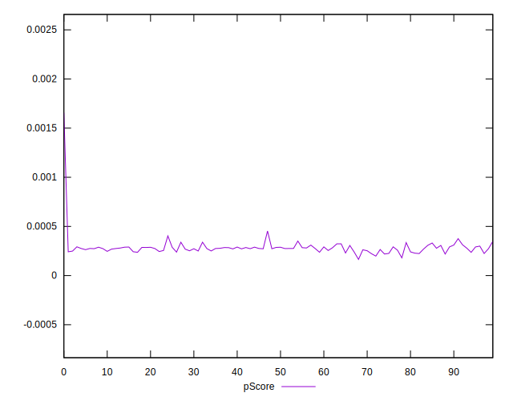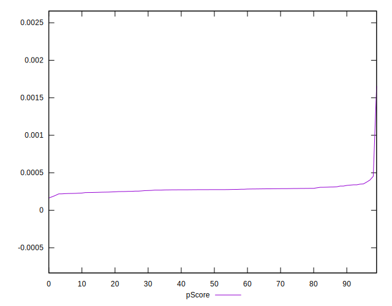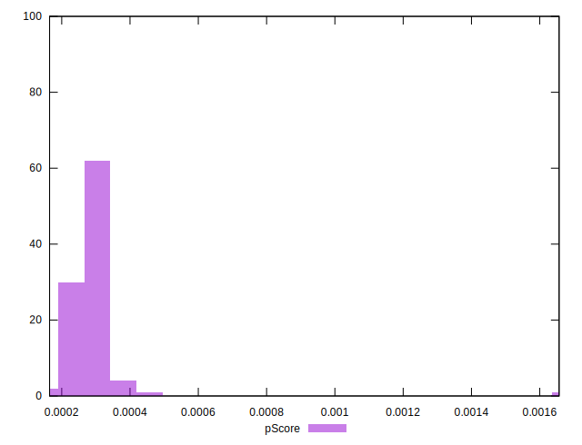
## Score Difference


```yaml
p90min: 0
p90max: 0
p90range: 0
p90mean: 0
p90median: 0
p90stdev: 0
p90skewness: .nan
p90eccentricity: .nan
p90discretization: 94
outlandishness: .nan
confidence: 0
p90confidence: 0

```


## P Score Difference


```yaml
p90min: 0.00021900416399778244
p90max: 0.0003757306519074355
p90range: 0.00015672648790965304
p90mean: 0.0002762636865518006
p90median: 0.00027535043675142035
p90stdev: 0.000030933845133930825
p90skewness: 0.5018105571603909
p90eccentricity: 1.0000000000000002
p90discretization: 1
outlandishness: 1.1038625125064159
confidence: 0.000056141552495033214
p90confidence: 0.000012506853618456074

```

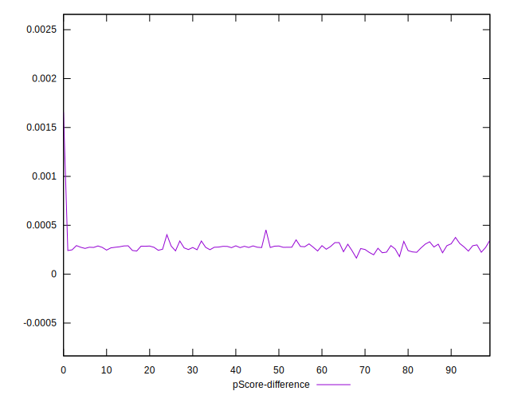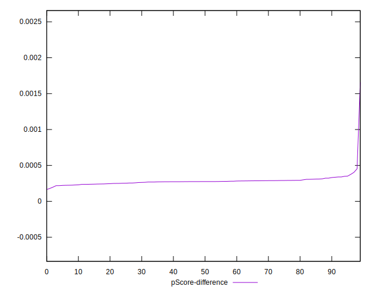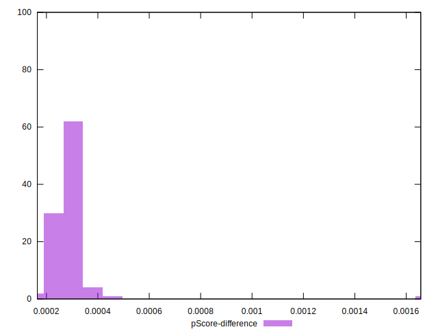