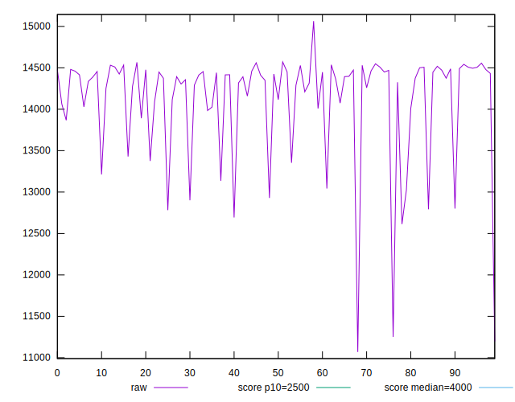
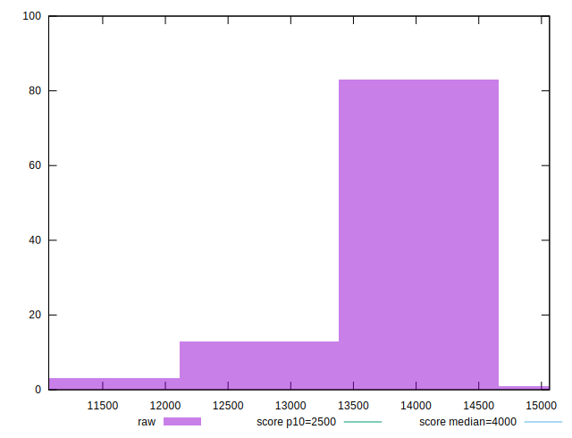

# //largest-contentful-paint/samples/pages

[→ Parent](../..)


## Raw


```yaml
p90min: 12613.119
p90max: 14560.625
p90range: 1947.5059999999994
p90mean: 14163.91500851064
p90median: 14393.529500000002
p90stdev: 518.0679015402742
p90skewness: -1.780838025882617
p90eccentricity: 0.9999999999999996
p90discretization: 1
outlandishness: 0.9897698728589313
confidence: 284.5608007407664
p90confidence: 209.45987739098678

```


## Score


```yaml
p90min: 0
p90max: 0
p90range: 0
p90mean: 0
p90median: 0
p90stdev: 0
p90skewness: .nan
p90eccentricity: .nan
p90discretization: 94
outlandishness: .nan
confidence: 0
p90confidence: 0

```


## Raw Estimate


## Score Estimate


## P Score


```yaml
p90min: 0.00021342953542435872
p90max: 0.0008698181155852858
p90range: 0.000656388580160927
p90mean: 0.00030884874215035226
p90median: 0.00024022397408177132
p90stdev: 0.00015823206055548729
p90skewness: 2.17231074430491
p90eccentricity: 1
p90discretization: 1
outlandishness: 1.455873974414176
confidence: 0.00016242067975806614
p90confidence: 0.00006397475679295493

```


## Score Difference


```yaml
p90min: 0
p90max: 0
p90range: 0
p90mean: 0
p90median: 0
p90stdev: 0
p90skewness: .nan
p90eccentricity: .nan
p90discretization: 94
outlandishness: .nan
confidence: 0
p90confidence: 0

```


## P Score Difference


```yaml
p90min: 0.00021342953542435872
p90max: 0.0008698181155852858
p90range: 0.000656388580160927
p90mean: 0.00030884874215035226
p90median: 0.00024022397408177132
p90stdev: 0.00015823206055548729
p90skewness: 2.17231074430491
p90eccentricity: 1
p90discretization: 1
outlandishness: 1.455873974414176
confidence: 0.00016242067975806614
p90confidence: 0.00006397475679295493

```

