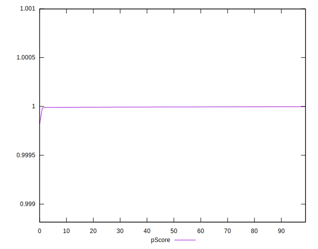

# //mainthread-work-breakdown/samples/pages+cached+noadtech+nomedia+nocss

[→ Parent](../..)


## Raw


```yaml
p90min: 357.86799999999994
p90max: 411.28000000000003
p90range: 53.41200000000009
p90mean: 384.8806382978725
p90median: 384.65
p90stdev: 14.059211179750857
p90skewness: 0.019498135762188958
p90eccentricity: 1
p90discretization: 1
outlandishness: 1.0107704704124485
confidence: 10.310330316546425
p90confidence: 5.684275441827727

```


## Score


```yaml
p90min: 1
p90max: 1
p90range: 0
p90mean: 1
p90median: 1
p90stdev: 0
p90skewness: .nan
p90eccentricity: .nan
p90discretization: 94
outlandishness: 1
confidence: 0
p90confidence: 0

```


## Raw Estimate


## Score Estimate


## P Score


```yaml
p90min: 0.9999896704680777
p90max: 0.9999968783301553
p90range: 0.000007207862077529548
p90mean: 0.9999938702958799
p90median: 0.9999941450179791
p90stdev: 0.0000019027116655745635
p90skewness: -0.4235439277330882
p90eccentricity: 1.0000000000000002
p90discretization: 1.0217391304347827
outlandishness: 0.999996311019846
confidence: 0.000006986596438678897
p90confidence: 7.692847810040707e-7

```


## Score Difference


```yaml
p90min: 0
p90max: 0
p90range: 0
p90mean: 0
p90median: 0
p90stdev: 0
p90skewness: .nan
p90eccentricity: .nan
p90discretization: 94
outlandishness: .nan
confidence: 0
p90confidence: 0

```


## P Score Difference


```yaml
p90min: -0.000010329531922259605
p90max: -0.0000031216698447300573
p90range: 0.000007207862077529548
p90mean: -0.0000061297041201511815
p90median: -0.000005854982020880861
p90stdev: 0.0000019027116655745637
p90skewness: -0.42354392724146245
p90eccentricity: 1.0000000000000004
p90discretization: 1.0217391304347827
outlandishness: 1.6923630949368573
confidence: 0.000006986596438678899
p90confidence: 7.692847810040708e-7

```

