# //mainthread-work-breakdown/samples/pages+cached+noadtech+nomedia

[→ Parent](../..)


## Raw


```yaml
p90min: 579.468
p90max: 649.6480000000001
p90range: 70.18000000000018
p90mean: 610.2898723404259
p90median: 610.2720000000007
p90stdev: 18.278790133640186
p90skewness: 0.20254642038947673
p90eccentricity: 1
p90discretization: 1
outlandishness: 1.004982605591924
confidence: 9.958808965892088
p90confidence: 7.390292139051224

```

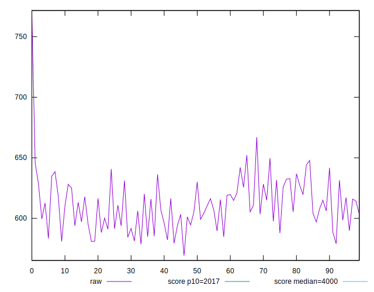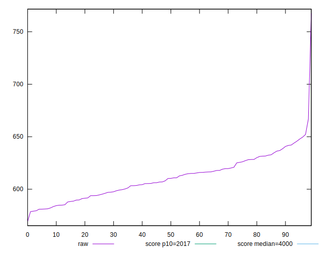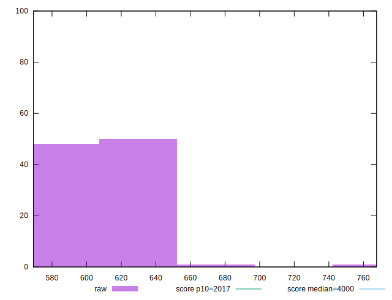
## Score


```yaml
p90min: 1
p90max: 1
p90range: 0
p90mean: 1
p90median: 1
p90stdev: 0
p90skewness: .nan
p90eccentricity: .nan
p90discretization: 94
outlandishness: 1
confidence: 0
p90confidence: 0

```


## Raw Estimate

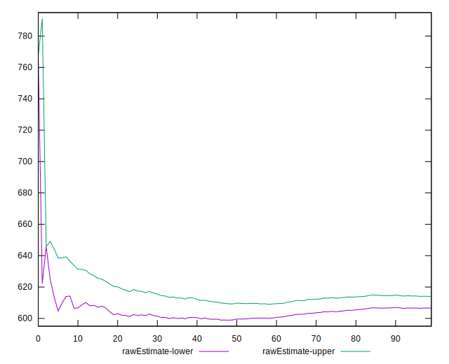
## Score Estimate

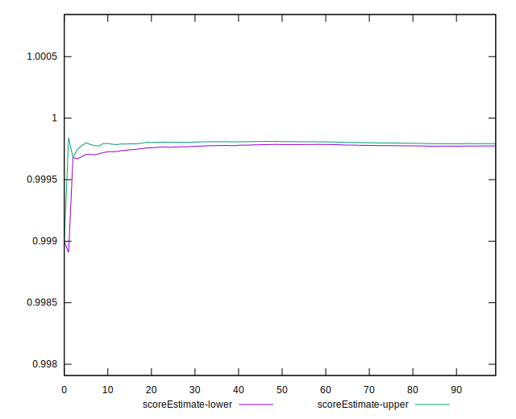
## P Score


```yaml
p90min: 0.9996656192783542
p90max: 0.9998504241363666
p90range: 0.00018480485801242175
p90mean: 0.9997795832444154
p90median: 0.999783491211373
p90stdev: 0.000047039347784060714
p90skewness: -0.48271852331431053
p90eccentricity: 0.9999999999999999
p90discretization: 1
outlandishness: 0.9999829924044431
confidence: 0.000036693409734168654
p90confidence: 0.00001901846454896683

```

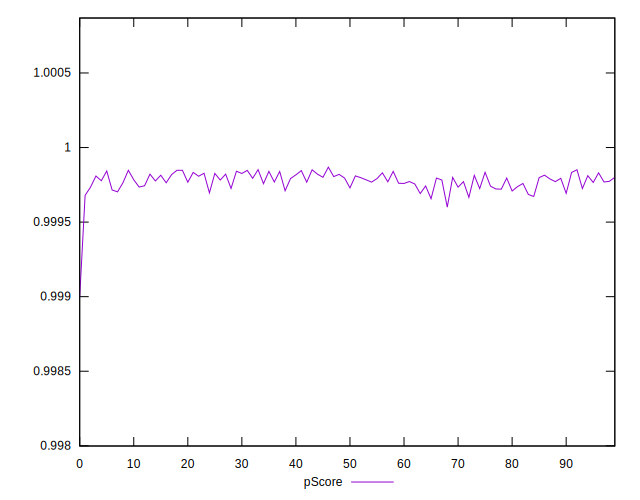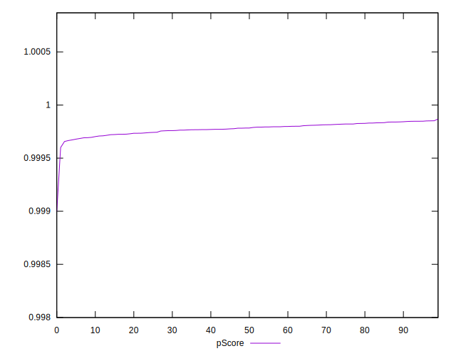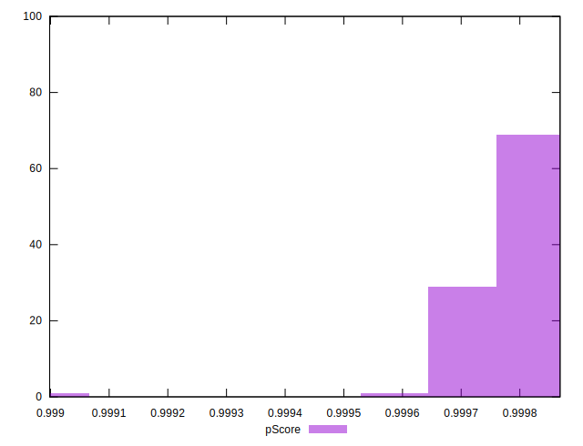
## Score Difference


```yaml
p90min: 0
p90max: 0
p90range: 0
p90mean: 0
p90median: 0
p90stdev: 0
p90skewness: .nan
p90eccentricity: .nan
p90discretization: 94
outlandishness: .nan
confidence: 0
p90confidence: 0

```


## P Score Difference


```yaml
p90min: -0.00033438072164582167
p90max: -0.00014957586363339992
p90range: 0.00018480485801242175
p90mean: -0.0002204167555851475
p90median: -0.0002165087886270567
p90stdev: 0.0000470393477840607
p90skewness: -0.48271852331453746
p90eccentricity: 1.0000000000000007
p90discretization: 1
outlandishness: 1.0786322180877
confidence: 0.00003669340973416865
p90confidence: 0.000019018464548966823

```

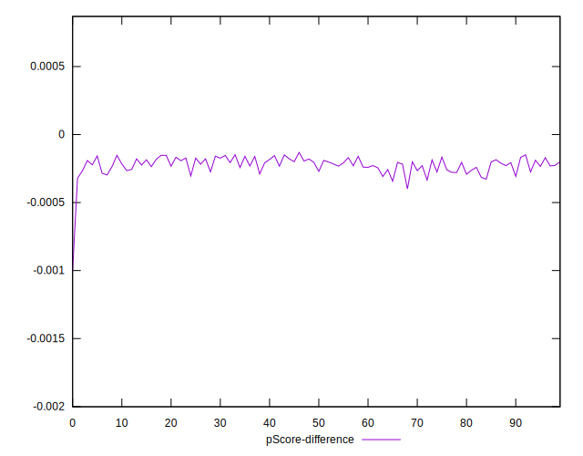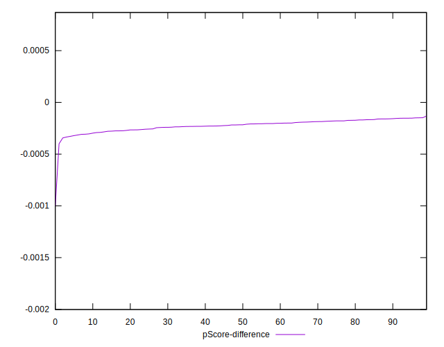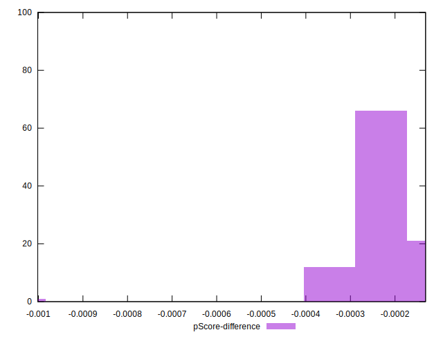