# //mainthread-work-breakdown/samples/pages+cached+noadtech

[→ Parent](../..)


## Raw


```yaml
p90min: 591.2200000000004
p90max: 661.4360000000004
p90range: 70.21600000000001
p90mean: 626.4530638297879
p90median: 626.2300000000004
p90stdev: 16.457174444541057
p90skewness: 0.0146361766783328
p90eccentricity: 1.0000000000000004
p90discretization: 1
outlandishness: 1.0021738446301043
confidence: 8.45369966968661
p90confidence: 6.653795247895077

```

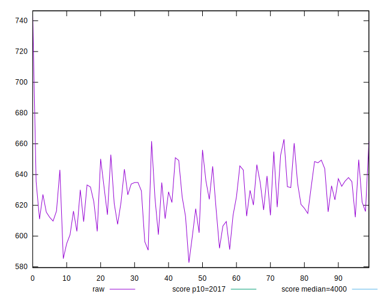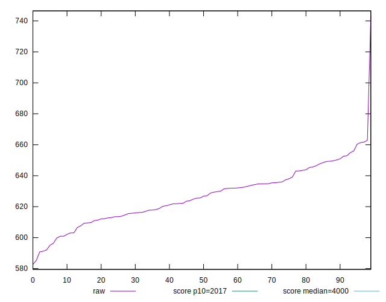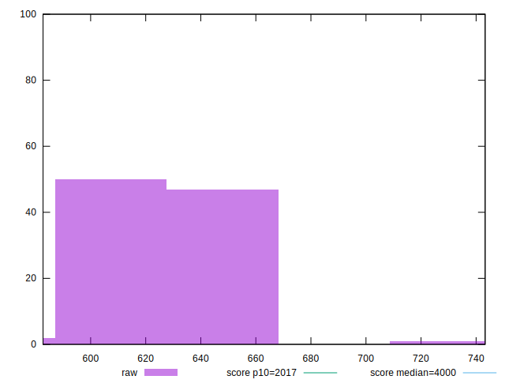
## Score


```yaml
p90min: 1
p90max: 1
p90range: 0
p90mean: 1
p90median: 1
p90stdev: 0
p90skewness: .nan
p90eccentricity: .nan
p90discretization: 94
outlandishness: 1
confidence: 0
p90confidence: 0

```


## Raw Estimate

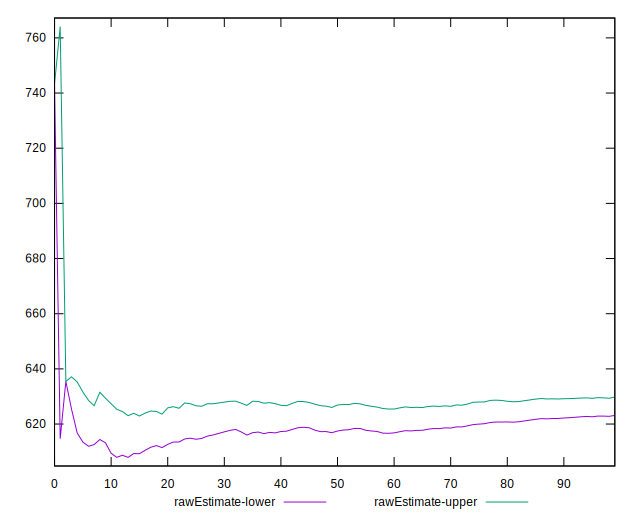
## Score Estimate

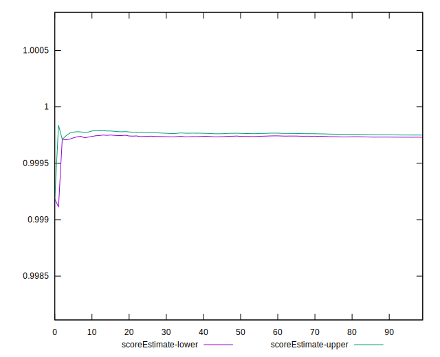
## P Score


```yaml
p90min: 0.9996219978061824
p90max: 0.9998271855994809
p90range: 0.00020518779329847803
p90mean: 0.9997364456494412
p90median: 0.9997405276073283
p90stdev: 0.00004809935853276675
p90skewness: -0.29729042204438877
p90eccentricity: 1.0000000000000004
p90discretization: 1
outlandishness: 0.9999902731793147
confidence: 0.00002982253386337381
p90confidence: 0.000019447037175830945

```

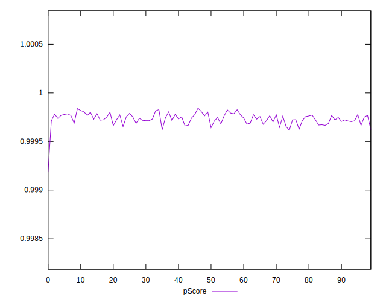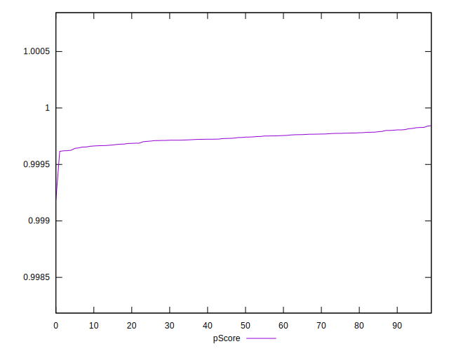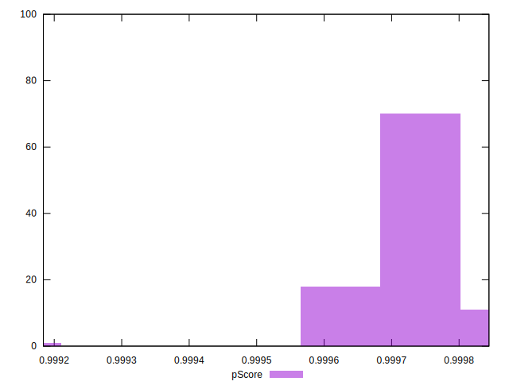
## Score Difference


```yaml
p90min: 0
p90max: 0
p90range: 0
p90mean: 0
p90median: 0
p90stdev: 0
p90skewness: .nan
p90eccentricity: .nan
p90discretization: 94
outlandishness: .nan
confidence: 0
p90confidence: 0

```


## P Score Difference


```yaml
p90min: -0.0003780021938175615
p90max: -0.00017281440051908348
p90range: 0.00020518779329847803
p90mean: -0.00026355435055858844
p90median: -0.0002594723926717113
p90stdev: 0.00004809935853276676
p90skewness: -0.2972904220577947
p90eccentricity: 1
p90discretization: 1
outlandishness: 1.0372370222171485
confidence: 0.00002982253386337381
p90confidence: 0.000019447037175830945

```

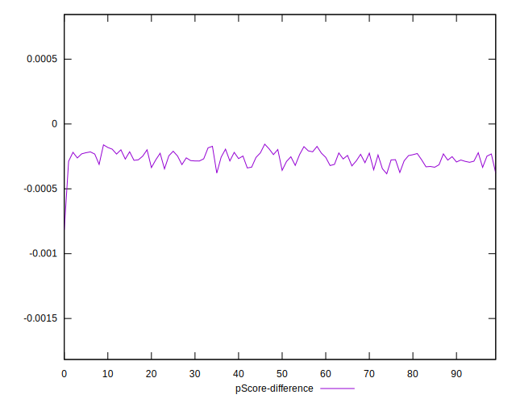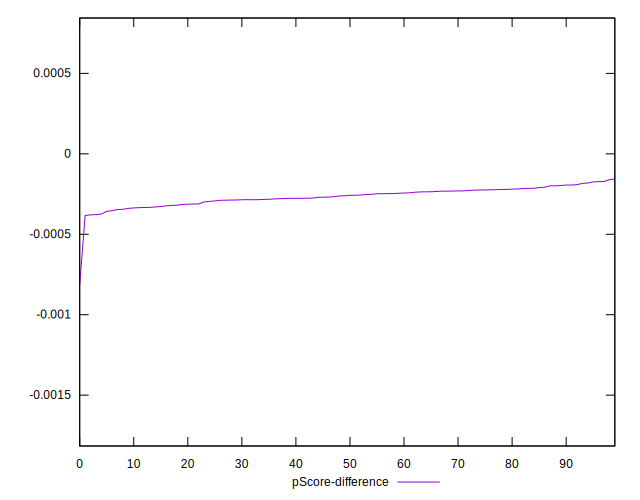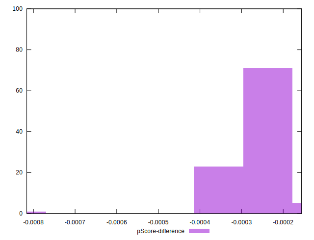