# //mainthread-work-breakdown/samples/pages+cached

[→ Parent](../..)


## Raw


```yaml
p90min: 1584.600000000001
p90max: 1689.628000000001
p90range: 105.02800000000002
p90mean: 1620.6697872340437
p90median: 1618.820000000001
p90stdev: 22.717352270181074
p90skewness: 0.6639704484552389
p90eccentricity: 1.0000000000000002
p90discretization: 1
outlandishness: 1.0056566200907668
confidence: 20.101107639943198
p90confidence: 9.184845860963016

```

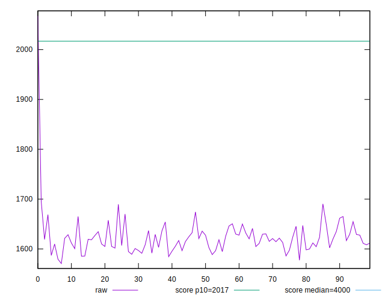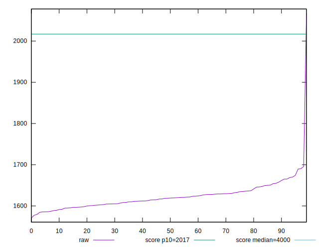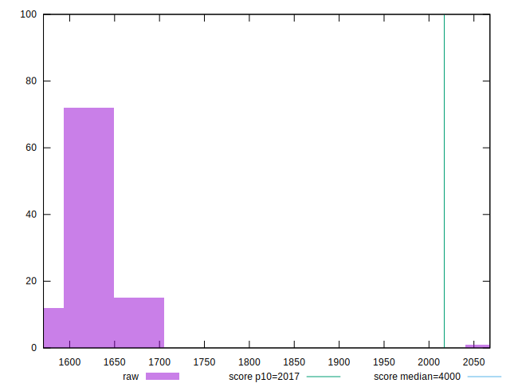
## Score


```yaml
p90min: 0.95
p90max: 0.96
p90range: 0.010000000000000009
p90mean: 0.95468085106383
p90median: 0.95
p90stdev: 0.004989803999812164
p90skewness: 0.12792042981318444
p90eccentricity: 1.0000000000000004
p90discretization: 47
outlandishness: 0.9987835215062268
confidence: 0.0031891450850768397
p90confidence: 0.0020174261537885705

```

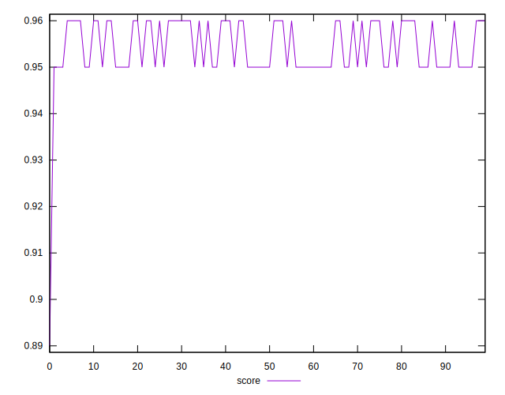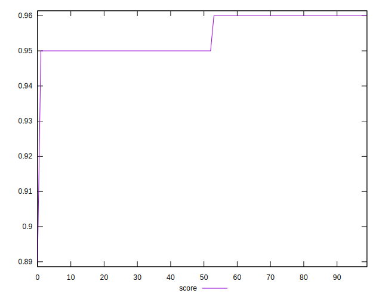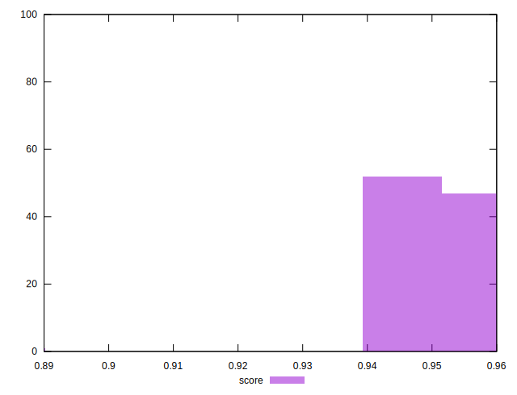
## Raw Estimate

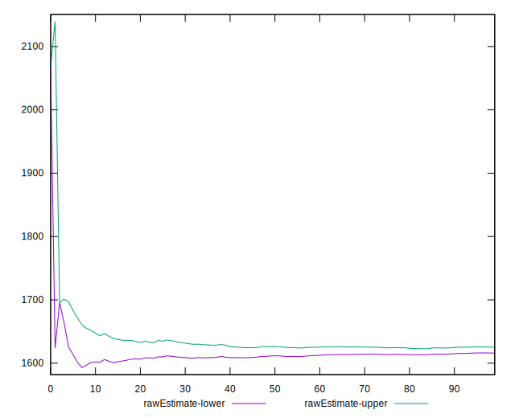
## Score Estimate

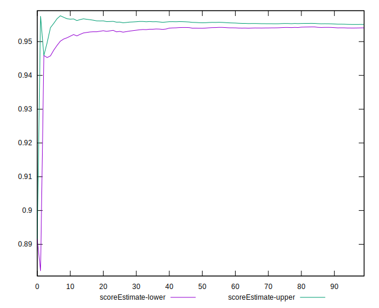
## P Score


```yaml
p90min: 0.9466324022878512
p90max: 0.958466827619394
p90range: 0.011834425331542775
p90mean: 0.9545471366380806
p90median: 0.9547888332914857
p90stdev: 0.0025307754930254645
p90skewness: -0.7372087425648602
p90eccentricity: 1
p90discretization: 1
outlandishness: 0.9986351672603369
confidence: 0.0026972516773270455
p90confidence: 0.0010232170781034552

```

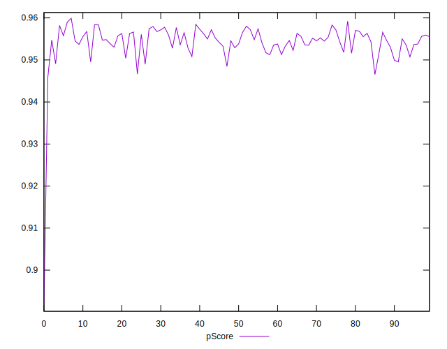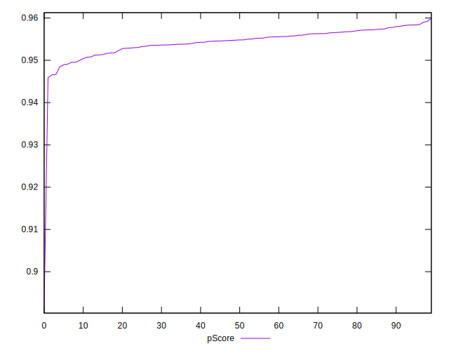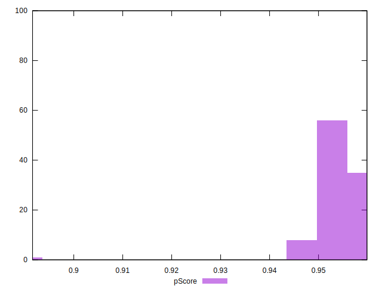
## Score Difference


```yaml
p90min: 0
p90max: 1.1102230246251565e-16
p90range: 1.1102230246251565e-16
p90mean: 5.787332787939646e-17
p90median: 1.1102230246251565e-16
p90stdev: 5.546086938105612e-17
p90skewness: -0.08518354199999222
p90eccentricity: 1
p90discretization: 47
outlandishness: 0.9951080383173677
confidence: 2.174255648481275e-17
p90confidence: 2.2423367411907613e-17

```

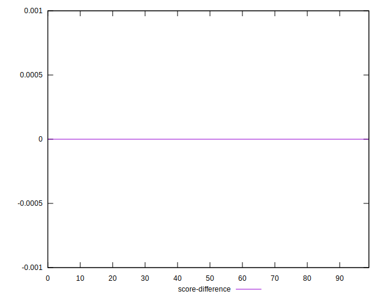
## P Score Difference


```yaml
p90min: -0.004749980656102104
p90max: 0.004757590369416254
p90range: 0.009507571025518358
p90mean: -0.00021801319642212596
p90median: -0.0009514705871181417
p90stdev: 0.0032377815570483405
p90skewness: 0.19013476330434503
p90eccentricity: 0.9999999999999999
p90discretization: 1
outlandishness: 0.8797406557140943
confidence: 0.0013165784873959236
p90confidence: 0.0013090664871184305

```

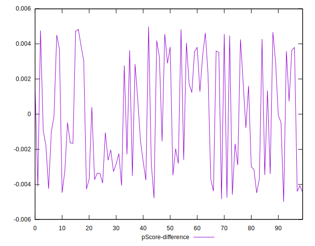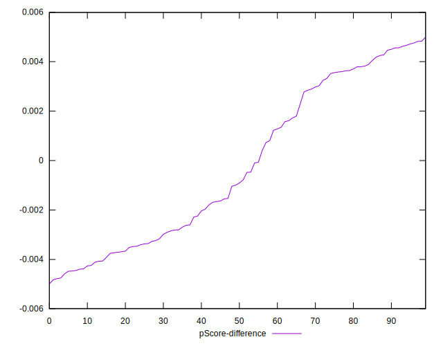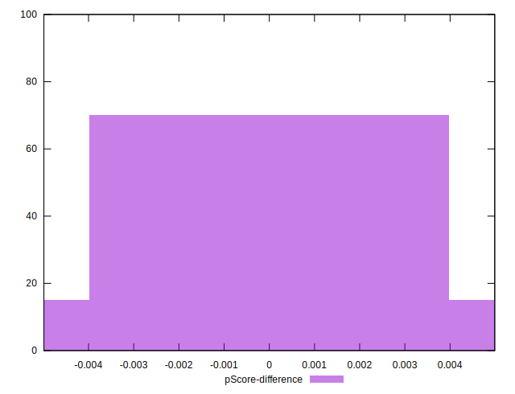