# //mainthread-work-breakdown/samples/pages

[→ Parent](../..)


## Raw


```yaml
p90min: 1767.4280000000028
p90max: 1897.616000000003
p90range: 130.1880000000001
p90mean: 1820.0185106382999
p90median: 1819.1580000000024
p90stdev: 25.538597625465023
p90skewness: 0.34700628007106277
p90eccentricity: 0.9999999999999997
p90discretization: 1
outlandishness: 1.0001169355935113
confidence: 12.53189370803959
p90confidence: 10.32550272167711

```

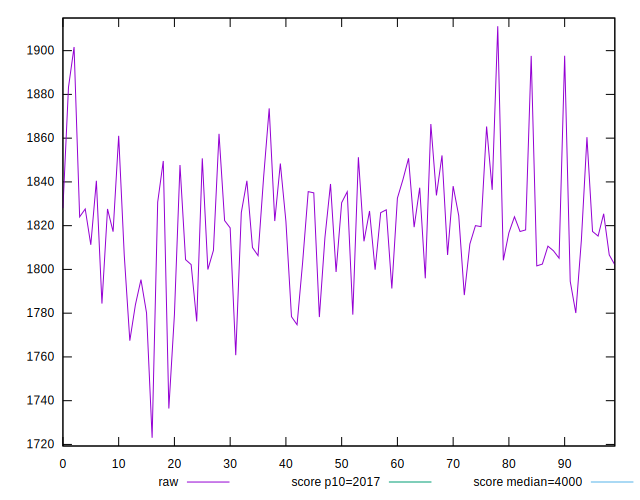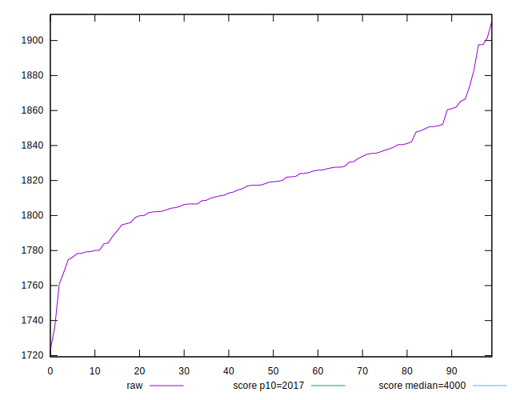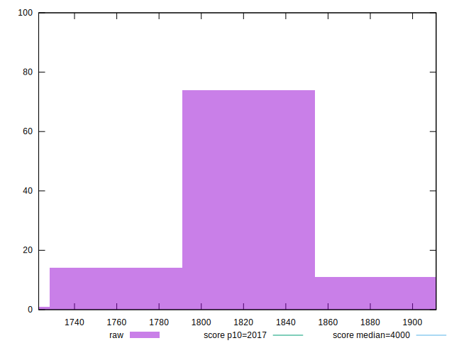
## Score


```yaml
p90min: 0.92
p90max: 0.94
p90range: 0.019999999999999907
p90mean: 0.9301063829787248
p90median: 0.93
p90stdev: 0.004251327915465531
p90skewness: 0.06336563227519791
p90eccentricity: 1.0000000000000022
p90discretization: 31.333333333333332
outlandishness: 0.9999862747811693
confidence: 0.001879522687149663
p90confidence: 0.0017188531103254695

```

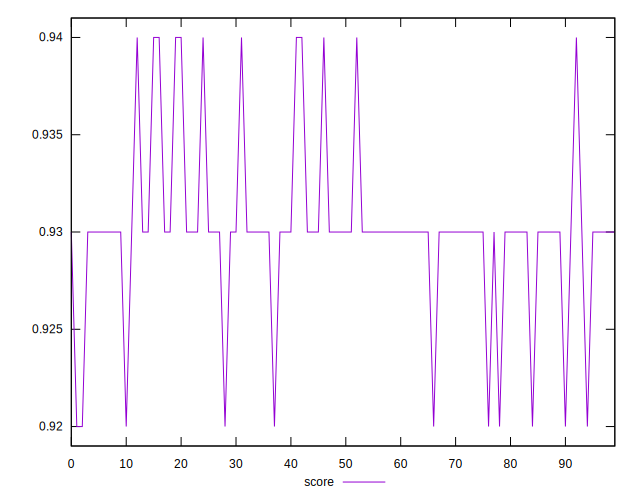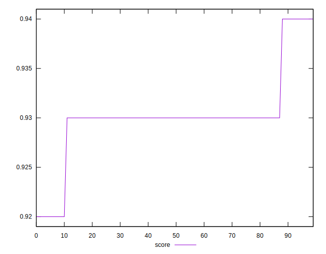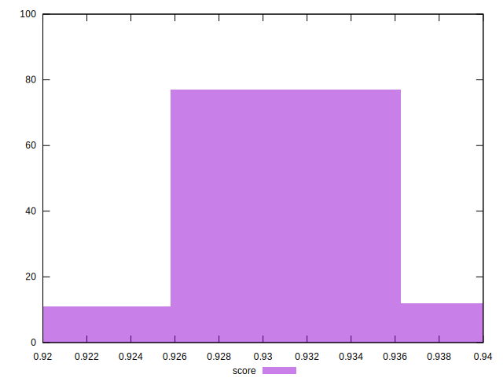
## Raw Estimate

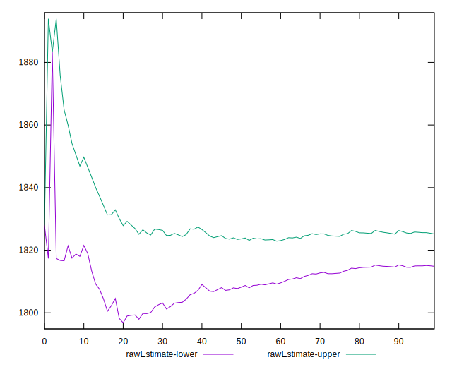
## Score Estimate

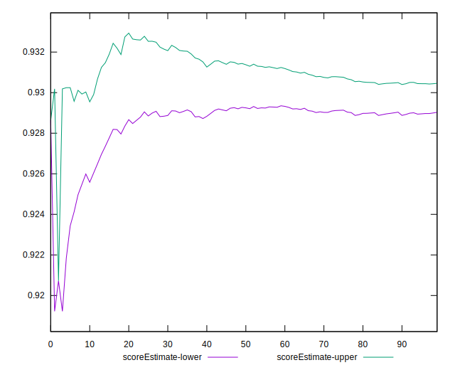
## P Score


```yaml
p90min: 0.9186053645586367
p90max: 0.9368407960411963
p90range: 0.018235431482559572
p90mean: 0.9297022433316847
p90median: 0.9298648850293573
p90stdev: 0.003551196203366738
p90skewness: -0.42089615337367026
p90eccentricity: 1.0000000000000007
p90discretization: 1
outlandishness: 0.9999151330508403
confidence: 0.001740029732754799
p90confidence: 0.0014357830684685058

```

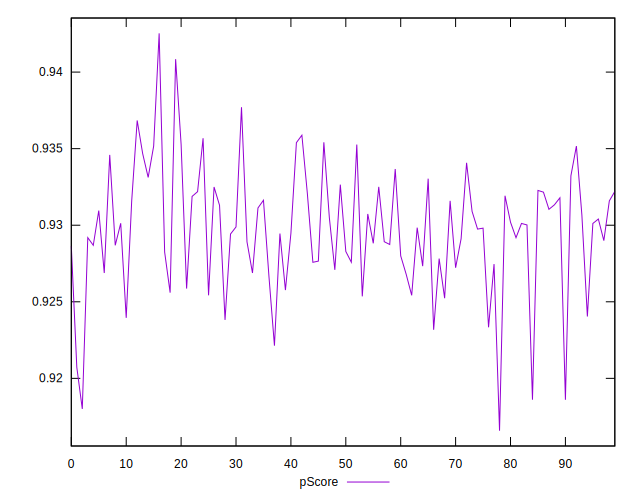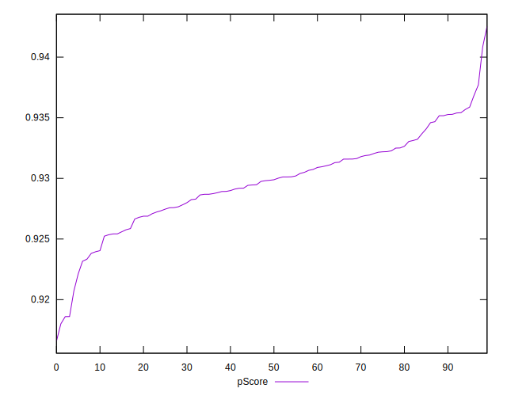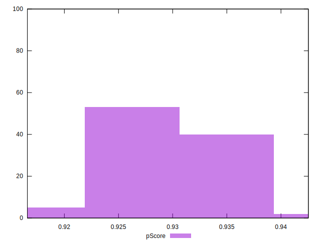
## Score Difference


```yaml
p90min: 0
p90max: 1.1102230246251565e-16
p90range: 1.1102230246251565e-16
p90mean: 1.0629794916623839e-17
p90median: 0
p90stdev: 3.266728893523981e-17
p90skewness: 2.7477857990363157
p90eccentricity: 1.000000000000002
p90discretization: 47
outlandishness: 1.570844444444444
confidence: 1.4142307486958864e-17
p90confidence: 1.320770176018971e-17

```

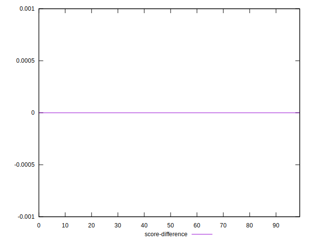
## P Score Difference


```yaml
p90min: -0.004732650478543099
p90max: 0.004040335921738358
p90range: 0.008772986400281457
p90mean: -0.0004535348237994708
p90median: -0.0003877577734860971
p90stdev: 0.0024607892632533793
p90skewness: -0.08962763591136917
p90eccentricity: 1.0000000000000007
p90discretization: 1
outlandishness: 0.929297835301223
confidence: 0.001035918547555222
p90confidence: 0.000994920966602367

```

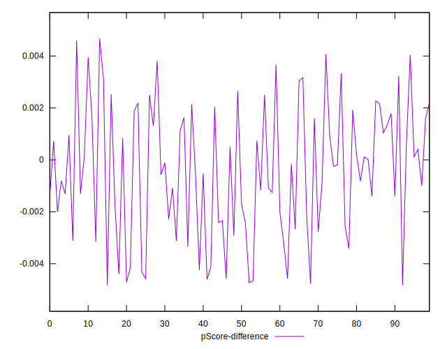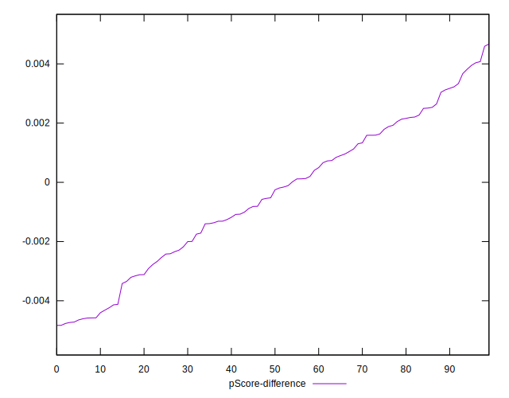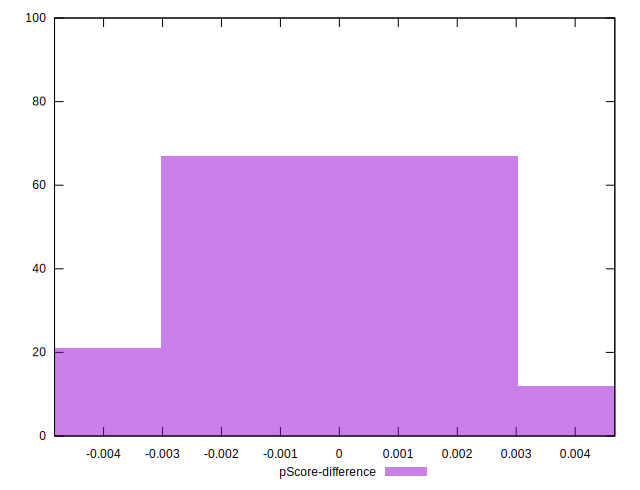