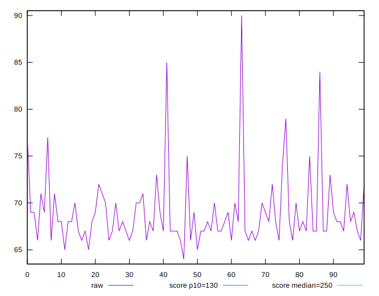

# //max-potential-fid/samples/pages+cached+noadtech+nomedia+nocss

[→ Parent](../..)


## Raw


```yaml
p90min: 65
p90max: 79
p90range: 14
p90mean: 68.6063829787234
p90median: 68
p90stdev: 2.6706365688941145
p90skewness: 1.6645809713997788
p90eccentricity: 1.0000000000000002
p90discretization: 7.230769230769231
outlandishness: 1.0120940302937744
confidence: 1.599003917353826
p90confidence: 1.079764267605296

```


## Score


```yaml
p90min: 0.99
p90max: 1
p90range: 0.010000000000000009
p90mean: 0.9944680851063821
p90median: 0.99
p90stdev: 0.0049716261470416755
p90skewness: 0.21398024625600057
p90eccentricity: 0.9999999999999982
p90discretization: 47
outlandishness: 0.9994609199114761
confidence: 0.002159876753856793
p90confidence: 0.0020100766716044443

```


## Raw Estimate


## Score Estimate


## P Score


```yaml
p90min: 0.9880175836752019
p90max: 0.9958542552567312
p90range: 0.007836671581529342
p90mean: 0.994265235057638
p90median: 0.9946375893622611
p90stdev: 0.0014064808920136093
p90skewness: -2.151392602998732
p90eccentricity: 1.0000000000000002
p90discretization: 7.230769230769231
outlandishness: 0.9993195713680847
confidence: 0.0010464166797853596
p90confidence: 0.0005686538662558584

```


## Score Difference


```yaml
p90min: 0
p90max: 0
p90range: 0
p90mean: 0
p90median: 0
p90stdev: 0
p90skewness: .nan
p90eccentricity: .nan
p90discretization: 94
outlandishness: .nan
confidence: 0
p90confidence: 0

```


## P Score Difference


```yaml
p90min: -0.004931822957321863
p90max: 0.0046375893622611075
p90range: 0.00956941231958297
p90mean: -0.00028112634247153017
p90median: 0.0008507430743767141
p90stdev: 0.004179075235565318
p90skewness: -0.0298548016077206
p90eccentricity: 0.9999999999999991
p90discretization: 5.529411764705882
outlandishness: 0.9436154769490009
confidence: 0.001653420193753114
p90confidence: 0.0016896406510550272

```

