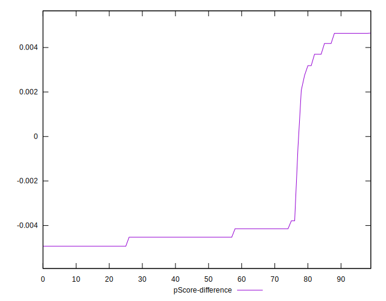

# //max-potential-fid/samples/pages+cached+noadtech+nomedia

[→ Parent](../..)


## Raw


```yaml
p90min: 65
p90max: 73
p90range: 8
p90mean: 66.74468085106383
p90median: 66
p90stdev: 1.4870803195750248
p90skewness: 1.4906237163309608
p90eccentricity: 1.000000000000001
p90discretization: 11.75
outlandishness: 1.0112780342267969
confidence: 1.1854525851427424
p90confidence: 0.6012409965617598

```


## Score


```yaml
p90min: 0.99
p90max: 1
p90range: 0.010000000000000009
p90mean: 0.9978723404255319
p90median: 1
p90stdev: 0.0040926349067385865
p90skewness: -1.403663161256732
p90eccentricity: 1.0000000000000022
p90discretization: 47
outlandishness: 0.9992538705725109
confidence: 0.0018696864782181152
p90confidence: 0.001654691987716007

```


## Raw Estimate


## Score Estimate


## P Score


```yaml
p90min: 0.9920780447368824
p90max: 0.9958542552567312
p90range: 0.003776210519848777
p90mean: 0.9951456416854273
p90median: 0.9954734645055221
p90stdev: 0.0006575420355625112
p90skewness: -1.884228033618939
p90eccentricity: 1.0000000000000002
p90discretization: 11.75
outlandishness: 0.9994836094177529
confidence: 0.0007147722778718313
p90confidence: 0.0002658506225513308

```


## Score Difference


```yaml
p90min: 0
p90max: 0
p90range: 0
p90mean: 0
p90median: 0
p90stdev: 0
p90skewness: .nan
p90eccentricity: .nan
p90discretization: 94
outlandishness: .nan
confidence: 0
p90confidence: 0

```


## P Score Difference


```yaml
p90min: -0.004931822957321863
p90max: 0.0046375893622611075
p90range: 0.00956941231958297
p90mean: -0.0027687370479570744
p90median: -0.004526535494477901
p90stdev: 0.0034746042896084887
p90skewness: 1.4550355435586726
p90eccentricity: 1.0000000000000009
p90discretization: 8.545454545454545
outlandishness: 0.8895312859217811
confidence: 0.0014193865081433786
p90confidence: 0.0014048162148625472

```

