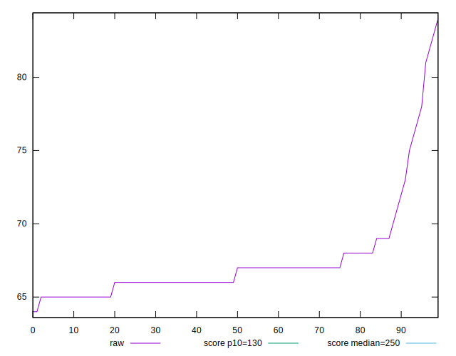
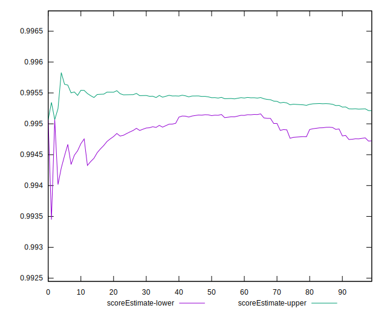

# //max-potential-fid/samples/pages+cached+noadtech

[→ Parent](../..)


## Raw


```yaml
p90min: 65
p90max: 81
p90range: 16
p90mean: 67.23404255319149
p90median: 66.5
p90stdev: 2.852492496922251
p90skewness: 2.7885056749444126
p90eccentricity: 0.9999999999999994
p90discretization: 6.714285714285714
outlandishness: 1.0115139660711427
confidence: 1.5300579075128786
p90confidence: 1.153290383147964

```


## Score


```yaml
p90min: 0.99
p90max: 1
p90range: 0.010000000000000009
p90mean: 0.9977659574468081
p90median: 1
p90stdev: 0.0041652706277557254
p90skewness: -1.328104555020558
p90eccentricity: 0.9999999999999983
p90discretization: 47
outlandishness: 0.9992665808414903
confidence: 0.0018897142957911017
p90confidence: 0.001684059314225181

```


## Raw Estimate


## Score Estimate


## P Score


```yaml
p90min: 0.9864020924526467
p90max: 0.9958542552567312
p90range: 0.009452162804084563
p90mean: 0.9948579653603177
p90median: 0.9952708207741001
p90stdev: 0.0015417507957757863
p90skewness: -3.383183496118189
p90eccentricity: 0.999999999999998
p90discretization: 6.714285714285714
outlandishness: 0.9994580531030989
confidence: 0.0009074706706464872
p90confidence: 0.0006233448003447629

```


## Score Difference


```yaml
p90min: 0
p90max: 0
p90range: 0
p90mean: 0
p90median: 0
p90stdev: 0
p90skewness: .nan
p90eccentricity: .nan
p90discretization: 94
outlandishness: .nan
confidence: 0
p90confidence: 0

```


## P Score Difference


```yaml
p90min: -0.004931822957321863
p90max: 0.0046375893622611075
p90range: 0.00956941231958297
p90mean: -0.0029818411493365317
p90median: -0.004526535494477901
p90stdev: 0.0031951734695271224
p90skewness: 1.6502881090125572
p90eccentricity: 1
p90discretization: 5.529411764705882
outlandishness: 0.8891067346870388
confidence: 0.0013249697649435695
p90confidence: 0.0012918396240730176

```

