# //max-potential-fid/samples/pages+cached

[→ Parent](../..)


## Raw


```yaml
p90min: 300
p90max: 334.9999999999991
p90range: 34.99999999999909
p90mean: 310.65957446808505
p90median: 310
p90stdev: 7.805553385168179
p90skewness: 0.9908157330723635
p90eccentricity: 1.000000000000001
p90discretization: 1.88
outlandishness: 1.0172658641377432
confidence: 9.88258154944923
p90confidence: 3.1558609405547755

```

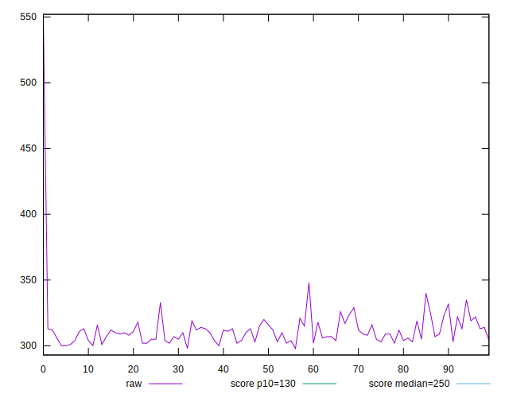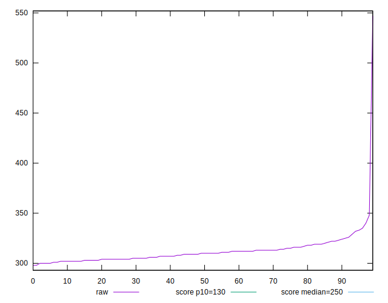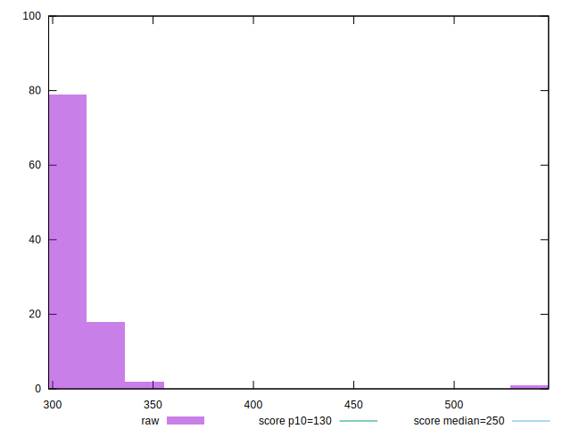
## Score


```yaml
p90min: 0.28
p90max: 0.36
p90range: 0.07999999999999996
p90mean: 0.3358510638297872
p90median: 0.34
p90stdev: 0.017829546029953305
p90skewness: -0.7814697098645994
p90eccentricity: 0.9999999999999984
p90discretization: 10.444444444444445
outlandishness: 0.9807335518287041
confidence: 0.013461057758906384
p90confidence: 0.007208658390662042

```

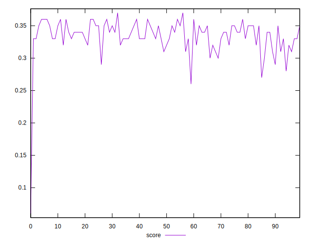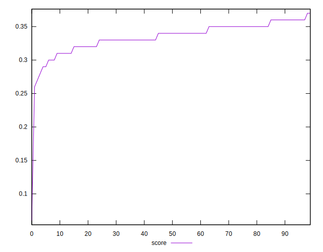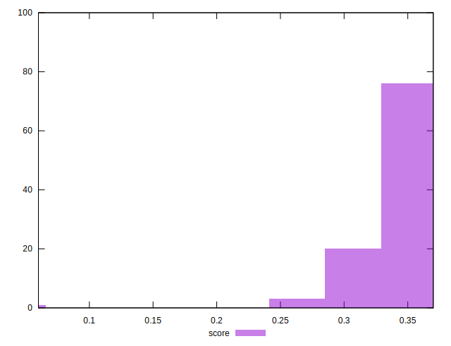
## Raw Estimate

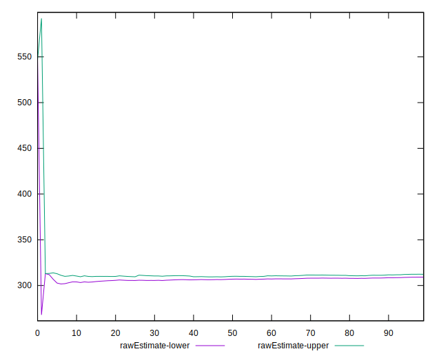
## Score Estimate

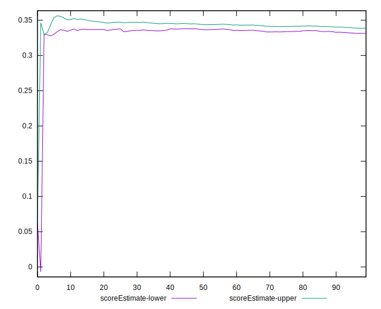
## P Score


```yaml
p90min: 0.28313009671525513
p90max: 0.3604299298111549
p90range: 0.07729983309589977
p90mean: 0.335560521112736
p90median: 0.336669189453885
p90stdev: 0.01755129452906323
p90skewness: -0.8732835796343962
p90eccentricity: 0.9999999999999991
p90discretization: 1.88
outlandishness: 0.9805484139681195
confidence: 0.013274292745090108
p90confidence: 0.007096158610059898

```

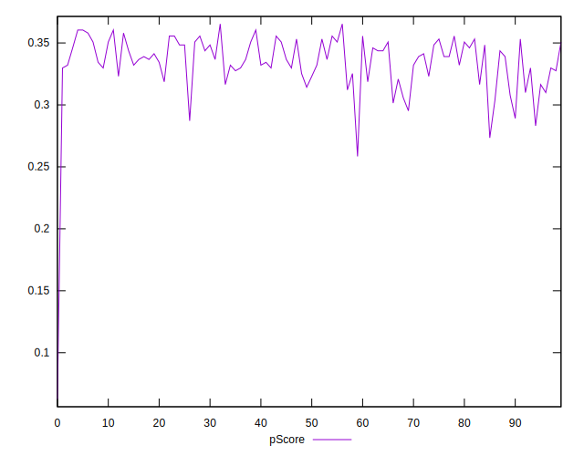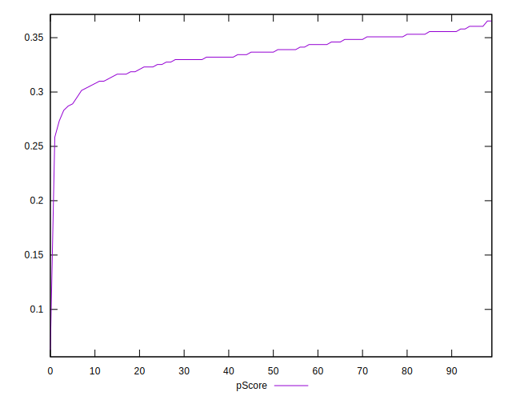
## Score Difference


```yaml
p90min: 0
p90max: 5.551115123125783e-17
p90range: 5.551115123125783e-17
p90mean: 1.1220339078658496e-17
p90median: 0
p90stdev: 2.2292553250386822e-17
p90skewness: 1.4834762399128532
p90eccentricity: 1.0000000000000007
p90discretization: 47
outlandishness: 1.1846603878116344
confidence: 9.013987730404081e-18
p90confidence: 9.013095497087214e-18

```

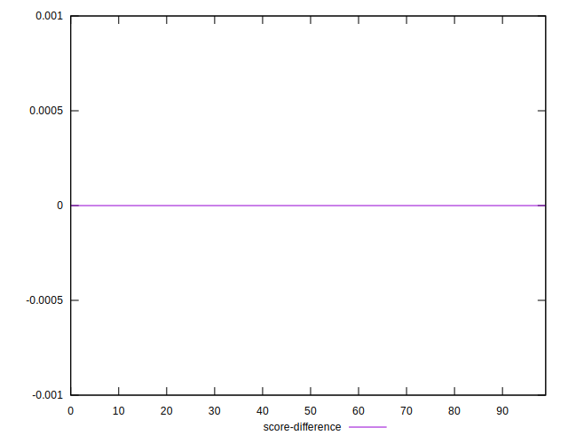
## P Score Difference


```yaml
p90min: -0.004652396920302393
p90max: 0.0042670112396060444
p90range: 0.008919408159908437
p90mean: -0.0003282183846057351
p90median: -0.00019264350706360567
p90stdev: 0.0026302143924439806
p90skewness: -0.0769103627017694
p90eccentricity: 1
p90discretization: 1.88
outlandishness: 0.9451960219830702
confidence: 0.0010908014482160977
p90confidence: 0.0010634211896073174

```

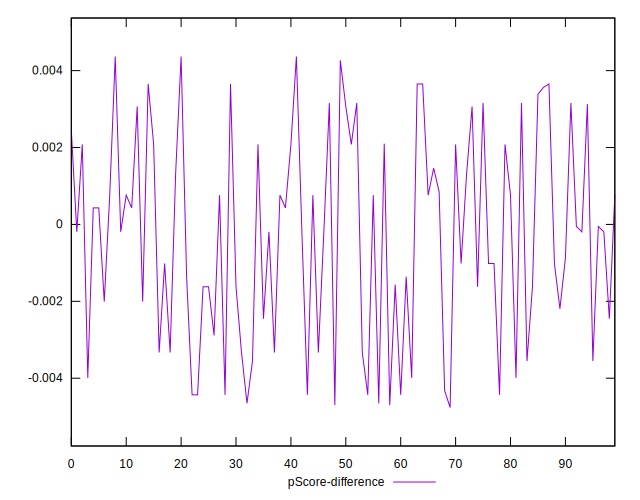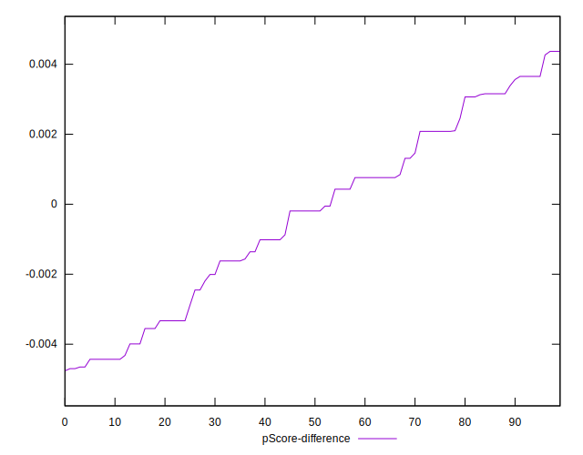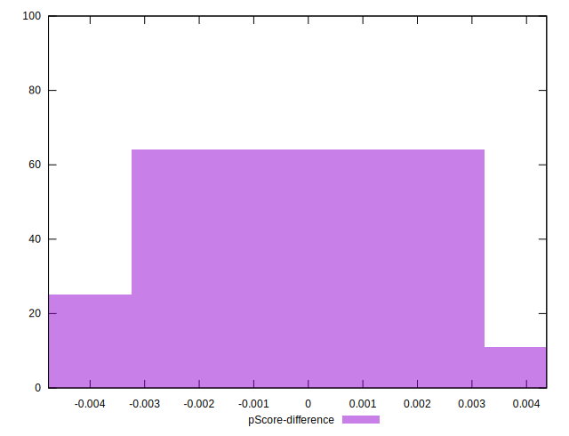