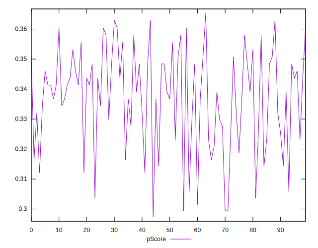
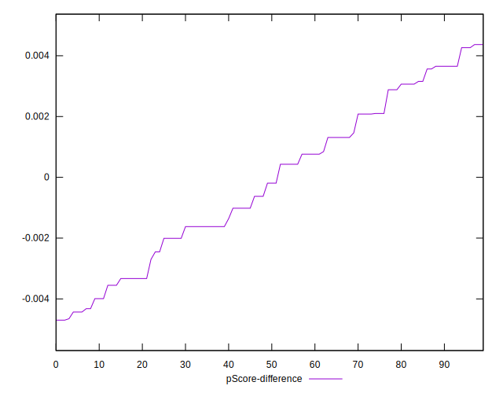

# //max-potential-fid/samples/pages

[→ Parent](../..)


## Raw


```yaml
p90min: 299.0000000000009
p90max: 327
p90range: 27.99999999999909
p90mean: 309.9148936170212
p90median: 308.9999999999991
p90stdev: 6.979696351482298
p90skewness: 0.5944275374480994
p90eccentricity: 1.000000000000001
p90discretization: 2.088888888888889
outlandishness: 1.0011949194252137
confidence: 3.0025215337121383
p90confidence: 2.8219589317562606

```


## Score


```yaml
p90min: 0.3
p90max: 0.36
p90range: 0.06
p90mean: 0.33734042553191473
p90median: 0.34
p90stdev: 0.016514051522605305
p90skewness: -0.521322152874129
p90eccentricity: 1.0000000000000004
p90discretization: 13.428571428571429
outlandishness: 0.9979827276143861
confidence: 0.007001215219664161
p90confidence: 0.006676791202213564

```


## Raw Estimate


## Score Estimate


## P Score


```yaml
p90min: 0.29937486094236787
p90max: 0.3628818283226889
p90range: 0.06350696738032102
p90mean: 0.3371955142177679
p90median: 0.33898361152324763
p90stdev: 0.01592665132953866
p90skewness: -0.5201537283148371
p90eccentricity: 0.9999999999999996
p90discretization: 2.088888888888889
outlandishness: 0.9978651327441775
confidence: 0.006834123634004681
p90confidence: 0.006439299606896851

```


## Score Difference


```yaml
p90min: 0
p90max: 5.551115123125783e-17
p90range: 5.551115123125783e-17
p90mean: 1.0039250754589182e-17
p90median: 0
p90stdev: 2.1365949807415518e-17
p90skewness: 1.658369978468351
p90eccentricity: 1.000000000000001
p90discretization: 47
outlandishness: 1.222975778546713
confidence: 8.703988572289725e-18
p90confidence: 8.638460737863963e-18

```


## P Score Difference


```yaml
p90min: -0.004652396920297952
p90max: 0.004267011239608043
p90range: 0.008919408159905995
p90mean: -0.0001645453306847839
p90median: -0.00019264350706466038
p90stdev: 0.0026153185970528518
p90skewness: 0.011719564095694003
p90eccentricity: 1
p90discretization: 2.0434782608695654
outlandishness: 1.0008095537779964
confidence: 0.0010851148134835935
p90confidence: 0.001057398675054706

```

