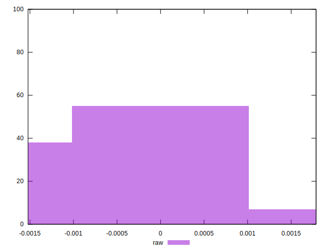

# //meta/pScore-difference/samples/pages+cached+noadtech+nomedia+nocss

[→ Parent](../..)


## Raw


```yaml
p90min: -0.001406797816018978
p90max: 0.0012072835874631462
p90range: 0.0026140814034821243
p90mean: -0.0004453782224057318
p90median: -0.0008203717006087047
p90stdev: 0.000825049621834262
p90skewness: 0.6113668355594363
p90eccentricity: 0.9999999999999996
p90discretization: 1
outlandishness: 0.8715969120845357
confidence: 0.0003503740907946272
p90confidence: 0.0003335755643557277

```

