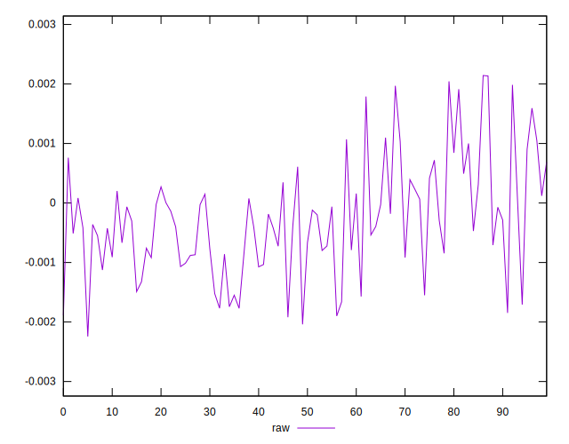
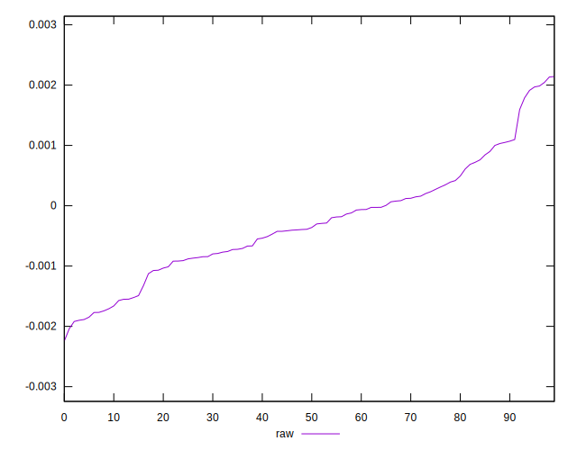
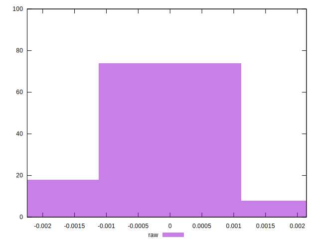

# //meta/pScore-difference/samples/pages+cached+noadtech+nomedia

[→ Parent](../..)


## Raw


```yaml
p90min: -0.0018990597546768573
p90max: 0.0019852128685066217
p90range: 0.003884272623183479
p90mean: -0.00028794040987183226
p90median: -0.00037560572714322724
p90stdev: 0.0009115229041580948
p90skewness: 0.39642982796763865
p90eccentricity: 1
p90discretization: 1
outlandishness: 0.8759098628931611
confidence: 0.00040136033538478984
p90confidence: 0.00036853755111324564

```

