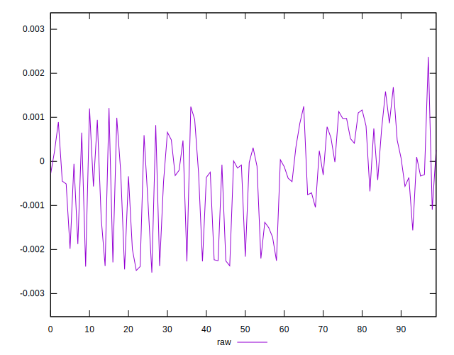
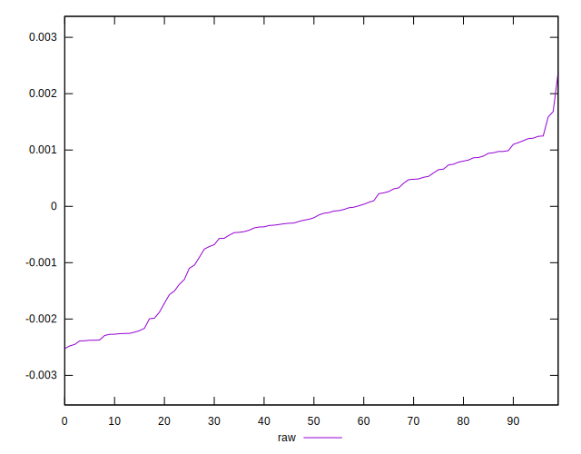
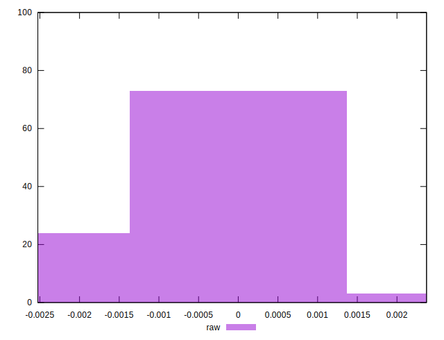

# //meta/pScore-difference/samples/pages+cached+noadtech

[→ Parent](../..)


## Raw


```yaml
p90min: -0.0023884844447271884
p90max: 0.0012496975977306696
p90range: 0.0036381820424578578
p90mean: -0.0003474741322458111
p90median: -0.00021582691194368053
p90stdev: 0.001109185134490556
p90skewness: -0.528898381972901
p90eccentricity: 0.9999999999999996
p90discretization: 1
outlandishness: 0.9843949175427468
confidence: 0.000471389119496403
p90confidence: 0.0004484543079846376

```

