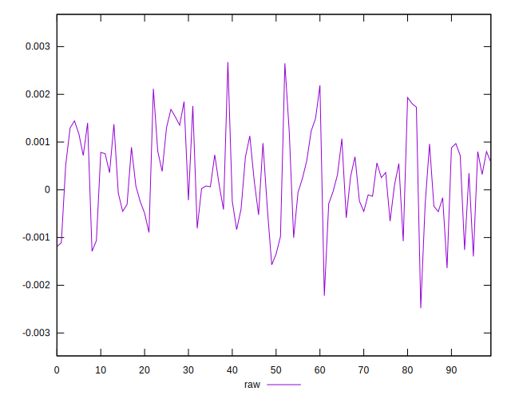
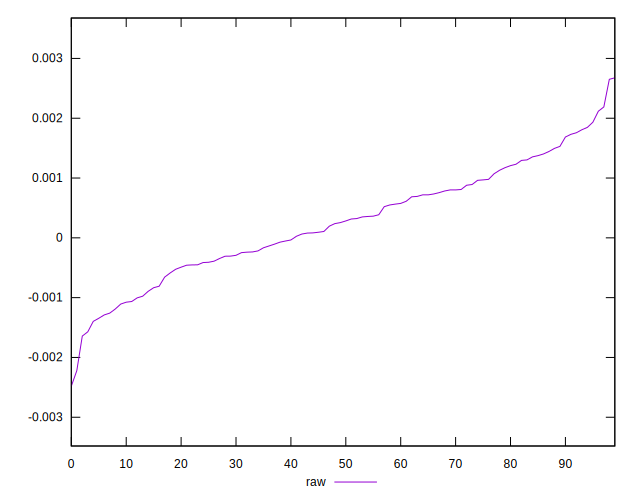
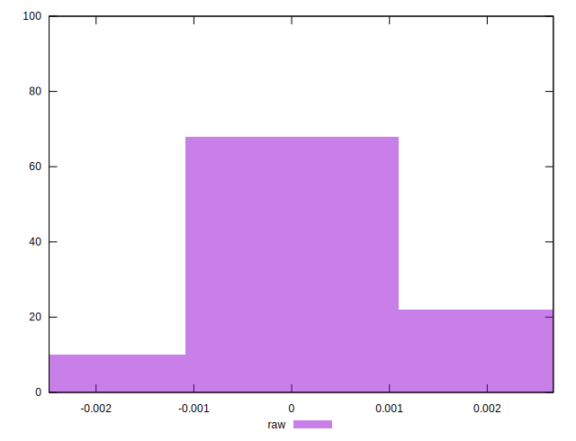

# //meta/pScore-difference/samples/pages+cached

[→ Parent](../..)


## Raw


```yaml
p90min: -0.0015715046598338107
p90max: 0.002117337078389347
p90range: 0.003688841738223158
p90mean: 0.00026586607410039056
p90median: 0.0002686756820802637
p90stdev: 0.0008867583977805361
p90skewness: -0.008815618053446179
p90eccentricity: 0.9999999999999996
p90discretization: 1
outlandishness: 0.9683836545529135
confidence: 0.0004044859719182255
p90confidence: 0.0003585250209910943

```

