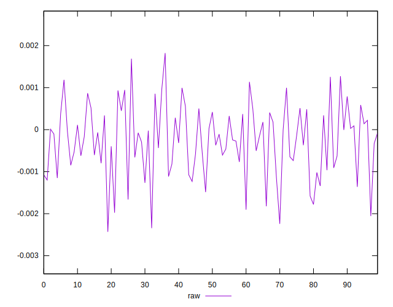
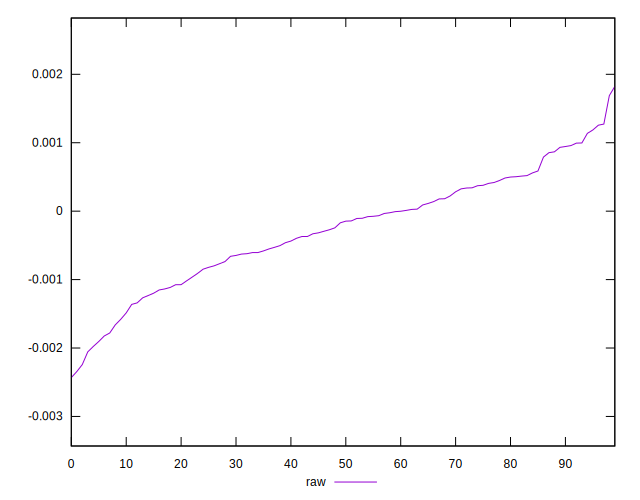
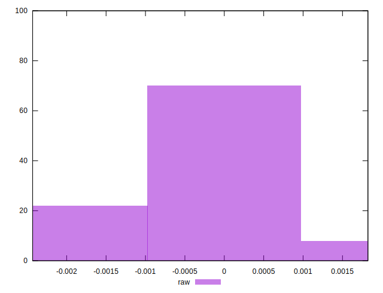

# //meta/pScore-difference/samples/pages

[→ Parent](../..)


## Raw


```yaml
p90min: -0.0020560738620722194
p90max: 0.0012563138721577813
p90range: 0.0033123877342300006
p90mean: -0.000261578330782894
p90median: -0.00015796638445711165
p90stdev: 0.0007918170355537717
p90skewness: -0.24239451309137083
p90eccentricity: 1.0000000000000007
p90discretization: 1
outlandishness: 1.0514766597261642
confidence: 0.0003558324373553477
p90confidence: 0.0003201393073959713

```

