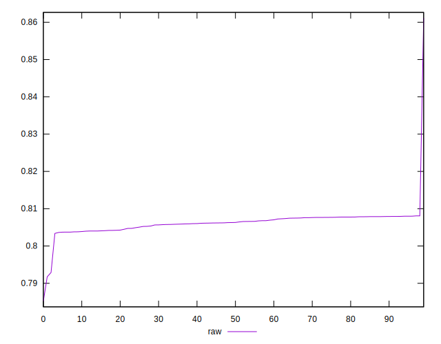

# //meta/pScore/samples/pages+cached+noadtech+nomedia+nocss

[→ Parent](../..)


## Raw


```yaml
p90min: 0.8033782633380743
p90max: 0.8080010589781278
p90range: 0.004622795640053523
p90mean: 0.8062533094532587
p90median: 0.8063003371230457
p90stdev: 0.0014461018006912904
p90skewness: -0.4592295505120213
p90eccentricity: 1
p90discretization: 1
outlandishness: 1.0002378756477168
confidence: 0.0024933115878670413
p90confidence: 0.0005846729839218492

```

