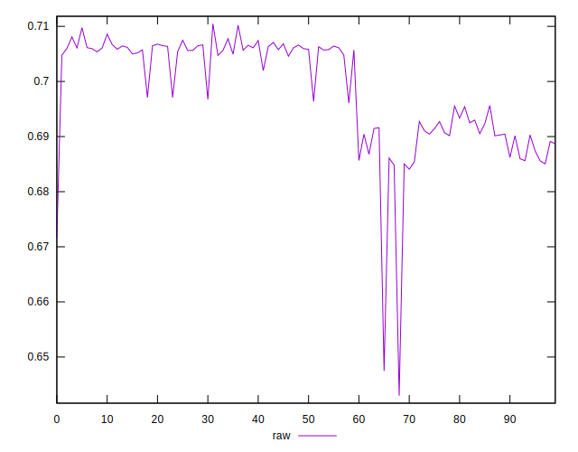
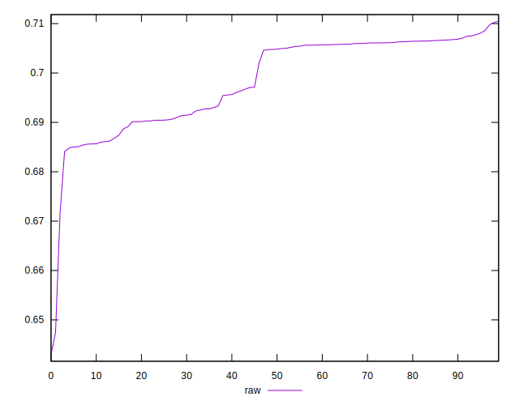
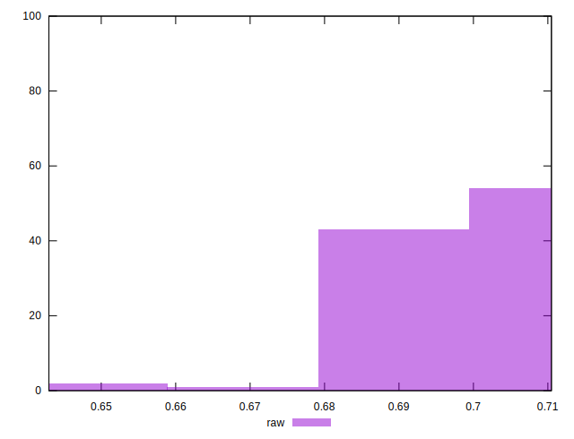

# //meta/pScore/samples/pages+cached+noadtech+nomedia

[→ Parent](../..)


## Raw


```yaml
p90min: 0.6840824360941273
p90max: 0.7085896083884811
p90range: 0.02450717229435373
p90mean: 0.6988886443280954
p90median: 0.7048000500813426
p90stdev: 0.008238913325441764
p90skewness: -0.42011106961687217
p90eccentricity: 0.9999999999999997
p90discretization: 1
outlandishness: 0.9971171349563552
confidence: 0.004499317123458565
p90confidence: 0.003331072567613693

```

