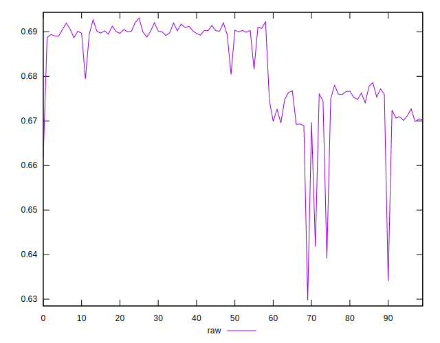
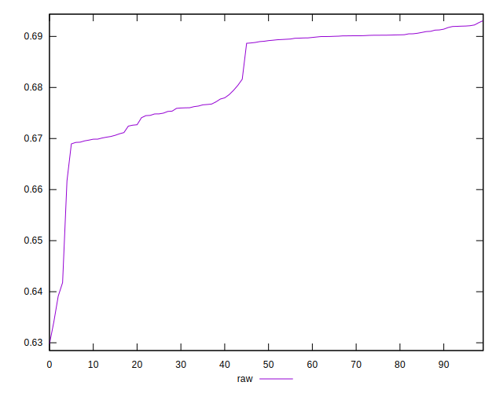
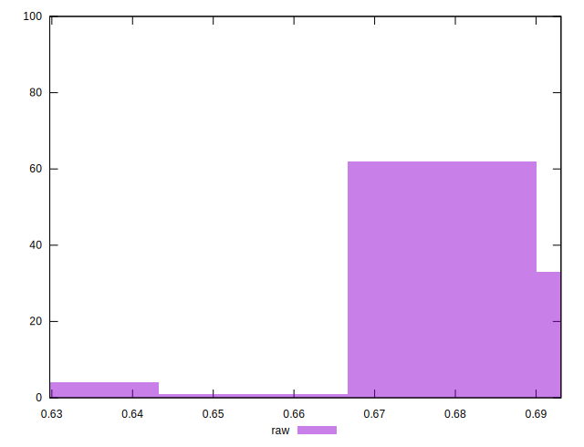

# //meta/pScore/samples/pages+cached+noadtech

[→ Parent](../..)


## Raw


```yaml
p90min: 0.6417840967436855
p90max: 0.6920939592806903
p90range: 0.05030986253700476
p90mean: 0.6825642956085732
p90median: 0.6891145878185045
p90stdev: 0.00950639722743622
p90skewness: -1.0900020006229214
p90eccentricity: 1.0000000000000002
p90discretization: 1
outlandishness: 0.9966506038021129
confidence: 0.0049116297715472235
p90confidence: 0.0038435286026575273

```

