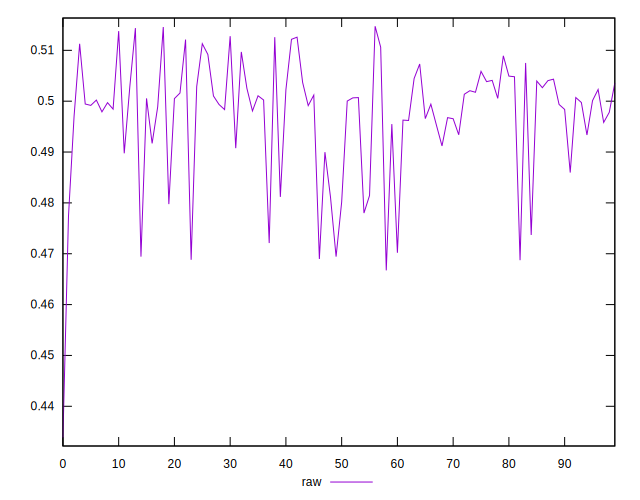
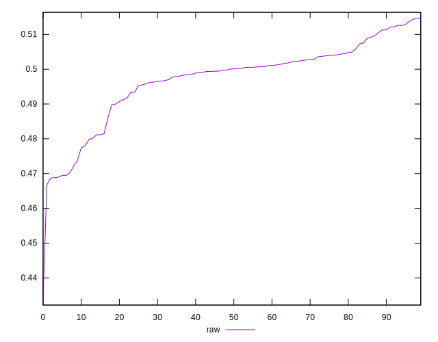
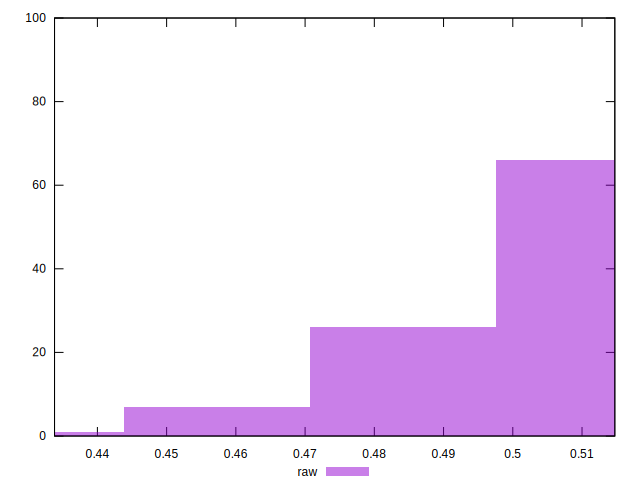

# //meta/pScore/samples/pages+cached

[→ Parent](../..)


## Raw


```yaml
p90min: 0.4688081719172702
p90max: 0.5137833522712235
p90range: 0.044975180353953315
p90mean: 0.49740635393546945
p90median: 0.5000637549615605
p90stdev: 0.010932018983424094
p90skewness: -1.1417296695786243
p90eccentricity: 1
p90discretization: 1
outlandishness: 0.9971282595273764
confidence: 0.005240685038308013
p90confidence: 0.004419921305867551

```

