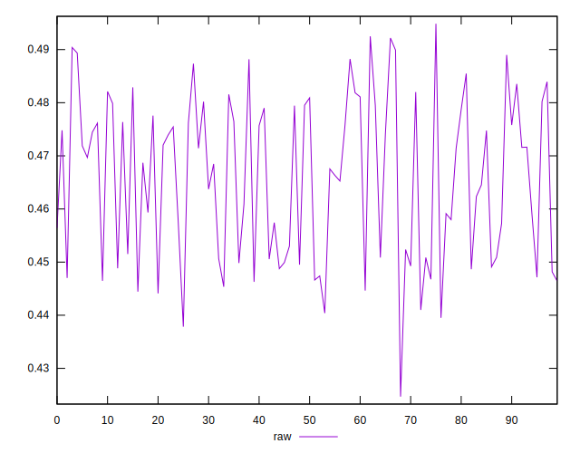

# //meta/pScore/samples/pages

[→ Parent](../..)


## Raw


```yaml
p90min: 0.4403946562835619
p90max: 0.49039612712077185
p90range: 0.05000147083720996
p90mean: 0.46574591850765124
p90median: 0.4685887534477444
p90stdev: 0.01471073640073413
p90skewness: -0.07278667941728721
p90eccentricity: 0.9999999999999996
p90discretization: 1
outlandishness: 0.9994455043594104
confidence: 0.0062909391195105
p90confidence: 0.0059476934078869165

```

