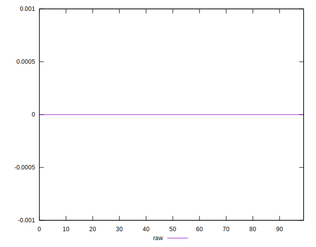

# //meta/score-difference/samples/pages+cached+noadtech+nomedia

[→ Parent](../..)


## Raw


```yaml
p90min: 0
p90max: 1.6653345369377347e-17
p90range: 1.6653345369377347e-17
p90mean: 4.074754718039137e-18
p90median: 0
p90stdev: 7.159236803097326e-18
p90skewness: 1.187813193945485
p90eccentricity: 1.0000000000000027
p90discretization: 47
outlandishness: 1.1291372400756143
confidence: 2.8634005853228776e-18
p90confidence: 2.8945488777270453e-18

```

