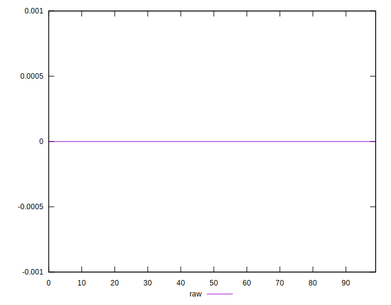

# //meta/score-difference/samples/pages+cached+noadtech

[→ Parent](../..)


## Raw


```yaml
p90min: 0
p90max: 1.6653345369377347e-17
p90range: 1.6653345369377347e-17
p90mean: 6.377876949974306e-18
p90median: 0
p90stdev: 8.095410624687268e-18
p90skewness: 0.4814569204856487
p90eccentricity: 1.0000000000000022
p90discretization: 47
outlandishness: 1.2026777777777777
confidence: 3.5969173537266765e-18
p90confidence: 3.2730530338499792e-18

```

