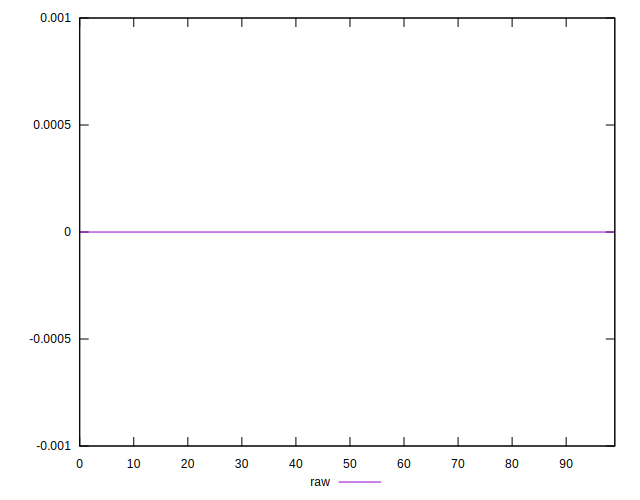

# //meta/score-difference/samples/pages+cached

[→ Parent](../..)


## Raw


```yaml
p90min: 0
p90max: 3.3306690738754695e-17
p90range: 3.3306690738754695e-17
p90mean: 1.4261641513137e-17
p90median: 1.6653345369377347e-17
p90stdev: 6.721121623308062e-18
p90skewness: -1.0113738181394627
p90eccentricity: 0.9999999999999989
p90discretization: 23.5
outlandishness: 1.0360120897256195
confidence: 3.1565274367938263e-18
p90confidence: 2.7174146612103413e-18

```

