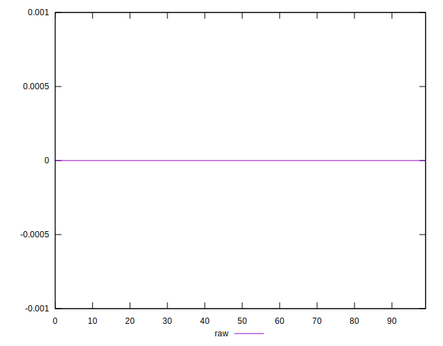

# //meta/score-difference/samples/pages

[→ Parent](../..)


## Raw


```yaml
p90min: 0
p90max: 1.6653345369377347e-17
p90range: 1.6653345369377347e-17
p90mean: 7.97234618746788e-19
p90median: 0
p90stdev: 2.99217136069252e-18
p90skewness: 3.9962132223136932
p90eccentricity: 1.000000000000002
p90discretization: 31.333333333333332
outlandishness: 3.404708367626884
confidence: 1.9611457189888412e-18
p90confidence: 1.209763902531134e-18

```

